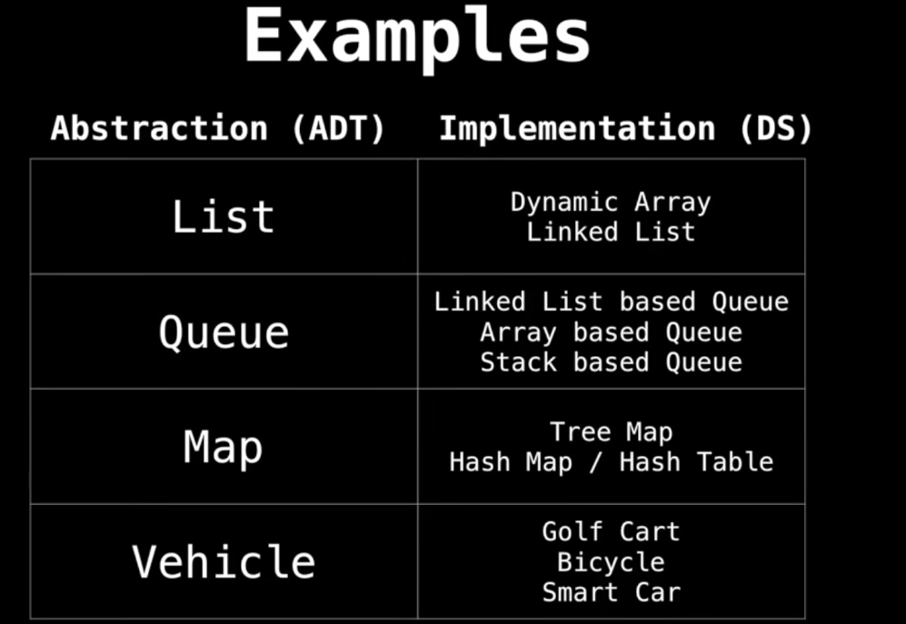

# Data structures

They are esssential ingredients in creating fast and powerful algorithms

They help manage and organize data

They make code cleaner and easier to understand

# ABstract Data Types vs. Data Sctructures

Abstract data type (ADT) is an abstraction of a data structure which provides only the interface to which a data strcuture must adhere to

  

Two important things to take into consideration when designing a program are TIME and SPACE. They are described by Big O Notation, that gives a value of this measure in the worst case this algorithm has to be calculated on. 

We are not interested in the exact value of O Notation (like 3n or 7n) but the proportion between different types of Big O results (like O(n) << O(n³) time)

## Data Structures

### Static and Dynamics arrays
A static array is a fixe length container containing n elements indexable on the range [0, n-1]. Super used everywhere.

Use cases:
Storing and accessing sequential data
Temporarily storing objects
Used by IO routines as buffers
Lookup tables and inverse lookup tables

### Dynamics arrays

Dynamic arrays can grow and shrink in size

Implementation:
1. Create static array with initial capacity
2. Add elements 
3. When the array has no more capacity, then create a copy of the static array somewhere else with twice the original capacity and copye elements into it

Runtime of algorithms seen in this section

Linear search O(n)
Binary search O(log n) but needs the list to be sorted
Selection sort O(n²)
Quicksort O(log n)
Merge sort O(n log n)