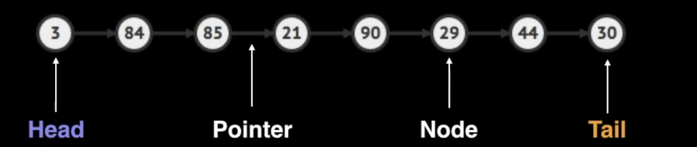
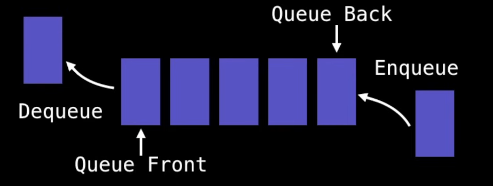
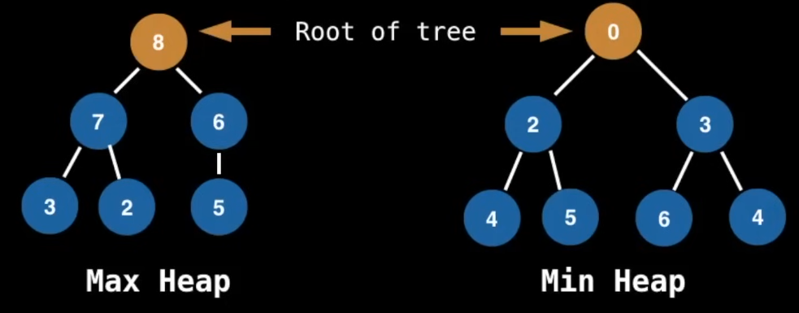
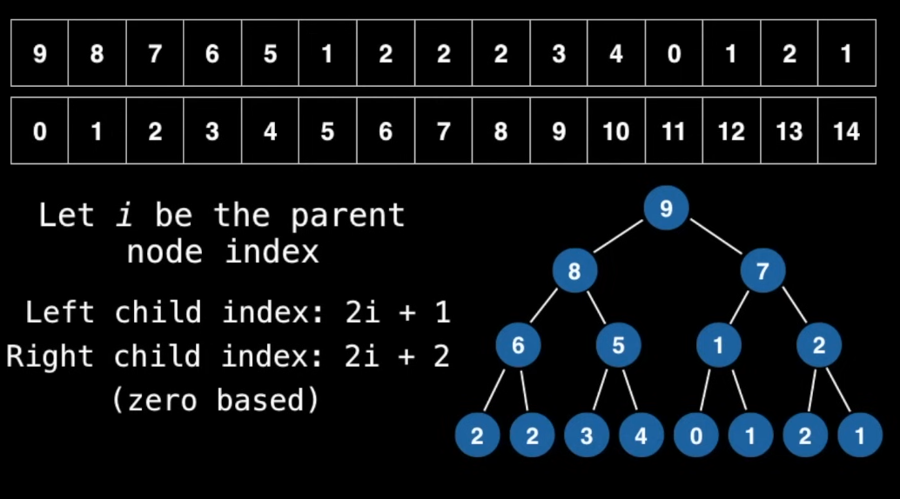
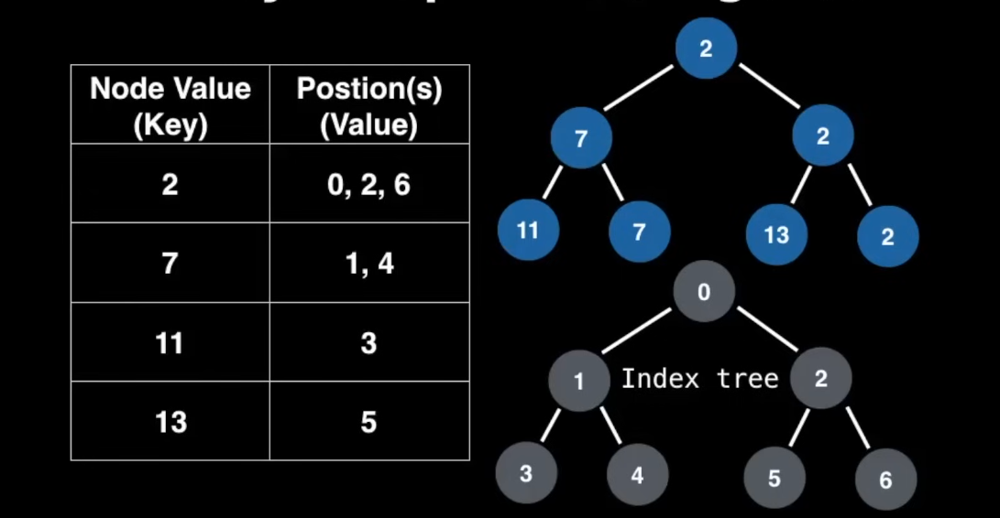

# Data structures

They are esssential ingredients in creating fast and powerful algorithms

They help manage and organize data

They make code cleaner and easier to understand

# ABstract Data Types vs. Data Sctructures

Abstract data type (ADT) is an abstraction of a data structure which provides only the interface to which a data strcuture must adhere to

  

Two important things to take into consideration when designing a program are TIME and SPACE. They are described by Big O Notation, that gives a value of this measure in the worst case this algorithm has to be calculated on. 

We are not interested in the exact value of O Notation (like 3n or 7n) but the proportion between different types of Big O results (like O(n) << O(n³) time)

## Data Structures

### Static and Dynamics arrays
A static array is a fixe length container containing n elements indexable on the range [0, n-1]. Super used everywhere.

Use cases:
Storing and accessing sequential data
Temporarily storing objects
Used by IO routines as buffers
Lookup tables and inverse lookup tables

### Dynamics arrays

Dynamic arrays can grow and shrink in size but they are created from Static Arrays

Implementation:
1. Create static array with initial capacity
2. Add elements 
3. When the array has no more capacity, then create a copy of the static array somewhere else with twice the original capacity and copye elements into it

### Singly and Doubly Linked List

Sequential list of nodes that hold data and point to other nodes that also contains data

Singly lists have pointers to the next node
Doubly lists have pointers to the previous and the next nodes

  

Use cases:
-List, Queue and stack implementations
Great for creating circular lists
Can easily model real world objects such as trains
User in separate chaining which is present certain hashtable implementations to deal with hashing collisions
Often used in the implementation of adjacency lists for graphs.

### Stack 

Stacks are one-ended linear data structures which model a real world stack by having two primary operations:
- push('Value'): adds the Value to the top of the stack
- pop(): removes the top Value of the stack

It behaves like a stack of plates, where the last plate is added on top of the stack and it's the first one to be removed 
(Last In, First Out (LIFO) principle).
In order to remove the plate on the bottom, you have to remove all the plates on top of it before. like in the tower of Hanoi game

  

Use cases:
Used by undo mechanisms in text editors
Used in compiles suntax checking for matching brackets an braces
Used to model a piel of books or plates
bUsed behind the scenes to support recursoon by keeping track of previous funtioncs calls

### Queues
Queues are one-ended linear dat astructures too which model queues. They follow the First In, First Out (FIFO) principle.

They have two main operations:
- enqueue('Value'): it adds a value on the queue back
- dequeue(): it removes the first value in the queue front

  

Use cases:
Model a real world queue
Used to keep track of the X most recently added elements
Web server requests management when you want first come first served
Breadth first search
ETLs

### Priority Queues 
It's an abstract data type similar to the queue but in this case every element of the queue has a certain priority. The removal of the values in the queue depends on their priority. PQs only support comparable data that is ordered in some way from least to greatest or the other way around.

It has two main operations:
- add(value)
- poll()

How does the PW know which one is the next value to be removed from the queue?

#### Heap

A heap is a tree based Data Structure that satisfies the heap invariant (also called heap property): if A is a parent node of B then A is ordered with respect to B for all nodes A,B in the heap. 
There are two types of heaps:
- Max Heap: the parent node is greater than the first row of children nodes, that are greater than the subsequent row of nodes
- Min Heap: the parent node is lower than the first row of children nodes, that are lower than the subsequent row of nodes

These are two examples of BINARY heaps

  

Heaps for the canonical data structure for priority queues

Use cases:
Used in certain implementations of Dijkstra's shortest path algorithm
To dynamically fetch the "next best" or "next worst" element
Used in Huffman coding (often used for lossless data compression)
Best First Search (BFS) algorithms
Minimum Spanning Tree (MST) algorithms

##### Turning Min PQs into Max PQs

Often the standad library of most programming language only provide a min PQ which sorts by smallest elements first, but sometimes we need a Max PQ

Since elements in a priority queue are comparable they implement some sort of **comparable interface** which we can simply negate to achieve a Max Heap

##### Adding/removing elements to a Binary Heap

As we saw before, PQs are usually implemented with heaps since this gives them the best possible time complexity. But we ahve to remember that PQs are abstract. There are actually other ways to implement PQs like using sorted lists, other types of heaps that are not binary, etc.

A binary heap is a binary tree that supports the heap invariant. In every binary heap every parent value has exactly two children (can be values or null nodes). 
A complete binary tree is a tree in which at every level, except possibly the last is completely fille and all the nodes are as far left as possible.

  

The have two main operations:
- insert(value)

Since every node has to have two children nodes, the order is to fill up the binary heap from left to right. When we insert a value that does not ensure the invariant property, this node is migrated up the tree until it finds a position where it does, turning into the parent of previously its parent nodes (reordering the nodes up or down based on their values as if they were bubbles)

-poll(): we usually want to remove the root value that is the greatest or the smallest node in the tree, aka the node of interest. When this happens we call it pooling but it has some steps:
1. Exchange the root node with the last node added to the tree
2. Remove the last node
3. Bubble down the now root node to a position where the heap invariant is satisfied

-remove(value): searches for the node with the value. Then as poll does, switches the position with the last node added to the tree and is eliminated. The node with which the value node was switched now has to find a new position bubbling up/down until the invariant property is ensured again.

In order to optimize the search for the algorithm we can use a hashtable to find out where a node is indexed at. A hashtables provides a constant time loojup and update for a mapping from a key (node value) to a value (index)

  

This strategy allow us to reduce the runtime to O(log n)

Does it matter which value of the repeated ones when removing? No, it doesn't if after the removal, we move the values positions so we keep the heap invariant

### Union Find
Is a data structure that keeps track of elements which are split into one or more disjoints sets.
It has two primary 

Cheatsheet with running time and space

Runtime of algorithms seen in this section

Linear search O(n)
Binary search O(log n) but needs the list to be sorted
Selection sort O(n²)
Quicksort O(log n)
Merge sort O(n log n)

