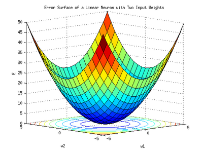
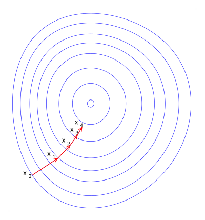
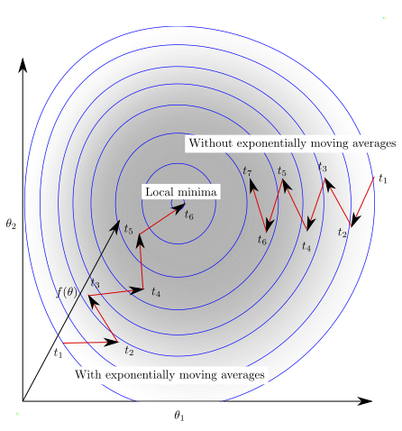

# Linear Regression Cheatsheet

## What is Linear Regression?

Linear regression is a supervised learning algorithm used to predict a continuous target variable based on one or more independent variables by fitting a linear equation to observed data.

### Equation

$$y = \beta_0 + \beta_1 x_1 + \beta_2 x_2 + \cdots + \beta_n x_n + \varepsilon$$

Where:
- $y$ = dependent variable (target)
- $x$ = independent variable(s) (features)
- $\beta_0$ = intercept (bias term)
- $\beta_1, \beta_2, \ldots, \beta_n$ = coefficients (weights)
- $\varepsilon$ = error term (residuals)

#### Matrix Form

$$\hat{y} = X\theta$$

Where:
- $X$ = feature matrix $(m \times n)$, m samples, n features
- $\theta$ = parameter vector $[\beta_0, \beta_1, \ldots, \beta_n]^T$
- $\hat{y}$ = predicted values

### Visual Intuition


*The goal is to find the line that minimizes the total distance between data points and the line.*

### Estimation Method

Linear Regression uses **Ordinary Least Squares (OLS)** as its estimation method. OLS finds the parameter values that **minimize the sum of squared residuals**. the squared vertical distances between each observed data point and the predicted value on the regression line.

**Why "Least Squares"?** The method minimizes the sum of squared errors rather than absolute errors. Squaring has two advantages: it makes all errors positive (so they don't cancel out), and it penalizes large errors more heavily, encouraging the model to avoid big mistakes.

**How it works:** Given the data, OLS computes the parameters $\theta$ (intercept and coefficients) such that the total squared error between the predicted values $\hat{y}_i = X_i \theta$ and the actual values $y_i$ is as small as possible. This can be solved either analytically (Normal Equation) or iteratively (Gradient Descent). both approaches are detailed below.


## Cost Function

**Mean Squared Error (MSE):**

$$\text{MSE} = \frac{1}{m} \sum_{i=1}^{m} (y_i - \hat{y}_i)^2$$

MSE is the standard metric that measures the average of the squared differences between predicted and actual values.

**Optimization Cost Function $J(\theta)$:**

For gradient descent, we use a slightly modified version with a $\frac{1}{2}$ factor:

$$J(\theta) = \frac{1}{2m} \sum_{i=1}^{m} (y_i - \hat{y}_i)^2$$

Or in matrix form:

$$J(\theta) = \frac{1}{2m} (y - X\theta)^T (y - X\theta)$$

The $\frac{1}{2}$ is a mathematical convenience. when we take the derivative of $J(\theta)$ during gradient descent, the exponent 2 from the square cancels with the $\frac{1}{2}$, producing a cleaner gradient formula. **It does not change the location of the minimum** (multiplying a function by a constant doesn't move its minimum), so the optimal $\theta$ is the same whether we minimize MSE or $J(\theta)$.



*The MSE cost function for linear regression is CONVEX (bowl-shaped). It has exactly ONE global minimum. no local minima to worry about.*

## Key Assumptions

Linear regression relies on four critical assumptions. If these assumptions are violated, the model's parameter estimates, predictions, or statistical tests (p-values, confidence intervals) may be unreliable.

---

### 1. Linearity

**What it means:** The relationship between the independent variables (features) $X$ and the dependent variable (target) $y$ is linear. the expected value of $y$ changes at a constant rate as each feature $x_j$ changes, holding all other features constant.

**Why it matters:** The entire linear regression model is built on the equation $y = X\theta + \varepsilon$. If the true relationship is curved, quadratic, or otherwise non-linear, a straight line will systematically miss the pattern. The model will underfit and the residuals will show clear structure instead of being random.

**How to detect violations:**

**For Simple Linear Regression** (one feature $x$, one target $y$):

1. **Scatterplot of $y$ vs. $x$**. the most direct check. If the relationship looks curved (U-shaped, exponential, logarithmic) instead of forming a straight-line pattern, linearity is violated.
2. **Residuals vs. predictors ($x$) plot**. plot the residuals ($y - \hat{y}$) against the predictor $x$. If linearity holds, the points scatter randomly around 0. Any systematic pattern (curve, fan shape) signals a violation.

**For Multiple Linear Regression** (multiple features $x_1, x_2, \ldots, x_p$):

1. **Residuals vs. fitted values plot**. plot the residuals ($y - \hat{y}$) against the predicted values ($\hat{y}$).
   - **Linearity holds:** residuals bounce randomly around the horizontal zero line forming a roughly horizontal band with no pattern.
   - *Note:* a funnel shape (spread increases left to right) indicates heteroscedasticity, not non-linearity.

2. **Residuals vs. predictors ($x$) plot**. plot residuals against each individual predictor $x_j$ separately.
   - **Linearity holds:** random scatter around zero with no visible trend for every predictor.
   - *Note:* for simple linear regression this gives the same information as the residuals vs. fitted plot. It becomes more valuable in multiple regression to pinpoint problematic predictors.

3. **Partial residual plots** (also called Component + Residual plots). plot $\hat{\beta}_j x_j + e$ against $x_j$, where $\hat{\beta}_j x_j$ is the fitted component and $e$ are the full-model residuals. This isolates the effect of each predictor after removing the influence of all other predictors.
   - **Linearity holds:** the scatter follows the fitted straight line ($\hat{\beta}_j x_j$) closely. A LOESS smoother overlaid on the plot should roughly coincide with the fitted line.
   - *Limitation:* when $x_j$ is highly correlated with other predictors, the variance in the partial residual plot can appear artificially small, masking actual non-linearity. More reliable than simple residual-vs-predictor plots when predictors are moderately correlated, but less trustworthy under severe multicollinearity.

**For both types:**

- **Domain knowledge**. consider whether a linear relationship is plausible given the context (e.g., diminishing returns on advertising spend suggests a log or square-root relationship, not linear).

**What to do if violated:**
- **Add polynomial features**. add $x^2$ if residuals show a U-shape, $x^3$ if residuals show an S-shape. Keep degree $\leq 3$ or $4$ to avoid overfitting and erratic behavior at the boundaries.
- **Apply non-linear transformations**. use $\log(x)$ if the relationship shows diminishing returns or exponential growth, $\sqrt{x}$ for power-type relationships.
- **Use regression splines**. divide the predictor range into regions at "knots" and fit low-degree polynomials in each region, constrained to join smoothly. This provides flexibility without the instability of high-degree polynomials.
- **Switch to a non-linear model**. if transformations are insufficient, consider decision trees, random forests, or neural networks.

After applying any remedy, refit the model and re-check the diagnostic plots to confirm the fix.

---

### 2. Independence

**What it means:** The observations (data points) are independent of each other and the residual (error) of one observation should not be correlated with the residual of another.

$$\text{Cov}(\varepsilon_i, \varepsilon_j) = 0 \quad \text{for } i \neq j$$

**Why it matters:** If observations are correlated (e.g., time series data where today's value depends on yesterday's), the model underestimates the true variance of the coefficients. This makes standard errors too small, p-values too low, and confidence intervals too narrow. you think your results are more significant than they actually are.

**How to detect violations:**
- **Durbin-Watson test**. tests for autocorrelation in residuals. Values near 2 indicate no autocorrelation; values near 0 or 4 indicate positive or negative autocorrelation.
- Plot residuals in order. if you see patterns (waves, trends), the observations are not independent.

> **Durbin-Watson Test. Explained:**
>
> The Durbin-Watson (DW) statistic measures whether consecutive residuals are correlated. It computes the ratio of the sum of squared differences between consecutive residuals to the sum of squared residuals:
>
> $$DW = \frac{\sum_{i=2}^{m}(e_i - e_{i-1})^2}{\sum_{i=1}^{m} e_i^2}$$
>
> The statistic ranges from 0 to 4:
>
> | DW value | Meaning | Action |
> |:---|:---|:---|
> | **~2** (1.5 – 2.5) | No autocorrelation. residuals are independent | Assumption holds, proceed |
> | **< 1.5** (toward 0) | Positive autocorrelation. consecutive residuals tend to have the same sign (e.g., several positive in a row, then several negative) | Add lagged features, use time-series models (ARIMA), or GLS |
> | **> 2.5** (toward 4) | Negative autocorrelation. consecutive residuals alternate signs (positive, negative, positive...) | Rare; investigate data ordering, consider GLS |
>
> **When to use it:** Primarily for data with a natural ordering (time series, sequential measurements). For cross-sectional data (no inherent order), independence is usually safe to assume and DW is less relevant.

**What to do if violated:**
- Use time series models (ARIMA, exponential smoothing) instead.
- Add lagged variables as features.
- Use Generalized Least Squares (GLS) which accounts for correlated errors.

---

### 3. Homoscedasticity (Constant Variance)

**What it means:** The variance of the residuals (errors) is **constant** across all levels of the predicted values. In other words, the spread of the errors doesn't change. the model is equally uncertain about its predictions whether the target value is small or large.

The opposite. **heteroscedasticity**. means the error variance changes. A common example: predicting income, where prediction errors are small for low incomes but very large for high incomes.

**Why it matters:** OLS assumes equal variance to give equal weight to all observations. If variance is larger for some observations, those high-variance points disproportionately influence the model. The coefficient estimates remain unbiased, but:
- Standard errors are wrong → hypothesis tests and confidence intervals are unreliable.
- The model is not efficient (not the best possible estimator).

**How to detect violations:**
- **Residuals vs. fitted values plot**. if the residuals fan out (funnel shape) or form a pattern, variance is not constant.
- **Breusch-Pagan test** or **White's test**. formal statistical tests for heteroscedasticity.

> **Breusch-Pagan Test. Explained:**
>
> The Breusch-Pagan (BP) test checks whether the variance of the residuals depends on the predictor values. It works by regressing the squared residuals ($e_i^2$) on the original predictors ($X$). If the predictors can explain the pattern in the squared residuals, variance is not constant.
>
> It produces two key outputs:
>
> | Output | How to interpret |
> |:---|:---|
> | **LM statistic** | Test statistic. higher values indicate stronger evidence of heteroscedasticity |
> | **p-value** | The probability of seeing this result if homoscedasticity held |
>
> | p-value | Interpretation | Action |
> |:---|:---|:---|
> | **> 0.05** | No significant heteroscedasticity. variance is approximately constant | Assumption holds, proceed |
> | **< 0.05** | Heteroscedasticity detected. error variance changes with predicted values | Transform y (log, sqrt), use WLS, or report robust standard errors (HC3) |
> | **< 0.05 but plot looks OK** | Borderline. large samples can trigger significance easily | Trust the residual plot more than the p-value |
>
> **White's Test. Explained:**
>
> White's test is a more general alternative to Breusch-Pagan. While BP assumes the relationship between variance and predictors is linear, White's test also checks for non-linear patterns by including squared terms and cross-products of the predictors. Use White's test when you suspect the heteroscedasticity has a non-linear form (e.g., variance increases quadratically). For most cases, Breusch-Pagan is sufficient.

**What to do if violated:**
- Apply a transformation to the target variable (e.g., $\log(y)$, $\sqrt{y}$) to stabilize variance.
- Use **Weighted Least Squares (WLS)**. gives less weight to observations with higher variance.
- Use **robust standard errors** (heteroscedasticity-consistent standard errors) which give correct p-values even with non-constant variance.
- Use **robust regression methods** (e.g., Huber regression, RANSAC) that are less sensitive to outliers and heteroscedastic errors.

---

### 4. Normality of Residuals

**What it means:** The residuals $\varepsilon_i = y_i - \hat{y}_i$ follow a **normal (Gaussian) distribution** with mean zero and constant variance: $\varepsilon \sim \mathcal{N}(0, \sigma^2)$.

**Why it matters:** The normality assumption is needed for **statistical inference**. specifically for p-values, t-tests on coefficients, and confidence intervals to be valid. It does **not** affect the OLS estimates themselves (OLS finds the best linear fit regardless of residual distribution), but without normality:
- You cannot trust whether a coefficient is statistically significant.
- Confidence intervals may be too wide or too narrow.
- Prediction intervals will be inaccurate.

**Important nuance:** For large samples ($m > 30$), the **Central Limit Theorem** makes the coefficient estimates approximately normal even if the residuals are not. So normality is most critical for small sample sizes.

**How to detect violations:**
- **Q-Q plot** (quantile-quantile plot). residuals should fall approximately on a straight line.
- **Shapiro-Wilk test** or **Kolmogorov-Smirnov test**. formal tests for normality.
- **Histogram of residuals**. should look roughly bell-shaped.

> **Shapiro-Wilk Test. Explained:**
>
> The Shapiro-Wilk test is the most powerful normality test for small to moderate samples (n < 5,000). It compares the observed distribution of residuals to what a perfect normal distribution would look like, producing a test statistic W (0 to 1) and a p-value.
>
> | Output | How to interpret |
> |:---|:---|
> | **W statistic** | Ranges from 0 to 1. Values close to 1 mean the data closely follows a normal distribution. Values significantly below 1 indicate departure from normality |
> | **p-value** | The probability of seeing this result if the data were truly normal |
>
> | p-value | Interpretation | Action |
> |:---|:---|:---|
> | **> 0.05** | Cannot reject normality. residuals are approximately normal | Assumption holds, proceed |
> | **< 0.05 and n ≤ 30** | Normality violated and sample is small. inference is unreliable | Transform y (Box-Cox, log), remove outliers, or use bootstrapping |
> | **< 0.05 and n > 30** | Normality violated but CLT applies. coefficient estimates are still approximately normal | Proceed with caution; prediction intervals will be approximate |
>
> **Important:** With large samples (n > ~500), the Shapiro-Wilk test becomes overly sensitive. it will reject normality even for tiny, practically irrelevant deviations. For large samples, rely on the Q-Q plot visual inspection instead.
>
> **Kolmogorov-Smirnov Test. Explained:**
>
> The Kolmogorov-Smirnov (KS) test compares the cumulative distribution of the residuals to a theoretical normal distribution. It measures the maximum distance between the two curves. Unlike Shapiro-Wilk, it works for any sample size, but it is **less powerful** (less likely to detect non-normality when it exists).
>
> | p-value | Interpretation | Action |
> |:---|:---|:---|
> | **> 0.05** | Cannot reject normality | Assumption holds |
> | **< 0.05** | Distribution differs significantly from normal | Same remedies as Shapiro-Wilk |
>
> **When to use which:**
> - **n < 5,000** → use Shapiro-Wilk (more powerful)
> - **n ≥ 5,000** → use KS test or rely on Q-Q plot (Shapiro-Wilk becomes too sensitive)
> - **Always** → check the Q-Q plot visually alongside any formal test

**What to do if violated:**
- Transform the target variable ($\log(y)$, Box-Cox transformation).
- Remove outliers that distort the distribution.
- For large samples, this assumption is less critical due to the Central Limit Theorem.
- Use non-parametric methods or bootstrapping for inference.

---

### Assumptions Summary

| Assumption | What It Affects If Violated | Severity |
|:---|:---|:---|
| **Linearity** | Biased predictions, systematic errors | High. model is fundamentally wrong |
| **Independence** | Standard errors, p-values, confidence intervals | High. conclusions are invalid |
| **Homoscedasticity** | Standard errors, efficiency of estimates | Medium. estimates are OK, but inference is off |
| **Normality** | p-values, confidence intervals, prediction intervals | Low for large samples (CLT helps) |

---

## Two Main Approaches to Find Optimal Parameters

### 1. Normal Equation (Closed-Form Solution)

The Normal Equation is a **direct analytical formula** that computes the optimal parameters $\theta$ in one step by setting the derivative of the cost function $J(\theta)$ to zero and solving for $\theta$ algebraically.

**Time Complexity:** $O(n^3 + mn^2)$. computing $X^TX$ costs $O(mn^2)$ and inverting it costs $O(n^3)$. **Space:** $O(mn + n^2)$.

**Derivation intuition:**

We want to find $\theta$ that minimizes $J(\theta) = \frac{1}{2m}(X\theta - y)^T(X\theta - y)$. Taking the gradient and setting it to zero:

$$\nabla_\theta J(\theta) = \frac{1}{m} X^T(X\theta - y) = 0$$

Solving for $\theta$:

$$X^T X\theta = X^T y$$

$$\theta = (X^T X)^{-1} X^T y$$

This is called the "Normal Equation" because it comes from setting the gradient **normal** (perpendicular) to the error. the residual vector $(X\theta - y)$ is orthogonal to the column space of $X$ at the optimal solution.

**Formula:**

$$\theta = (X^T X)^{-1} X^T y$$

Where:
- $X$ = feature matrix $(m \times n)$ with intercept column of ones
- $X^T$ = transpose of $X$
- $(X^T X)^{-1}$ = inverse of the $n \times n$ matrix $X^T X$
- $y$ = target vector $(m \times 1)$
- $\theta$ = resulting parameter vector $(n \times 1)$

**Advantages:**
- ✅ No need to choose learning rate
- ✅ No iterations required
- ✅ Gives exact solution in one step
- ✅ Works well for small to medium datasets (n < 10,000)

**Disadvantages:**
- ❌ Computationally expensive for large datasets $O(n^3)$ (Order n cubed)
- ❌ Requires matrix inversion $(X^T X)^{-1}$
- ❌ Doesn't work if $X^T X$ is singular (non-invertible)
- ❌ Slow when number of features is very large

**When to Use:** Small datasets with fewer features (<10,000)

---

### 2. Gradient Descent (Iterative Solution)

#### What is Gradient Descent?

Gradient Descent is an iterative optimization algorithm used to find the parameters (weights) that minimize the cost function.

Mathematically, the gradient ($\nabla J$) is a vector of partial derivatives that points in the direction of steepest **ascent**. By subtracting the gradient, we move in the direction of steepest **descent**, toward the minimum.

> **Gradient descent requires feature scaling for fast convergence.** When features are on different scales, the cost contours become elongated and gradient descent zigzags instead of converging directly.
>
> **Always scale your features before using gradient descent.** Standardization (Z-score) is the most common choice.
>
> See **[feature_scaling.md](feature_scaling.md)** for the full guide on Standardization, Min-Max Normalization, and Robust Scaling. including when to use each, advantages/disadvantages, and Python code.

#### How It Works Step-by-Step

```
Step 1: Initialize parameters θ randomly or to zeros
Step 2: Compute predictions ŷ = Xθ
Step 3: Compute the error (ŷ - y)
Step 4: Compute the gradient ∇J(θ) = (1/m) Xᵀ(ŷ - y)
Step 5: Update parameters θ := θ - α · ∇J(θ)
Step 6: Repeat steps 2-5 until convergence
```


*Gradient descent with different initial conditions, iteratively stepping toward the minimum. Each step moves $\theta$ in the direction of steepest descent, with step size controlled by the learning rate ($\alpha$) and the gradient magnitude.*

#### Update Rule

$$\theta_j := \theta_j - \alpha \frac{\partial J(\theta)}{\partial \theta_j}$$

#### Gradient

$$\frac{\partial J(\theta)}{\partial \theta_j} = \frac{1}{m} \sum_{i=1}^{m} (\hat{y}_i - y_i) \, x_{ij}$$$$

#### Vectorized Update

$$\theta := \theta - \frac{\alpha}{m} X^T (X\theta - y)$$

#### The Learning Rate ($\alpha$)

The learning rate $\alpha$ is a **hyperparameter**. a value that is set before training begins and is not learned from the data. It controls the size of each step during gradient descent. Choosing it correctly is critical.



| Learning Rate | Effect |
|:---:|:---:|
| **Too small** (0.0001) | Very slow convergence, takes thousands of iterations |
| **Just right** (0.01) | Fast, stable convergence to the minimum |
| **Too large** (10) | Overshoots the minimum, oscillates or diverges |

#### How to Choose the Learning Rate

There is no universal value. it depends on the problem, the data, and whether features are scaled.

**Step 1. Start with a reasonable default:**
A good starting point is $\alpha = 0.01$. This works well for most problems when features are scaled.

**Step 2. Try values on a logarithmic scale:**
Test a range of values that increase by roughly 3x each step:

$$\alpha \in \{0.001, \; 0.003, \; 0.01, \; 0.03, \; 0.1, \; 0.3, \; 1.0\}$$

**Step 3. Plot the cost vs. iterations for each value:**
The cost curve tells you everything:

| What You See | What It Means | Action |
|:---|:---|:---|
| Cost decreases very slowly | $\alpha$ is too small | Increase $\alpha$ |
| Cost decreases smoothly and flattens | $\alpha$ is good | Keep it |
| Cost oscillates (up and down) | $\alpha$ is slightly too large | Decrease $\alpha$ by half |
| Cost explodes (increases rapidly, NaN) | $\alpha$ is way too large | Decrease $\alpha$ by 10x |

**Step 4. Pick the largest $\alpha$ that converges smoothly:**
You want fast convergence without instability. The best $\alpha$ is the largest value where the cost curve still decreases smoothly.

#### Managing the Learning Rate During Training

A fixed learning rate is often good enough for linear regression, but for more complex problems or large datasets, you may want to **decay** the learning rate over time. The idea is: take large steps early (fast progress), then smaller steps later (precision near the minimum).

**1. Step Decay. Reduce by a factor every N epochs:**

$$\alpha_t = \alpha_0 \cdot \gamma^{\lfloor t / N \rfloor}$$

Example: Start at $\alpha_0 = 0.1$, multiply by $\gamma = 0.5$ every 100 epochs.

**2. Exponential Decay. Smooth continuous reduction:**

$$\alpha_t = \alpha_0 \cdot e^{-kt}$$

Where $k$ controls how fast the rate decays.

**3. Inverse Time Decay. Slow, gradual reduction:**

$$\alpha_t = \frac{\alpha_0}{1 + k \cdot t}$$

**4. Adaptive Methods (most practical). Let the algorithm decide:**

Instead of manually tuning schedules, adaptive optimizers adjust the learning rate automatically per parameter:

| Method | Idea | When to Use |
|:---|:---|:---|
| **AdaGrad** | Scales $\alpha$ down for frequently updated parameters | Sparse data |
| **RMSProp** | Uses exponential moving average of squared gradients | Non-stationary problems |
| **Adam** | Combines momentum + RMSProp; adapts per-parameter | Default choice for most problems |

#### Quick Rules of Thumb

1. **Always scale features first**. this makes the choice of $\alpha$ much less sensitive
2. **Start with $\alpha = 0.01$** and adjust from there
3. **If cost increases** → $\alpha$ is too large, divide by 10
4. **If cost barely moves** → $\alpha$ is too small, multiply by 3
5. **Plot cost vs. iterations**. never skip this, it's your diagnostic tool
6. **For linear regression specifically**, a fixed learning rate with scaled features is almost always sufficient
7. **For production / complex models**, use Adam optimizer and let it handle the learning rate

#### Worked Example: Gradient Descent for Linear Regression

Suppose we have a tiny dataset and want to fit $y = \theta_0 + \theta_1 x$:

```
Data: x = [1, 2, 3], y = [2, 4, 5]
Initialize: θ₀ = 0, θ₁ = 0, α = 0.1

── Iteration 1 ──
Predictions: ŷ = [0+0·1, 0+0·2, 0+0·3] = [0, 0, 0]
Errors:      ŷ - y = [0-2, 0-4, 0-5] = [-2, -4, -5]
Gradient θ₀: (1/3)·(-2 + -4 + -5)           = -3.667
Gradient θ₁: (1/3)·(-2·1 + -4·2 + -5·3)     = -8.333
Update:      θ₀ = 0 - 0.1·(-3.667)   = 0.367
             θ₁ = 0 - 0.1·(-8.333)   = 0.833

── Iteration 2 ──
Predictions: ŷ = [0.367+0.833·1, 0.367+0.833·2, 0.367+0.833·3] = [1.200, 2.033, 2.867]
Errors:      ŷ - y = [-0.800, -1.967, -2.133]
Gradient θ₀: (1/3)·(-0.800 + -1.967 + -2.133)         = -1.633
Gradient θ₁: (1/3)·(-0.800·1 + -1.967·2 + -2.133·3)   = -3.711
Update:      θ₀ = 0.367 - 0.1·(-1.633)  = 0.530
             θ₁ = 0.833 - 0.1·(-3.711)  = 1.204

...after many iterations → θ₀ ≈ 0.333, θ₁ ≈ 1.500 (best-fit line)
```

#### Types of Gradient Descent

---

##### 1. Batch Gradient Descent (BGD)

**Definition:** Batch Gradient Descent computes the gradient of the cost function using the **entire training dataset** at every single update step. It sums the errors across all $m$ samples, calculates the average gradient, and then updates the parameters once per epoch.

**Time Complexity:** $O(mn)$ per iteration, $O(kmn)$ total. where $k$ = number of iterations. 
**Space:** $O(mn)$ (full dataset in memory).

**Update rule:**

$$\theta := \theta - \frac{\alpha}{m} \sum_{i=1}^{m} \nabla_\theta L(\hat{y}_i, y_i)$$

**How it works:**
1. Use all $m$ training samples to compute predictions.
2. Calculate the error for every sample.
3. Average all the gradients into one gradient vector.
4. Update $\theta$ once.
5. Repeat until convergence.

**Advantages:**
- ✅ **Stable convergence**. the gradient is exact (no noise), so the cost decreases smoothly at every step.
- ✅ **Guaranteed to converge** to the global minimum for convex problems (with appropriate learning rate).
- ✅ **Deterministic**. same result every run given the same initialization.
- ✅ **Efficient vectorization**. a single matrix multiplication computes the gradient for all samples at once.

**Disadvantages:**
- ❌ **Slow for large datasets**. each update requires processing all $m$ samples. If $m = 10$ million, every single step is expensive.
- ❌ **High memory usage**. the entire dataset must fit in memory to compute the gradient.
- ❌ **Cannot learn online**. cannot incorporate new data without retraining on the entire dataset.
- ❌ **Can get stuck in saddle points and local minima** (in non-convex problems) because the gradient is too smooth to escape.

**When to use:** Small to medium datasets (up to ~10,000 samples) where stability is more important than speed.

---

##### 2. Stochastic Gradient Descent (SGD)

**Definition:** Stochastic Gradient Descent updates the parameters after computing the gradient on **a single randomly chosen training sample**. Instead of waiting to see all the data, it makes a small update after each example.

**Time Complexity:** $O(n)$ per update, $O(mn)$ per epoch, $O(kmn)$ total. 
**Space:** $O(n)$ (one sample at a time).

**Update rule (for one random sample $i$):**

$$\theta := \theta - \alpha \, \nabla_\theta L(\hat{y}_i, y_i)$$

**How it works:**
1. Shuffle the training data randomly.
2. Pick one sample $(x_i, y_i)$.
3. Compute the gradient using only that sample.
4. Update $\theta$ immediately.
5. Move to the next sample. One pass through all samples = one epoch.

**Advantages:**
- ✅ **Very fast updates**. each step is $O(n)$ instead of $O(mn)$, making it much faster per iteration.
- ✅ **Low memory**. only one sample is needed in memory at a time.
- ✅ **Supports online learning**. can learn from new data as it arrives without retraining from scratch.
- ✅ **Can escape shallow local minima and saddle points**. the noise from random sampling helps the algorithm explore and avoid getting stuck (beneficial for non-convex problems like neural networks).

**Disadvantages:**
- ❌ **Noisy, unstable convergence**. the gradient from one sample is a very noisy estimate of the true gradient, causing the parameters to zigzag erratically.
- ❌ **Never truly converges**. oscillates around the minimum instead of settling on it (unless the learning rate is decayed).
- ❌ **Cannot exploit vectorized hardware**. processing one sample at a time doesn't benefit from GPU/matrix parallelism.
- ❌ **Sensitive to learning rate**. too high causes divergence, too low negates the speed advantage.

**When to use:** Very large datasets, online learning scenarios, or when you need to escape local minima in non-convex optimization.

---

##### 3. Mini-Batch Gradient Descent

**Definition:** Mini-Batch Gradient Descent is the **compromise between Batch GD and SGD**. It computes the gradient on a small random subset (mini-batch) of the training data. typically 32 to 256 samples. and updates the parameters once per mini-batch.

**Time Complexity:** $O(bn)$ per update, $O(mn)$ per epoch, $O(kmn)$ total. where $b$ = batch size. **Space:** $O(bn)$.

**Update rule (for a mini-batch $B$ of size $b$):**

$$\theta := \theta - \frac{\alpha}{b} \sum_{i \in B} \nabla_\theta L(\hat{y}_i, y_i)$$

**How it works:**
1. Shuffle the training data.
2. Split it into mini-batches of size $b$ (e.g., 32, 64, 128, 256).
3. For each mini-batch: compute gradient, update $\theta$.
4. One pass through all mini-batches = one epoch.

**Common mini-batch sizes:**

| Batch size | Trade-off |
|:---:|:---|
| **32** | More noise, more updates per epoch, better generalization |
| **64–128** | Good balance (most common default) |
| **256** | Smoother gradient, fewer updates, faster per epoch on GPU |
| **512+** | Very smooth, but may generalize worse and needs more memory |

**How to choose the mini-batch size:**

The batch size is a hyperparameter that affects training speed, convergence behavior, and generalization. Here is how to choose it:

**1. Start with 32 or 64.** These are the most widely used defaults. Research (Bengio, 2012; Masters & Luschi, 2018) has consistently shown that smaller batch sizes (32–64) generalize better than large ones. When in doubt, use 32.

**2. Use powers of 2.** Batch sizes of 32, 64, 128, 256, 512 align with GPU memory architecture. Non-power-of-2 sizes waste hardware capacity and run slower.

**3. Consider your dataset size.** The batch size should be smaller than the training set, but the ratio matters:

| Dataset size ($m$) | Recommended batch size |
|:---:|:---|
| $m < 500$ | Use full batch (Batch GD). dataset is small enough |
| $500 < m < 5{,}000$ | 32–64 |
| $5{,}000 < m < 100{,}000$ | 64–256 |
| $m > 100{,}000$ | 128–512 (limited by GPU memory) |

**4. Check your GPU memory.** The practical upper limit on batch size is how much data fits in your GPU (or RAM). If you run out of memory, reduce the batch size. The formula is roughly:

$$b_{\max} \approx \frac{\text{Available GPU memory}}{\text{Memory per sample} \times \text{multiplier for gradients/activations}}$$

**5. Understand the trade-off between batch size and learning rate:**

| Batch size | Gradient noise | Learning rate |
|:---:|:---|:---|
| Small (32) | High noise → acts as regularization | Use a smaller learning rate |
| Large (512) | Low noise → more precise gradient | Can use a larger learning rate |

A common rule of thumb: **when you double the batch size, multiply the learning rate by $\sqrt{2}$** (linear scaling rule). This keeps the effective noise level roughly constant.

**6. Larger batches ≠ better models.** A counter-intuitive finding in deep learning research: larger batch sizes often lead to **worse** generalization. The noise from small batches helps the optimizer escape sharp, narrow minima and find flatter minima that generalize better. This is called the **generalization gap**.

**Quick decision:**
- **Default choice:** 32 or 64. works well in almost all cases.
- **If training is too slow:** increase to 128 or 256 (and increase learning rate proportionally).
- **If running out of memory:** decrease batch size.
- **If model overfits:** try a smaller batch size (more noise = implicit regularization).
- **If loss is very noisy / unstable:** increase batch size for smoother gradients.

**Advantages:**
- ✅ **Balances speed and stability**. smoother than SGD, faster than Batch GD.
- ✅ **Exploits vectorized hardware**. GPUs and modern CPUs are optimized for matrix operations on batches, making mini-batch much faster than processing one sample at a time.
- ✅ **Good generalization**. the moderate noise from mini-batches acts as a form of regularization, often leading to better models than Batch GD.
- ✅ **Scalable**. works well for datasets of any size.

**Disadvantages:**
- ❌ **Extra hyperparameter**. you need to choose the batch size $b$ in addition to the learning rate.
- ❌ **Still oscillates** (less than SGD, more than Batch GD). requires learning rate scheduling for precise convergence.
- ❌ **Not deterministic**. results vary between runs due to random shuffling (unless you fix the random seed).

**When to use:** **Almost always.** Mini-batch GD is the default choice in practice for most machine learning and deep learning applications.

---

#### Summary Comparison

| Aspect | Batch GD | Stochastic GD | Mini-Batch GD |
|:---|:---|:---|:---|
| **Samples per update** | All $m$ | 1 | Mini-batch of $b$ (32–256) |
| **Updates per epoch** | 1 | $m$ | $m / b$ |
| **Gradient quality** | Exact | Very noisy | Moderately noisy |
| **Convergence path** | Smooth, direct | Zigzag, erratic | Balanced |
| **Speed per epoch** | Slow | Fast (but many steps) | Fast (vectorized) |
| **Memory** | High ($O(m)$) | Low ($O(1)$) | Medium ($O(b)$) |
| **Hardware utilization** | Good (vectorized) | Poor (scalar) | Best (optimized batch ops) |
| **Online learning** | ❌ | ✅ | ❌ (but can adapt) |
| **Escapes local minima** | ❌ | ✅ | Partially |
| **Default choice?** | Small data only | Rarely used alone | **Yes. standard in practice** |



*Comparison of convergence paths. Batch GD follows a smooth path, SGD zigzags noisily, and Mini-Batch GD balances both.*

**When to Use Gradient Descent (general):** Large datasets with many features (>10,000)

## Quick Decision Guide

### Normal Equation vs Gradient Descent

| Scenario | Method | Why |
|----------|--------|-----|
| Small dataset (< 10k samples), few features | **Normal Equation** | Direct closed-form solution, no tuning needed |
| Large dataset (> 10k samples) | **Gradient Descent** | Normal Equation's $O(n \cdot p^2 + p^3)$ becomes too slow |
| Many features (> 10k) | **Gradient Descent** | Matrix inversion $O(p^3)$ is prohibitive with many features |
| Need exact solution quickly | **Normal Equation** | No hyperparameters to tune, single computation |
| Online / streaming data | **Stochastic GD** | Updates incrementally as new data arrives |
| $X^T X$ is singular | **Gradient Descent** or **Regularization** | Normal Equation requires invertible $X^T X$ |

### Which Gradient Descent Variant?

| Scenario | Variant | Why |
|----------|---------|-----|
| Small dataset (fits in memory, < 10k) | **Batch GD** | Uses full dataset. stable, exact gradients, converges smoothly |
| Medium dataset (10k–100k) | **Mini-Batch GD** | Best balance of speed and stability |
| Large dataset (> 100k) | **Mini-Batch GD** | Full-batch is too slow per step; mini-batch exploits GPU parallelism |
| Very large / streaming data | **Stochastic GD (SGD)** | Updates per sample. fastest per iteration, handles infinite streams |
| Online learning (data arrives continuously) | **SGD** | Processes one sample at a time, adapts to new data immediately |
| Need fastest convergence (fewest epochs) | **Batch GD** | Most stable gradient → most direct path to minimum |
| Need fastest wall-clock time | **Mini-Batch GD** | GPU-optimized matrix operations on batches of 32–256 |
| Highly non-convex loss landscape | **SGD** or **Mini-Batch GD** | Noise in gradient helps escape local minima and saddle points |
| Need reproducible, deterministic training | **Batch GD** | Same gradient every epoch. no randomness |
| Limited GPU memory | **SGD** or **small Mini-Batch GD** | Lower memory footprint per step |

> **In practice:** Mini-Batch GD (batch size 32–256) is the most widely used variant. It combines the stability of Batch GD with the speed and regularization benefits of SGD. Pure Batch GD and pure SGD are the two extremes. Mini-Batch sits in the sweet spot.

---

## Common Issues in Linear Regression and Solutions

---

### Multicollinearity

**What it is:** Two or more independent variables (features) are highly correlated with each other. For example, including both "height in cm" and "height in inches" as features. they carry the same information.

**Why it matters:** When features are correlated, the model cannot determine which one is truly responsible for the effect on $y$. This causes:
- **Unstable coefficients**. small changes in the data cause coefficients to swing wildly.
- **Inflated standard errors**. the standard error of a coefficient increases by a factor of $\sqrt{\text{VIF}}$, making p-values unreliable.
- **Loss of interpretability**. you can't trust individual coefficient values to understand feature importance.

> **Important caveat:** Multicollinearity affects coefficient interpretation and statistical inference, but it does **NOT** reduce the model's predictive accuracy. If your only goal is prediction (not understanding which features matter), multicollinearity is not a problem.

**How to detect:**
- **Variance Inflation Factor (VIF)**. the primary diagnostic tool. VIF measures how much a coefficient's variance is inflated due to correlation with other predictors:
  - $\text{VIF} < 5$: acceptable (minimal multicollinearity)
  - $5 \leq \text{VIF} \leq 10$: moderate (warrants attention)
  - $\text{VIF} > 10$: severe (requires action)
- **Correlation matrix**. check pairwise correlations between features. Correlations above $|0.8|$ are a warning sign.
- **Unstable coefficients**. if adding or removing a feature drastically changes other coefficients, multicollinearity is likely present.

> **Variance Inflation Factor (VIF). Explained:**
>
> VIF quantifies how much the variance of a coefficient is inflated because of linear relationships with other predictors. For each feature $x_j$, VIF is computed by regressing $x_j$ on all other features and measuring how well they predict it:
>
> $$\text{VIF}_j = \frac{1}{1 - R_j^2}$$
>
> Where $R_j^2$ is the R-squared from regressing feature $x_j$ on all other features. If $x_j$ is perfectly predicted by other features ($R_j^2 = 1$), VIF is infinite. If $x_j$ is completely independent ($R_j^2 = 0$), VIF = 1.
>
> **How to interpret:**
>
> | VIF value | $R_j^2$ (how well other features predict this one) | Meaning | Action |
> |:---|:---|:---|:---|
> | **1** | 0% | No correlation with other features | No issue |
> | **1 – 5** | 0% – 80% | Low to moderate correlation | Acceptable, no action needed |
> | **5 – 10** | 80% – 90% | High correlation | Monitor; consider combining features or dropping one |
> | **> 10** | > 90% | Severe multicollinearity | Must act: drop one feature from the correlated pair, use PCA, or use Ridge regression |
> | **> 100** | > 99% | Near-perfect collinearity | Features are essentially duplicates; drop one immediately |
>
> **Practical effect on coefficients:** A VIF of 10 means the standard error of that coefficient is $\sqrt{10} \approx 3.2$ times larger than it would be without multicollinearity. This makes it much harder to detect whether the feature is statistically significant. the p-value inflates and confidence intervals widen.
>
> **Important:** VIF requires at least 2 features to be meaningful. For simple linear regression (one feature), multicollinearity does not apply.

**Solutions:**
- **Remove one of the correlated features**. the simplest approach. Drop the feature with the highest VIF.
- **Combine correlated features**. create a composite variable (e.g., average or sum of correlated features).
- **PCA (Principal Component Analysis)**. transform correlated features into uncorrelated principal components.
- **Regularization**. Ridge regression ($L2$) handles multicollinearity well by shrinking correlated coefficients toward each other. See [regularization_techniques.md](../regularization_techniques.md).

---

### Overfitting

**What it is:** The model fits the training data too well. it has learned the noise and random fluctuations in the training set, not just the underlying pattern. Think of it as "memorizing the answers" instead of "learning the concept."

**How to detect:**
- **Training error is low, but test error is significantly higher**. the defining sign of overfitting.
- **Learning curves**. plot training and validation error as a function of training set size. If there is a large gap between training error (low) and validation error (high), the model is overfitting.
- **Too many features relative to samples**. if $p$ (number of features) is close to or exceeds $n$ (number of samples), overfitting is almost guaranteed.

**Solutions:**
- **Regularization** (Ridge / Lasso / Elastic Net). adds a penalty term to the cost function that constrains coefficient magnitudes, preventing the model from fitting noise.
- **More training data**. makes it harder for the model to memorize individual data points.
- **Feature selection**. remove irrelevant or redundant features to reduce model complexity.
- **Cross-validation**. use k-fold cross-validation to evaluate model performance and select hyperparameters.
- **Reduce polynomial degree**. if using polynomial features, lower the degree.

---

### Underfitting

**What it is:** The model is too simple to capture the underlying pattern in the data. It performs poorly on both training and test data. Think of it as trying to fit a straight line to clearly curved data.

**How to detect:**
- **Both training and test errors are high**. the model fails to learn even from the data it has seen.
- **Residual plots show systematic patterns**. if residuals have a clear structure (curves, patterns) rather than random scatter, the model is missing something.

**Solutions:**
- **Add polynomial features**. if the relationship is non-linear, adding $x^2$, $x^3$, or interaction terms can capture the curvature. See [polynomial_regression_cheatsheet.md](polynomial_regression_cheatsheet.md).
- **Add more features**. include additional relevant predictors that carry information about $y$.
- **Reduce regularization**. if regularization is too strong (very small $C$ or very large $\alpha$), the model is over-constrained. Decrease the penalty.
- **Use a more complex model**. if linear regression fundamentally cannot capture the relationship, consider decision trees, random forests, SVMs, or neural networks.

---

## Model Evaluation

Once you've trained a linear regression model, you need to measure how well it actually performs. This section covers the key metrics, residual analysis, and cross-validation techniques.

> For a comprehensive deep-dive into every metric (formulas, from-scratch code, advantages/disadvantages, and when to use each), see the dedicated **[Regression Evaluation Metrics](../metrics/regression_metrics_cheatsheet.md)** cheatsheet.

---

### Key Evaluation Metrics

**MSE (Mean Squared Error)**

$$\text{MSE} = \frac{1}{m} \sum_{i=1}^{m} (y_i - \hat{y}_i)^2$$

Average squared error. Penalizes large errors heavily. Used as the training cost function.

---

**RMSE (Root Mean Squared Error)**

$$\text{RMSE} = \sqrt{\text{MSE}}$$

Same as MSE but in the original units of $y$. "On average, predictions are off by ~RMSE."

---

**MAE (Mean Absolute Error)**

$$\text{MAE} = \frac{1}{m} \sum_{i=1}^{m} \lvert y_i - \hat{y}_i \rvert$$

Average absolute error. More robust to outliers than RMSE.

---

**R² (Coefficient of Determination)**

$$R^2 = 1 - \frac{SS_{\text{res}}}{SS_{\text{tot}}}$$

Proportion of variance explained. $R^2 = 0.85$ means the model explains 85% of the variability in $y$.

---

**Adjusted R²**

$$R^2_{\text{adj}} = 1 - \frac{(1 - R^2)(m - 1)}{m - n - 1}$$

Like R² but penalizes adding irrelevant features. **Always use this when comparing models with different numbers of features.**

**Quick guide. which metric to pick:**
- **Reporting results?** → RMSE (interpretable units) or MAE (robust to outliers)
- **Comparing models with different feature counts?** → Adjusted R²
- **Data has outliers?** → MAE or Median Absolute Error
- **Optimizing during training?** → MSE (differentiable, convex)

---

### Residual Analysis

Residuals are the differences between actual and predicted values: $e_i = y_i - \hat{y}_i$. Analyzing them tells you whether the model's assumptions hold and where it fails.

**What to look for in a residual plot (residuals vs. predicted values):**

| Pattern | What It Means | Action |
|---------|---------------|--------|
| **Random scatter** around zero | Assumptions are met. good model | None needed |
| **Funnel shape** (spread increases) | Heteroscedasticity. variance is not constant | Log-transform $y$, or use Weighted Least Squares |
| **Curved pattern** (U-shape, arch) | Non-linearity. the model is missing a pattern | Add polynomial features or interaction terms |
| **Clusters or groups** | Subgroups in data with different behaviors | Add a categorical feature, or fit separate models |

**The three plots above answer three questions:**
1. **Residuals vs Predicted**. Are there patterns? (checks linearity and homoscedasticity)
2. **Histogram**. Are residuals normally distributed? (checks normality assumption)
3. **Q-Q Plot**. Do residuals follow a theoretical normal distribution? (more precise normality check. points should lie on the diagonal line)

---

### Cross-Validation

A single train/test split can give misleading results depending on how the data was divided. **Cross-validation** provides a more reliable estimate of model performance by testing on multiple different splits.

**K-Fold Cross-Validation**. the most common approach:
1. Split data into $k$ equally sized folds (typically $k = 5$ or $k = 10$)
2. For each fold: train on $k-1$ folds, evaluate on the remaining fold
3. Average the $k$ scores to get the final performance estimate

**Why use cross-validation?**
- **More reliable** than a single train/test split. averages over multiple splits
- **Uses all data** for both training and validation (every sample gets tested exactly once)
- **Detects overfitting**. if there's a large gap between training and CV scores, the model is overfitting

**When to use which $k$:**
| Value of $k$ | Use Case |
|--------------|----------|
| $k = 5$ | Default. good balance between bias and variance of the estimate |
| $k = 10$ | Slightly more reliable, but 2x slower |
| $k = m$ (LOO-CV) | Very small datasets where every sample counts. Computationally expensive for large $m$ |

---

### Putting It All Together: Full Evaluation Workflow

**Interpretation checklist:**
- R² > 0.7 → model explains a meaningful amount of variance
- RMSE is small relative to the range of $y$ → predictions are accurate
- CV scores are consistent across folds (low std) → model is stable
- Residuals show no patterns → assumptions are met
