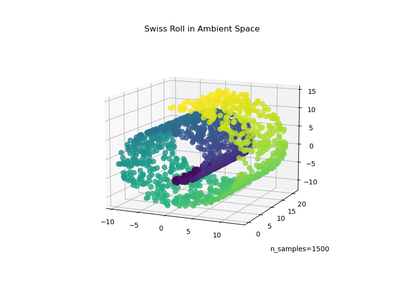
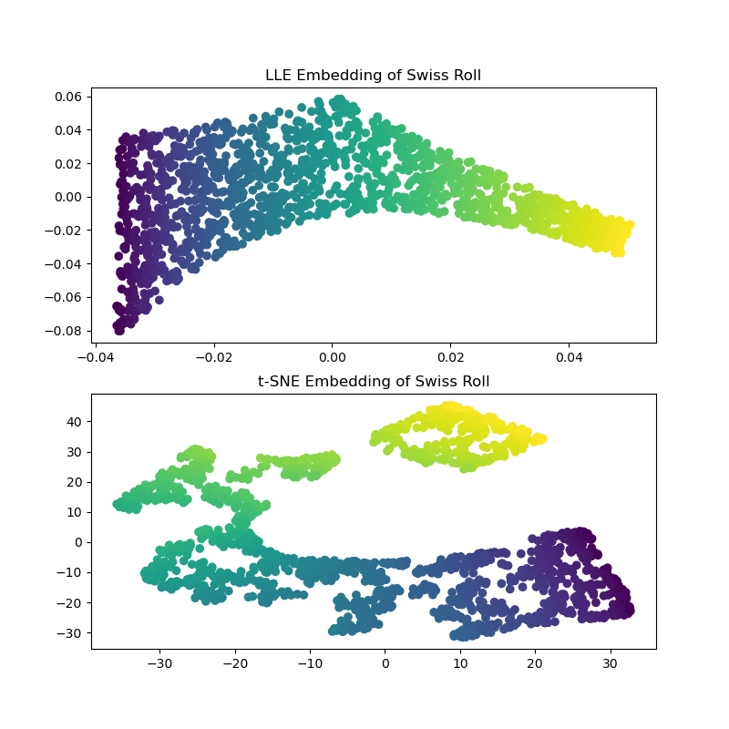
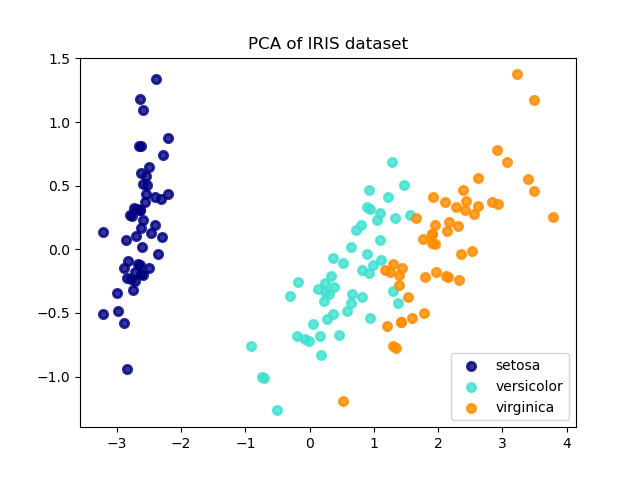
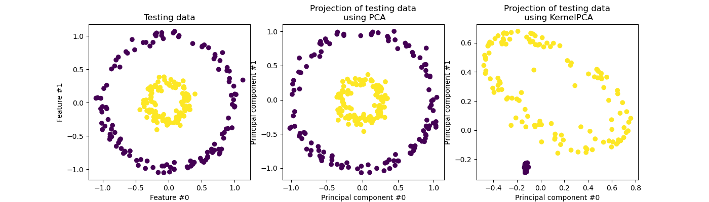
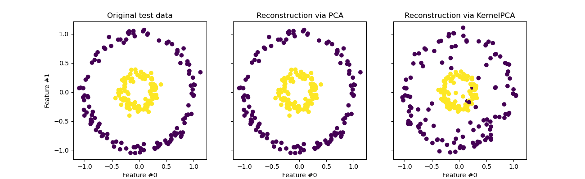
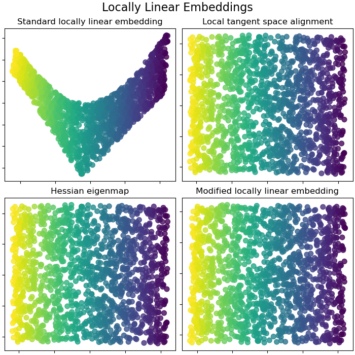
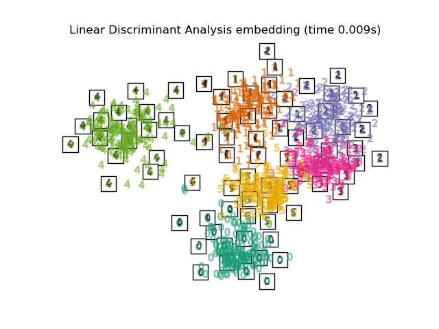
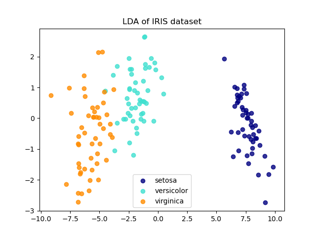
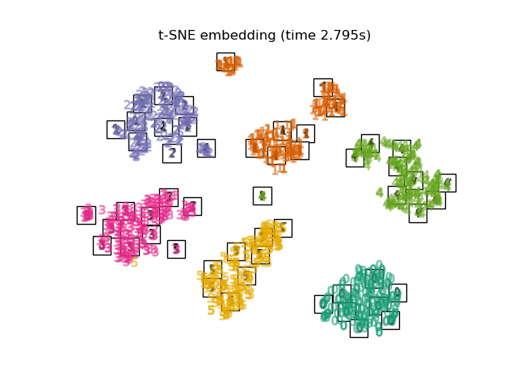
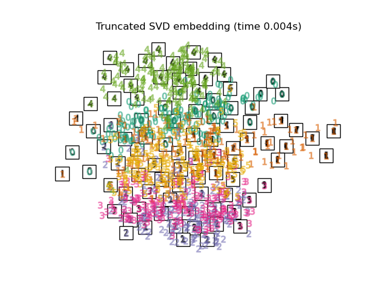

# Dimensionality Reduction

Dimensionality reduction is the process of reducing the number of features (dimensions) in a dataset while retaining as much meaningful information as possible. It is essential for fighting the curse of dimensionality, speeding up training, improving model generalization, and enabling data visualization.

## Table of Contents

- [The Curse of Dimensionality](#1-the-curse-of-dimensionality)
- [Main Approaches for Dimensionality Reduction](#2-main-approaches-for-dimensionality-reduction)
  - [Projection](#projection)
  - [Manifold Learning](#manifold-learning)
- [PCA (Principal Component Analysis)](#3-pca-principal-component-analysis)
  - [Preserving the Variance](#preserving-the-variance)
  - [Principal Components](#principal-components)
  - [The Covariance Matrix and Eigendecomposition](#the-covariance-matrix-and-eigendecomposition)
  - [Projecting Down to d Dimensions](#projecting-down-to-d-dimensions)
  - [Using Scikit-Learn](#using-scikit-learn)
  - [Explained Variance Ratio](#explained-variance-ratio)
  - [Choosing the Right Number of Dimensions](#choosing-the-right-number-of-dimensions)
- [PCA for Compression](#4-pca-for-compression)
- [Incremental PCA](#5-incremental-pca)
- [Randomized PCA](#6-randomized-pca)
- [Kernel PCA (kPCA)](#7-kernel-pca-kpca)
  - [Selecting a Kernel and Tuning Hyperparameters](#selecting-a-kernel-and-tuning-hyperparameters)
- [LLE (Locally Linear Embedding)](#8-lle-locally-linear-embedding)
  - [LLE Variants](#lle-variants)
- [LDA (Linear Discriminant Analysis)](#9-lda-linear-discriminant-analysis)
  - [PCA vs LDA](#pca-vs-lda)
- [Other Dimensionality Reduction Techniques](#10-other-dimensionality-reduction-techniques)
  - [t-SNE](#t-sne-t-distributed-stochastic-neighbor-embedding)
  - [MDS](#mds-multidimensional-scaling)
  - [Isomap](#isomap)
  - [UMAP](#umap-uniform-manifold-approximation-and-projection)
- [When Dimensionality Reduction Hurts](#when-dimensionality-reduction-hurts)
- [Algorithm Comparison Summary](#algorithm-comparison-summary)
- [How to Choose the Right Algorithm](#how-to-choose-the-right-algorithm)
- [General Best Practices](#general-best-practices)
- [Python Quick Reference](#python-quick-reference)

---

## 1. The Curse of Dimensionality

As the number of features grows, the volume of the feature space increases exponentially. This causes several problems:

- **Sparsity:** Data points become increasingly sparse in high-dimensional space. Even a large dataset can feel "small" because the points are spread so far apart.
- **Distance concentration:** In high dimensions, the difference between the nearest and farthest neighbors of a point shrinks, making distance-based algorithms (KNN, clustering) unreliable.
- **Overfitting:** More dimensions means more parameters to fit, and models can easily memorize noise instead of learning signal.
- **Computational cost:** Training time and memory usage grow rapidly with the number of features.

**Key intuition:** A random point in a unit hypercube in 1,000,000 dimensions is almost certainly near the boundary. Almost all the volume concentrates in a thin shell near the edges, making the interior essentially empty.

**Practical implication:** To maintain the same density of training data in higher dimensions, the required number of training instances grows exponentially. For most real-world problems, this is impossible — so we must reduce the number of dimensions instead.

---

## 2. Main Approaches for Dimensionality Reduction

There are two broad families of techniques:

### Projection

**Idea:** Project high-dimensional data onto a lower-dimensional subspace (a hyperplane or set of hyperplanes).

**How it works:** In many real-world datasets, features are highly correlated, so the data lies close to a lower-dimensional subspace within the high-dimensional space. Projection identifies this subspace and maps each data point onto it.

**Example:** A 3D dataset where all points lie near a 2D plane can be projected down to 2D by dropping the axis with the least variance.

**When it works well:**
- Data lies near a linear subspace (features are correlated)
- The underlying structure is roughly flat

**When it fails:**
- The data manifold is curved or twisted (e.g., a Swiss roll). A linear projection can squash distant parts of the manifold on top of each other, destroying the structure.

### Manifold Learning

**Idea:** Model the nonlinear low-dimensional surface (manifold) on which the data lies, then "unroll" or "unfold" it into a lower-dimensional space.

**How it works:** Based on the **manifold hypothesis** — the assumption that real-world high-dimensional data tends to lie near a much lower-dimensional nonlinear manifold. Manifold learning algorithms discover this structure and map data points to a low-dimensional representation that preserves local (and sometimes global) relationships.

**When it works well:**
- Data lies on a curved, twisted, or rolled surface
- You need to preserve local neighborhood structure

**When it fails:**
- The manifold hypothesis doesn't hold (data truly fills the high-dimensional space)
- The manifold is too complex or noisy for the algorithm to model

**Common pitfall:** The manifold assumption is often made implicitly, but it doesn't always hold. Dimensionality reduction isn't always beneficial — sometimes the low-dimensional representation discards important signal. Always validate that reducing dimensions actually helps your downstream task.

### Projection vs. Manifold Learning: The Swiss Roll Example

The **Swiss roll** is the classic dataset that illustrates the difference between projection and manifold learning. It's a 2D sheet rolled up into 3D space.

**The Swiss Roll in 3D** — a 2D manifold embedded in 3D space:



*Source: [scikit-learn — Swiss Roll and Swiss-Hole Reduction](https://scikit-learn.org/stable/auto_examples/manifold/plot_swissroll.html)*

**LLE vs t-SNE on the Swiss Roll** — manifold learning methods successfully unroll the structure:



*Source: [scikit-learn — Swiss Roll and Swiss-Hole Reduction](https://scikit-learn.org/stable/auto_examples/manifold/plot_swissroll.html)*

- **PCA (projection)** would squash the roll flat from above. Points from different layers of the roll land on top of each other — the structure is destroyed.
- **LLE (manifold learning)** "unrolls" the Swiss roll, preserving the 2D sheet structure so that nearby points on the manifold remain nearby in the 2D embedding.
- **t-SNE** preserves the general structure but tends to clump sections together.

This is the fundamental reason you need nonlinear methods for curved manifolds: a flat projection cannot distinguish points that are far apart on the manifold but close in Euclidean space.

---

## 3. PCA (Principal Component Analysis)

PCA is the most popular dimensionality reduction algorithm. It identifies the hyperplane that lies closest to the data and projects the data onto it, choosing the hyperplane that preserves the maximum amount of variance.

### Preserving the Variance

**Idea:** Among all possible projections, choose the one that maximizes the variance of the projected data. High variance means the projection retains the most information; low variance means important structure is being discarded.

**Why variance?** If you project data onto an axis where all projected points are nearly the same value (low variance), you've essentially lost the ability to distinguish those points — information is destroyed. Maximizing variance minimizes information loss.

**PCA on the Iris dataset** — projecting 4D data onto the 2 directions of maximum variance:



*Source: [scikit-learn — Comparison of LDA and PCA 2D projection of Iris dataset](https://scikit-learn.org/stable/auto_examples/decomposition/plot_pca_vs_lda.html)*

### Principal Components

A **principal component** is a unit vector that defines a direction of maximum variance in the data.

- The **first principal component** (PC1) is the direction along which the data varies the most.
- The **second principal component** (PC2) is the direction of maximum remaining variance, **orthogonal** to PC1.
- The $i$-th principal component is the direction of maximum remaining variance, orthogonal to all previous components.

**Mathematically:** PCA finds the eigenvectors (principal components) and eigenvalues (explained variance) of the data's covariance matrix. The eigenvectors define the directions; the eigenvalues tell you how much variance each direction captures.

**Computation:** The principal components are found via **Singular Value Decomposition (SVD)** of the centered data matrix:

$$\mathbf{X} = \mathbf{U} \boldsymbol{\Sigma} \mathbf{V}^T$$

The columns of $\mathbf{V}$ are the principal components. The diagonal values of $\boldsymbol{\Sigma}$ (singular values) relate to the variance captured by each component.

**Important:** PCA is sensitive to the scale of the features. **Always standardize** (zero mean, unit variance) your features before applying PCA. Otherwise, features with larger scales will dominate the principal components.

### The Covariance Matrix and Eigendecomposition

Understanding the math behind PCA solidifies the intuition.

**Step 1 — Center the data:** Subtract the mean of each feature so the data is centered at the origin.

$$\bar{\mathbf{x}} = \frac{1}{m} \sum_{i=1}^{m} \mathbf{x}_i \qquad \mathbf{X}_c = \mathbf{X} - \bar{\mathbf{x}}$$

**Step 2 — Compute the covariance matrix:** The covariance matrix $\mathbf{C}$ captures how every pair of features varies together.

$$\mathbf{C} = \frac{1}{m-1} \mathbf{X}_c^T \mathbf{X}_c$$

$\mathbf{C}$ is an $n \times n$ symmetric positive semi-definite matrix (where $n$ = number of features). Each entry $C_{ij}$ is the covariance between feature $i$ and feature $j$. The diagonal entries $C_{ii}$ are the variances of individual features.

**Step 3 — Eigendecomposition:** Decompose the covariance matrix into its eigenvectors and eigenvalues:

$$\mathbf{C} = \mathbf{V} \boldsymbol{\Lambda} \mathbf{V}^T$$

where $\mathbf{V}$ is the matrix of eigenvectors (principal components) and $\boldsymbol{\Lambda}$ is the diagonal matrix of eigenvalues.

| Symbol | Meaning |
|:---|:---|
| Eigenvector $\mathbf{v}_i$ | The $i$-th principal component direction |
| Eigenvalue $\lambda_i$ | The variance of the data projected onto $\mathbf{v}_i$ |
| $\lambda_i / \sum_j \lambda_j$ | The explained variance ratio of the $i$-th component |

**Connection to SVD:** In practice, PCA uses SVD instead of direct eigendecomposition because it is numerically more stable and efficient. The relationship is:

$$\text{If } \mathbf{X}_c = \mathbf{U} \boldsymbol{\Sigma} \mathbf{V}^T \text{, then } \mathbf{C} = \mathbf{V} \frac{\boldsymbol{\Sigma}^2}{m-1} \mathbf{V}^T$$

So the eigenvalues of the covariance matrix are $\lambda_i = \sigma_i^2 / (m-1)$, where $\sigma_i$ are the singular values.

```python
import numpy as np

# Manual PCA via covariance matrix (for understanding)
X_centered = X - X.mean(axis=0)
cov_matrix = np.cov(X_centered, rowvar=False)  # shape: (n_features, n_features)

eigenvalues, eigenvectors = np.linalg.eigh(cov_matrix)

# Sort by descending eigenvalue
sorted_idx = np.argsort(eigenvalues)[::-1]
eigenvalues = eigenvalues[sorted_idx]
eigenvectors = eigenvectors[:, sorted_idx]

# Explained variance ratio
explained_variance_ratio = eigenvalues / eigenvalues.sum()
print(f"First component explains {explained_variance_ratio[0]:.1%} of variance")
```

### Projecting Down to d Dimensions

Once you have the principal components, reduce dimensionality by:

1. Select the top $d$ principal components (those with the largest eigenvalues).
2. Project the data onto these $d$ components:

$$\mathbf{X}_{d\text{-proj}} = \mathbf{X} \cdot \mathbf{W}_d$$

where $\mathbf{W}_d$ is the matrix whose columns are the top $d$ principal components.

### Using Scikit-Learn

```python
from sklearn.decomposition import PCA
from sklearn.preprocessing import StandardScaler

# ALWAYS scale before PCA
scaler = StandardScaler()
X_scaled = scaler.fit_transform(X)

# Reduce to 2 dimensions
pca = PCA(n_components=2)
X_reduced = pca.fit_transform(X_scaled)

# Access the principal components (directions)
print(pca.components_)         # shape: (n_components, n_features)

# Explained variance per component
print(pca.explained_variance_ratio_)
```

### Explained Variance Ratio

The **explained variance ratio** tells you the proportion of the dataset's total variance captured by each principal component.

```python
pca = PCA().fit(X_scaled)
cumulative_variance = np.cumsum(pca.explained_variance_ratio_)

# Plot explained variance
import matplotlib.pyplot as plt

plt.plot(range(1, len(cumulative_variance) + 1), cumulative_variance)
plt.xlabel('Number of Components')
plt.ylabel('Cumulative Explained Variance')
plt.axhline(y=0.95, color='r', linestyle='--', label='95% threshold')
plt.legend()
plt.show()
```

**Interpretation:** If the first 10 components capture 95% of the variance, you can reduce the data to 10 dimensions with only a 5% loss of information (in terms of variance).

### Choosing the Right Number of Dimensions

There are several strategies:

| Strategy | How | When to Use |
|:---|:---|:---|
| **Variance threshold** | Choose $d$ such that cumulative explained variance $\geq$ a threshold (commonly 95%) | General-purpose |
| **Elbow method** | Plot explained variance vs. number of components, look for the "elbow" | Visual inspection |
| **Downstream task** | Set `n_components` to preserve a target variance, then evaluate downstream model performance | When dimensionality reduction is a preprocessing step |

```python
# Automatically choose d for 95% variance
pca = PCA(n_components=0.95)
X_reduced = pca.fit_transform(X_scaled)
print(f"Number of components: {pca.n_components_}")
```

### Pros, Cons, and Common Pitfalls of PCA

**Advantages:**
- Fast and efficient — relies on SVD, which is $O(\min(mn^2, m^2n))$ for an $m \times n$ matrix
- Well-understood, deterministic (up to sign flips)
- Optimal linear projection for preserving variance
- Works as both dimensionality reduction and a compression technique
- Can be applied to any numerical dataset

**Disadvantages:**
- **Linear only** — cannot capture nonlinear relationships. If the data lies on a curved manifold, PCA will produce poor results.
- **Assumes variance = information** — the direction of maximum variance may not be the most discriminative direction (LDA addresses this for classification).
- **Sensitive to scale** — features must be standardized first.
- **Sensitive to outliers** — outliers can dramatically distort the principal components. Consider using Robust PCA or removing outliers first.
- **Information loss** — even with 95% explained variance, the discarded 5% could contain signal important for your task.

**Common pitfalls:**
- Forgetting to scale features before PCA.
- Choosing the number of components arbitrarily instead of using explained variance or downstream evaluation.
- Applying PCA when the data is inherently nonlinear — use Kernel PCA or manifold learning instead.
- Interpreting principal components as meaningful "real-world" features — they are linear combinations of original features and may not have intuitive meaning.
- Fitting PCA on the full dataset (train + test) instead of only the training set. Always `fit` on train, `transform` on test to avoid data leakage.

---

## 4. PCA for Compression

PCA can be used to compress data by keeping only the top $d$ components, then reconstructing an approximation of the original data from the reduced representation.

$$\mathbf{X}_{\text{reconstructed}} = \mathbf{X}_{d\text{-proj}} \cdot \mathbf{W}_d^T$$

The **reconstruction error** measures how much information was lost:

$$\text{Reconstruction Error} = \frac{1}{m} \sum_{i=1}^{m} \| \mathbf{x}_i - \hat{\mathbf{x}}_i \|^2$$

This is equivalent to the variance **not** captured by the retained components.

```python
pca = PCA(n_components=154)  # MNIST: 784 → 154 dimensions (~95% variance)
X_reduced = pca.fit_transform(X_train)

# Reconstruct (decompress)
X_recovered = pca.inverse_transform(X_reduced)
```

**Use cases:** Compressing images, reducing storage requirements, speeding up downstream algorithms while accepting a small loss of fidelity.

---

## 5. Incremental PCA

Standard PCA requires the entire dataset to fit in memory (it uses full SVD). **Incremental PCA (IPCA)** processes the data in mini-batches, making it suitable for large or streaming datasets.

```python
from sklearn.decomposition import IncrementalPCA

n_batches = 100
inc_pca = IncrementalPCA(n_components=154)

for X_batch in np.array_split(X_train, n_batches):
    inc_pca.partial_fit(X_batch)

X_reduced = inc_pca.transform(X_train)
```

**Advantages:**
- Handles datasets that don't fit in memory
- Can process streaming data
- Produces results very similar to full PCA

**Disadvantages:**
- Slightly slower than full PCA (due to multiple passes or mini-batch overhead)
- Results can vary slightly depending on batch size and order
- Not as mathematically exact as full SVD-based PCA

**When to use:** Large datasets that don't fit in memory, or when data arrives in a stream.

### Using Incremental PCA with `np.memmap` (On-Disk Data)

For datasets stored on disk that are too large for RAM, you can use `np.memmap` to access the data file as if it were an in-memory array, without loading it all at once:

```python
import numpy as np
from sklearn.decomposition import IncrementalPCA

# Assume X_train has been saved to disk as a memmap file
filename = "my_large_dataset.dat"
# Save (do this once)
X_mm = np.memmap(filename, dtype='float32', mode='w+', shape=X_train.shape)
X_mm[:] = X_train
del X_mm  # flush to disk

# Load as memory-mapped file (doesn't load into RAM)
X_mm = np.memmap(filename, dtype='float32', mode='r', shape=X_train.shape)

# Incremental PCA on memory-mapped data
n_batches = 100
inc_pca = IncrementalPCA(n_components=154, batch_size=X_mm.shape[0] // n_batches)
inc_pca.fit(X_mm)  # Scikit-Learn automatically processes in batches

X_reduced = inc_pca.transform(X_mm)
```

This pattern lets you run PCA on datasets far larger than available RAM.

---

## 6. Randomized PCA

When the number of dimensions to reduce to ($d$) is much smaller than the number of original features ($n$), **Randomized PCA** uses a stochastic algorithm to quickly approximate the top $d$ principal components. Scikit-Learn uses this by default when `n_components` is significantly smaller than `n_features`.

```python
# Scikit-Learn uses randomized PCA by default when appropriate
pca = PCA(n_components=154, svd_solver='randomized')
X_reduced = pca.fit_transform(X_train)

# Force full SVD
pca_full = PCA(n_components=154, svd_solver='full')
```

**Advantages:**
- Dramatically faster than full SVD, especially for large matrices: $O(m \cdot d^2) + O(d^3)$ vs $O(m \cdot n^2)$
- Memory-efficient — doesn't need to compute the full SVD
- Typically produces results very close to exact PCA

**Disadvantages:**
- Approximate — results can vary slightly between runs (set `random_state` for reproducibility)
- Less accurate when $d$ is close to $n$

**When to use:** High-dimensional datasets where you want a moderate-to-large reduction in dimensionality. The go-to choice for most practical PCA applications.

---

## 7. Kernel PCA (kPCA)

Kernel PCA applies the **kernel trick** to PCA, enabling it to perform nonlinear dimensionality reduction. It implicitly maps data to a higher-dimensional space using a kernel function, then performs PCA in that space.

**PCA vs Kernel PCA on concentric circles** — linear PCA cannot separate the two classes, but RBF Kernel PCA untangles them:



*Source: [scikit-learn — Kernel PCA](https://scikit-learn.org/stable/auto_examples/decomposition/plot_kernel_pca.html)*

**Reconstruction: PCA is exact, Kernel PCA is approximate:**



*Source: [scikit-learn — Kernel PCA](https://scikit-learn.org/stable/auto_examples/decomposition/plot_kernel_pca.html)*

```python
from sklearn.decomposition import KernelPCA

# RBF (Gaussian) kernel
kpca = KernelPCA(n_components=2, kernel='rbf', gamma=0.04)
X_reduced = kpca.fit_transform(X)
```

### Common Kernels

| Kernel | When to Use |
|:---|:---|
| **Linear** | Equivalent to regular PCA |
| **RBF (Gaussian)** | General-purpose nonlinear; most commonly used |
| **Polynomial** | When polynomial relationships exist between features |
| **Sigmoid** | Rarely used; can mimic neural network behavior |

### Selecting a Kernel and Tuning Hyperparameters

Unlike regular PCA, Kernel PCA does not have a straightforward explained variance ratio. Choosing the kernel and its hyperparameters requires indirect evaluation:

**Strategy 1 — Grid search with downstream task:**
```python
from sklearn.model_selection import GridSearchCV
from sklearn.pipeline import Pipeline
from sklearn.linear_model import LogisticRegression

pipeline = Pipeline([
    ("kpca", KernelPCA(n_components=2)),
    ("clf", LogisticRegression()),
])

param_grid = {
    "kpca__kernel": ["rbf", "poly", "sigmoid"],
    "kpca__gamma": np.linspace(0.03, 0.05, 10),
}

grid = GridSearchCV(pipeline, param_grid, cv=3)
grid.fit(X_train, y_train)
print(grid.best_params_)
```

**Strategy 2 — Reconstruction error:**
```python
kpca = KernelPCA(n_components=2, kernel='rbf', gamma=0.04, fit_inverse_transform=True)
X_reduced = kpca.fit_transform(X)
X_reconstructed = kpca.inverse_transform(X_reduced)

reconstruction_error = np.mean(np.sum((X - X_reconstructed) ** 2, axis=1))
```

**Advantages:**
- Handles nonlinear relationships that PCA cannot
- Leverages the kernel trick — no need to explicitly compute the high-dimensional mapping
- Powerful for complex, nonlinear datasets

**Disadvantages:**
- Computationally expensive: $O(m^2)$ memory and $O(m^3)$ time for the kernel matrix
- No explained variance ratio — harder to choose the number of components
- Kernel and hyperparameter selection requires cross-validation or reconstruction error
- Does not scale well to very large datasets
- `inverse_transform` is approximate (requires training a separate model)

**Common pitfalls:**
- Using Kernel PCA on a dataset where regular PCA suffices — adds complexity without benefit.
- Forgetting to tune the kernel hyperparameters (e.g., `gamma` for RBF). Default values rarely work well.
- Trying to use Kernel PCA on very large datasets without considering the $O(m^2)$ memory requirement.

---

## 8. LLE (Locally Linear Embedding)

LLE is a powerful **nonlinear** manifold learning technique. Unlike PCA-based methods, it does not rely on projections. Instead, it tries to preserve the **local linear relationships** between each data point and its nearest neighbors.

**How it works (two steps):**

1. **Find local relationships:** For each data point, find its $k$ nearest neighbors and compute the weights $w_{ij}$ that best reconstruct each point as a linear combination of its neighbors (by minimizing $\| \mathbf{x}_i - \sum_j w_{ij} \mathbf{x}_j \|^2$).

2. **Find low-dimensional embedding:** Fix the weights and find the low-dimensional coordinates $\mathbf{z}_i$ that best preserve these local linear relationships (by minimizing $\| \mathbf{z}_i - \sum_j w_{ij} \mathbf{z}_j \|^2$).

```python
from sklearn.manifold import LocallyLinearEmbedding

lle = LocallyLinearEmbedding(n_components=2, n_neighbors=10)
X_reduced = lle.fit_transform(X)
```

**Advantages:**
- Excels at unrolling nonlinear manifolds (e.g., the Swiss roll)
- Preserves local neighborhood structure
- No kernel hyperparameters to tune (just $k$ and $d$)

**Disadvantages:**
- Sensitive to the choice of $k$ (number of neighbors). Too few → noisy embedding; too many → loses local structure.
- Computationally expensive: $O(m^2)$ for nearest neighbor search, $O(m^2 n)$ for weight computation, and sparse eigenvalue problem for embedding.
- Does not handle large datasets well
- Cannot naturally transform new data points (no `transform` method for out-of-sample data)
- Sensitive to noise
- Does not preserve global structure well — only local relationships are maintained

**Common pitfalls:**
- Setting $k$ too small (noisy, disconnected manifold) or too large (over-smoothing, losing local structure).
- Expecting LLE to preserve global distances — it only preserves local relationships.
- Applying LLE to datasets where the manifold hypothesis doesn't hold.
- Forgetting that LLE has no `transform` method — you can't project new unseen data.

### LLE Variants

Standard LLE can produce poor results when the manifold is not well-sampled or when the regularization is insufficient. Scikit-Learn provides improved variants:

**Comparison of LLE variants on the S-curve** — Standard LLE, LTSA, Hessian LLE, and Modified LLE:



*Source: [scikit-learn — Comparison of Manifold Learning methods](https://scikit-learn.org/stable/auto_examples/manifold/plot_compare_methods.html)*

| Variant | Key Idea | When to Use |
|:---|:---|:---|
| **Standard LLE** | Reconstruct each point from its neighbors, preserve weights in low-D | Simple manifolds, well-sampled data |
| **Modified LLE** | Uses multiple weight vectors per neighborhood to regularize the embedding | When standard LLE produces distorted results; better at handling non-uniform sampling |
| **Hessian LLE** | Uses local Hessian (curvature) estimates instead of simple linear reconstruction | When the manifold has varying curvature; more theoretically grounded than standard LLE |
| **LTSA** (Local Tangent Space Alignment) | Aligns local tangent spaces to produce a global embedding | Similar to Hessian LLE; requires $k > d$ (neighbors > target dimensions) |

```python
from sklearn.manifold import LocallyLinearEmbedding

# Standard LLE
lle_standard = LocallyLinearEmbedding(n_components=2, n_neighbors=10, method='standard')

# Modified LLE — often more robust
lle_modified = LocallyLinearEmbedding(n_components=2, n_neighbors=10, method='modified')

# Hessian LLE — requires n_neighbors > n_components * (n_components + 3) / 2
lle_hessian = LocallyLinearEmbedding(n_components=2, n_neighbors=12, method='hessian')

# LTSA
lle_ltsa = LocallyLinearEmbedding(n_components=2, n_neighbors=10, method='ltsa')
```

**Tip:** If standard LLE gives noisy or distorted results, try **Modified LLE** first — it's the most practical improvement.

---

## 9. LDA (Linear Discriminant Analysis)

LDA is a **supervised** dimensionality reduction technique. Unlike PCA (which is unsupervised and maximizes variance), LDA finds the linear combinations of features that best **separate the classes**.

**How it works:**

1. Compute the **within-class scatter matrix** $\mathbf{S}_W$: measures how spread out each class is internally.
2. Compute the **between-class scatter matrix** $\mathbf{S}_B$: measures how far apart the class means are from each other.
3. Find the directions (linear discriminants) that maximize the ratio $\mathbf{S}_B / \mathbf{S}_W$ — i.e., maximize class separation while minimizing within-class spread.
4. Project the data onto the top $d$ discriminant directions.

$$\mathbf{S}_W = \sum_{k=1}^{K} \sum_{\mathbf{x} \in C_k} (\mathbf{x} - \boldsymbol{\mu}_k)(\mathbf{x} - \boldsymbol{\mu}_k)^T$$

$$\mathbf{S}_B = \sum_{k=1}^{K} n_k (\boldsymbol{\mu}_k - \boldsymbol{\mu})(\boldsymbol{\mu}_k - \boldsymbol{\mu})^T$$

where $K$ = number of classes, $\boldsymbol{\mu}_k$ = mean of class $k$, $\boldsymbol{\mu}$ = overall mean, $n_k$ = number of samples in class $k$.

The discriminant directions are the eigenvectors of $\mathbf{S}_W^{-1} \mathbf{S}_B$.

**Key constraint:** LDA can produce at most $K - 1$ discriminant components (where $K$ is the number of classes). For binary classification, LDA reduces to a single dimension.

**LDA on handwritten digits** — supervised projection achieves good class separation:



*Source: [scikit-learn — Manifold learning on handwritten digits](https://scikit-learn.org/stable/auto_examples/manifold/plot_lle_digits.html)*

```python
from sklearn.discriminant_analysis import LinearDiscriminantAnalysis

# Reduce to 2 dimensions (requires at least 3 classes)
lda = LinearDiscriminantAnalysis(n_components=2)
X_lda = lda.fit_transform(X_train, y_train)  # NOTE: requires labels y

# LDA can also be used directly as a classifier
lda_clf = LinearDiscriminantAnalysis()
lda_clf.fit(X_train, y_train)
y_pred = lda_clf.predict(X_test)
```

**Advantages:**
- **Supervised** — uses label information to find the most discriminative directions, often yielding better class separation than PCA.
- Serves double duty as both a dimensionality reduction technique and a classifier.
- Fast and efficient — similar computational cost to PCA.
- The resulting components directly relate to class separability.

**Disadvantages:**
- **Requires labels** — cannot be used for unsupervised tasks or visualization of unlabeled data.
- **At most $K - 1$ components** — for binary classification you get only 1 dimension. This is a hard limit.
- **Assumes Gaussian class distributions** with equal covariance matrices. Violating this assumption degrades performance.
- **Linear only** — cannot capture nonlinear class boundaries (use Kernel LDA or other methods).
- Sensitive to class imbalance and outliers.

**Common pitfalls:**
- Using LDA when classes are severely imbalanced — the between-class scatter will be dominated by the large class.
- Forgetting that LDA needs labels — it can't be used on unlabeled data.
- Expecting more than $K - 1$ components — if you have 3 classes, you can get at most 2 LDA dimensions.
- Applying LDA to non-Gaussian data without validating the assumption.

### PCA vs LDA

This is a frequently asked comparison:

**Side by side on the Iris dataset** — PCA maximizes variance, LDA maximizes class separation:

 

*Source: [scikit-learn — Comparison of LDA and PCA 2D projection of Iris dataset](https://scikit-learn.org/stable/auto_examples/decomposition/plot_pca_vs_lda.html)*

Notice how LDA produces tighter, better-separated clusters for the three Iris species because it uses the class labels to find the most discriminative directions.

| Aspect | PCA | LDA |
|:---|:---|:---|
| **Type** | Unsupervised | Supervised |
| **Objective** | Maximize variance | Maximize class separation |
| **Needs labels?** | No | Yes |
| **Max components** | $\min(m, n)$ | $K - 1$ |
| **Assumptions** | None (but works best with correlated features) | Gaussian classes, equal covariance |
| **Best for** | General preprocessing, compression, visualization | Classification preprocessing |
| **When it shines** | High variance aligns with useful structure | Classes are well-separated and roughly Gaussian |
| **When it fails** | Variance direction ≠ discriminative direction | Non-Gaussian classes, $K$ is small |

**When to choose which:**
- **No labels available** → PCA (only option)
- **Classification task with Gaussian-ish classes** → LDA (uses label info, often better separation)
- **Many classes, need many components** → PCA (LDA is limited to $K - 1$)
- **Unsure** → Try both, evaluate on the downstream task

---

## 10. Other Dimensionality Reduction Techniques

### t-SNE (t-Distributed Stochastic Neighbor Embedding)

**Purpose:** Primarily used for **visualization** of high-dimensional data in 2D or 3D. It preserves local structure and tends to produce well-separated clusters.

**t-SNE on handwritten digits** — each digit class forms a distinct, well-separated cluster:



*Source: [scikit-learn — Manifold learning on handwritten digits](https://scikit-learn.org/stable/auto_examples/manifold/plot_lle_digits.html)*

Compare with **Truncated SVD (linear PCA variant)** on the same digits — much more overlap between classes:



*Source: [scikit-learn — Manifold learning on handwritten digits](https://scikit-learn.org/stable/auto_examples/manifold/plot_lle_digits.html)*

```python
from sklearn.manifold import TSNE

tsne = TSNE(n_components=2, random_state=42, perplexity=30)
X_reduced = tsne.fit_transform(X)
```

**Advantages:**
- Produces excellent visualizations with clear cluster separation
- Preserves local structure very well

**Disadvantages:**
- Very slow: $O(m^2)$ or $O(m \log m)$ with Barnes-Hut approximation
- Non-deterministic (results vary between runs; set `random_state`)
- Cannot transform new data (no `transform` method)
- Not suitable for dimensionality reduction as a preprocessing step — use for visualization only
- The `perplexity` hyperparameter significantly affects results and must be tuned
- **Cluster sizes and distances between clusters in t-SNE plots are NOT meaningful** — do not interpret them

**Common pitfalls:**
- Interpreting cluster sizes or inter-cluster distances as meaningful.
- Using t-SNE as a preprocessing step for a downstream model (use PCA or UMAP instead).
- Running on the full high-dimensional data — it's common practice to first reduce to ~50 dimensions with PCA, then apply t-SNE.

### MDS (Multidimensional Scaling)

**Purpose:** Finds a low-dimensional representation that preserves pairwise distances between points as well as possible.

```python
from sklearn.manifold import MDS

mds = MDS(n_components=2, random_state=42)
X_reduced = mds.fit_transform(X)
```

**Advantages:**
- Preserves global pairwise distances
- Interpretable — distances in the low-dimensional space approximate distances in the original space

**Disadvantages:**
- Very slow: $O(m^3)$ — impractical for large datasets
- Can get stuck in local minima
- No `transform` method for new data

### Isomap

**Purpose:** Extends MDS by using **geodesic distances** (shortest path along the manifold) instead of Euclidean distances. This allows it to unroll nonlinear manifolds.

```python
from sklearn.manifold import Isomap

isomap = Isomap(n_components=2, n_neighbors=5)
X_reduced = isomap.fit_transform(X)
```

**Advantages:**
- Preserves geodesic distances — can unroll nonlinear manifolds (e.g., Swiss roll)
- Has a `transform` method for new data

**Disadvantages:**
- Sensitive to `n_neighbors` and noise
- Computationally expensive for large datasets
- Assumes a single connected manifold

### UMAP (Uniform Manifold Approximation and Projection)

**Purpose:** A modern alternative to t-SNE that is faster, scales better, and preserves more global structure.

```python
# Requires: pip install umap-learn
import umap

reducer = umap.UMAP(n_components=2, random_state=42)
X_reduced = reducer.fit_transform(X)
```

**Advantages:**
- Faster than t-SNE and scales to larger datasets
- Preserves both local and (some) global structure
- Has a `transform` method for new data
- Can be used as a general-purpose dimensionality reduction step (not just visualization)

**Disadvantages:**
- Hyperparameters (`n_neighbors`, `min_dist`) significantly affect results
- Less theoretically grounded than PCA
- External library (not in Scikit-Learn)

---

## When Dimensionality Reduction Hurts

Dimensionality reduction is not always beneficial. Here are concrete scenarios where it can actively damage performance:

**1. Tree-based models on moderate-dimensional data.**
Decision Trees, Random Forests, and Gradient Boosting handle high dimensions natively (they select features at each split). Applying PCA destroys the individual feature semantics that trees rely on, often lowering accuracy without meaningful speedup.

**2. When discriminative features have low variance.**
PCA keeps high-variance directions and discards low-variance ones. But a feature with small variance can be the most important for classification (e.g., a binary indicator feature). PCA would discard it. LDA is safer here for classification tasks.

**3. Sparse data (text, one-hot encodings).**
Sparse matrices are memory-efficient and many algorithms (linear SVMs, Naive Bayes) handle them natively. PCA densifies the data, destroying sparsity and increasing memory usage. Use TruncatedSVD (sparse-compatible PCA) or feature selection instead.

**4. When the dataset is already low-dimensional.**
If you have 20 features, the overhead of fitting PCA and tuning the number of components may outweigh any benefit. The curse of dimensionality isn't a problem at 20 dimensions with a reasonably sized dataset.

**5. When interpretability is critical.**
Regulators, doctors, or stakeholders may need to understand which specific features drive predictions. PCA components are opaque linear combinations. In these cases, prefer **feature selection** (SelectKBest, mutual information, L1 regularization) over dimensionality reduction.

**6. Information-critical applications.**
In medical imaging or anomaly detection, the "rare" signal might live in the low-variance components that PCA discards. Always validate that reducing dimensions doesn't degrade task-specific performance.

**Rule of thumb:** Always compare your model's performance with and without dimensionality reduction. If accuracy drops or training time doesn't meaningfully improve, skip it.

---

## Algorithm Comparison Summary

| Algorithm | Type | Linear? | Supervised? | Scalability | Preserves | `transform`? | Best For |
|:---|:---|:---|:---|:---|:---|:---|:---|
| **PCA** | Projection | Yes | No | Excellent | Global variance | Yes | General-purpose, preprocessing |
| **Incremental PCA** | Projection | Yes | No | Excellent (streaming) | Global variance | Yes | Large/streaming datasets |
| **Randomized PCA** | Projection | Yes | No | Excellent | Global variance | Yes | High-dimensional data |
| **Kernel PCA** | Projection (kernel) | No | No | Poor ($O(m^3)$) | Nonlinear structure | Yes (approx.) | Nonlinear structure |
| **LDA** | Projection | Yes | Yes | Excellent | Class separation | Yes | Classification preprocessing |
| **LLE** | Manifold | No | No | Moderate | Local geometry | No | Manifold unrolling |
| **t-SNE** | Manifold | No | No | Poor ($O(m^2)$) | Local structure | No | Visualization only |
| **MDS** | Manifold | No | No | Poor ($O(m^3)$) | Pairwise distances | No | Small datasets |
| **Isomap** | Manifold | No | No | Moderate | Geodesic distances | Yes | Manifold unrolling |
| **UMAP** | Manifold | No | No | Good | Local + some global | Yes | Visualization + preprocessing |

---

## How to Choose the Right Algorithm

| Scenario | Recommended | Why |
|:---|:---|:---|
| **General preprocessing** (speed up training) | **PCA** (randomized) | Fast, effective, well-understood |
| **Classification preprocessing** (labels available) | **LDA** | Maximizes class separation using label information |
| **Data doesn't fit in memory** | **Incremental PCA** | Processes data in mini-batches |
| **Nonlinear data + supervised task** | **Kernel PCA** | Captures nonlinear structure with kernel trick |
| **Visualization (2D/3D)** | **t-SNE** or **UMAP** | Excellent cluster separation |
| **Unrolling a manifold** | **LLE** or **Isomap** | Preserves manifold geometry |
| **Fast nonlinear reduction + new data** | **UMAP** | Fast, supports `transform` |
| **Preserve global distances** | **MDS** or **Isomap** | Optimizes pairwise distance preservation |
| **Sparse data (text, one-hot)** | **TruncatedSVD** or feature selection | Preserves sparsity; PCA densifies |

---

## General Best Practices

1. **Always scale your data** before applying PCA or other distance-based methods (use `StandardScaler`).
2. **Start with PCA.** It's fast, simple, and often sufficient. Only move to nonlinear methods if PCA clearly fails.
3. **Evaluate on the downstream task.** The best number of dimensions and the best algorithm are the ones that maximize your downstream model's performance, not necessarily the ones that preserve the most variance.
4. **Don't blindly reduce dimensions.** Sometimes the full-dimensional data works best. Always compare with a baseline.
5. **Watch for data leakage.** Fit the dimensionality reduction model on the training set only, then `transform` the test set.
6. **For visualization, use t-SNE or UMAP.** For preprocessing, use PCA or UMAP.
7. **Combine techniques.** It's valid to chain methods (e.g., PCA to ~50 dimensions, then t-SNE to 2D for visualization).

---

## Python Quick Reference

```python
from sklearn.decomposition import PCA, IncrementalPCA, KernelPCA
from sklearn.discriminant_analysis import LinearDiscriminantAnalysis
from sklearn.manifold import TSNE, LocallyLinearEmbedding, MDS, Isomap
from sklearn.preprocessing import StandardScaler

# Always scale first
scaler = StandardScaler()
X_scaled = scaler.fit_transform(X_train)

# PCA — general-purpose
pca = PCA(n_components=0.95)                       # keep 95% variance
X_pca = pca.fit_transform(X_scaled)

# Incremental PCA — large datasets
ipca = IncrementalPCA(n_components=154)
for batch in np.array_split(X_scaled, 100):
    ipca.partial_fit(batch)
X_ipca = ipca.transform(X_scaled)

# Randomized PCA — fast for high-dimensional data
rpca = PCA(n_components=154, svd_solver='randomized', random_state=42)
X_rpca = rpca.fit_transform(X_scaled)

# Kernel PCA — nonlinear
kpca = KernelPCA(n_components=2, kernel='rbf', gamma=0.04)
X_kpca = kpca.fit_transform(X_scaled)

# LDA — supervised, requires labels
lda = LinearDiscriminantAnalysis(n_components=2)
X_lda = lda.fit_transform(X_scaled, y_train)       # NOTE: needs y

# LLE — manifold learning
lle = LocallyLinearEmbedding(n_components=2, n_neighbors=10)
X_lle = lle.fit_transform(X_scaled)

# t-SNE — visualization
tsne = TSNE(n_components=2, perplexity=30, random_state=42)
X_tsne = tsne.fit_transform(X_scaled)

# MDS — preserve distances
mds = MDS(n_components=2, random_state=42)
X_mds = mds.fit_transform(X_scaled)

# Isomap — geodesic distances
isomap = Isomap(n_components=2, n_neighbors=5)
X_isomap = isomap.fit_transform(X_scaled)
```
