# Support Vector Machines (SVMs)

Support Vector Machines are **supervised learning models** that find the optimal hyperplane separating classes by maximizing the margin between the closest data points of each class. 

**Core idea:** Instead of just finding *any* boundary that separates the classes, SVMs find the boundary that is **as far as possible** from the nearest training points of each class. This maximum-margin property gives SVMs strong generalization.

---

## Linear SVM Classification

A Linear SVM finds a hyperplane $\mathbf{w} \cdot \mathbf{x} + b = 0$ that separates two classes with the **largest possible margin**.

### What is Large Margin Classification?

Imagine you have two groups of points on a table and you need to draw a line between them. Many different lines could separate them correctly — but which line is "best"?

The SVM answer: **the line that stays as far away as possible from the closest points on each side**. This distance is called the **margin**, and maximizing it is called **large margin classification**.

**Why does a large margin matter?**
- A large margin means the model has a **buffer zone** between the classes
- New, unseen data points that fall near the boundary are still classified correctly (they land in the buffer)
- A narrow margin is fragile — slight noise or new data can cross it and get misclassified
- Larger margins give **better generalization** to unseen data

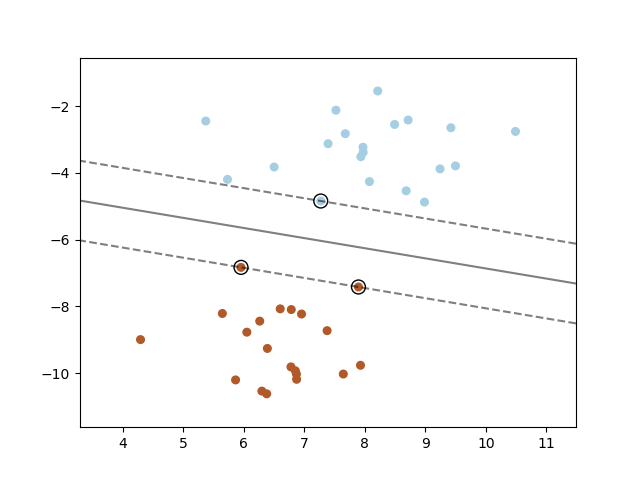

*The SVM finds the maximum margin hyperplane (solid black line) that separates the two classes. The margin is the region between the two dashed lines. The wider this margin, the more robust the classifier. (Source: scikit-learn)*

### What is a Support Vector?

A **support vector** is a training instance that lies **exactly on the margin boundary** (or inside/across it in the soft margin case). These are the "hardest" points to classify — the ones closest to the other class.

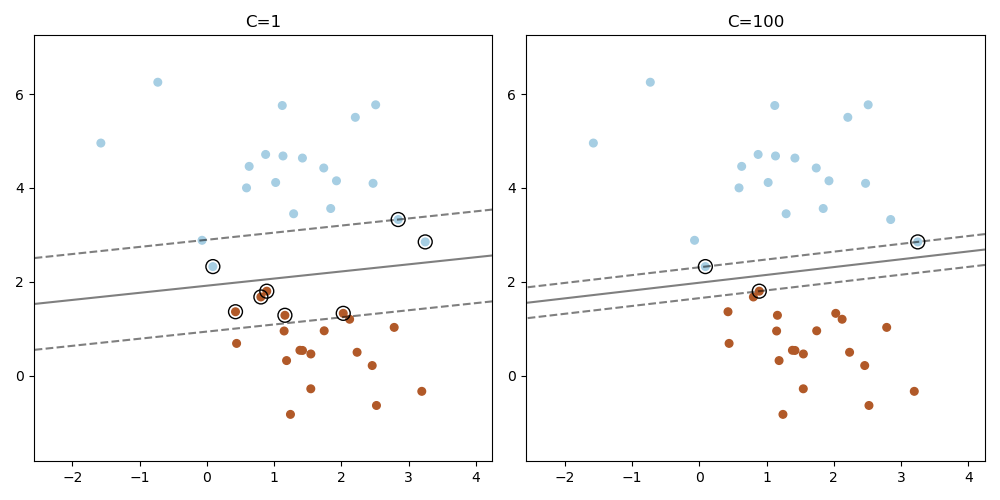

*Support vectors (circled points) are the training instances that define the margin. They sit right at the edge. All other points could be removed without changing the decision boundary at all. (Source: scikit-learn)*

**Key properties of support vectors:**
- **Only support vectors determine the hyperplane.** Remove all other training points, retrain, and you get the exact same model.
- After training, `model.support_vectors_` gives the support vectors; `model.n_support_` tells you how many per class.
- **Fewer support vectors = simpler model** with better generalization.
- At prediction time, only the support vectors are used — not the full training set.

```python
from sklearn.svm import SVC

model = SVC(kernel='linear', C=1.0)
model.fit(X_train, y_train)

print(f"Support vectors per class: {model.n_support_}")
print(f"Total support vectors: {len(model.support_vectors_)} out of {len(X_train)} training points")
```

### Why Feature Scaling is Critical for SVMs

SVMs compute **distances** — the margin width, kernel similarities (e.g., $\|\mathbf{x}_i - \mathbf{x}_j\|^2$ in RBF), and the regularization term $\|\mathbf{w}\|^2$ all depend on the magnitude of features. If features are on different scales, the SVM effectively **ignores the smaller-scale features**.

**Example:** With "income" (20,000–200,000) and "age" (18–65), the distance between two points is dominated by income. The SVM essentially treats age as irrelevant.

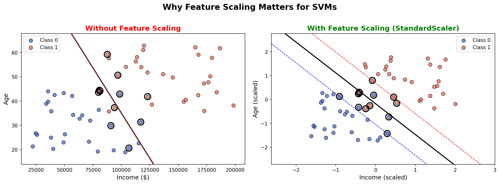

*Left: Without scaling — the decision boundary is nearly horizontal because the income axis (range 20k–200k) dwarfs the age axis (range 18–65). The SVM "can't see" the age feature. Right: With StandardScaler — both features contribute equally, and the SVM finds a much better decision boundary. Support vectors are circled.*

**Always scale your features:**

```python
from sklearn.preprocessing import StandardScaler
from sklearn.pipeline import Pipeline
from sklearn.svm import SVC

# Best practice: always wrap SVM in a pipeline with scaling
model = Pipeline([
    ('scaler', StandardScaler()),
    ('svm', SVC(kernel='linear', C=1.0))
])
model.fit(X_train, y_train)
```

> **Note:** `gamma='scale'` (default in scikit-learn) sets $\gamma = \frac{1}{n \cdot \text{Var}(X)}$, which partially accounts for feature scale. But explicit scaling is still recommended for best results and faster convergence.

### Decision Function and the Margin

**Decision function:**

$$f(\mathbf{x}) = \mathbf{w} \cdot \mathbf{x} + b$$

- If $f(\mathbf{x}) \geq 0$ → class 1
- If $f(\mathbf{x}) < 0$ → class 0 (or class -1)

**The margin** is the distance between the two parallel hyperplanes $\mathbf{w} \cdot \mathbf{x} + b = +1$ and $\mathbf{w} \cdot \mathbf{x} + b = -1$:

$$\text{margin} = \frac{2}{\|\mathbf{w}\|}$$

Maximizing the margin is equivalent to **minimizing** $\|\mathbf{w}\|$ (or $\frac{1}{2}\|\mathbf{w}\|^2$ for mathematical convenience).

**Hard Margin Classification** requires that all instances are correctly classified and lie outside the margin. This only works if the data is **perfectly linearly separable** and is very sensitive to outliers.

```python
from sklearn.svm import SVC

# Hard margin: very large C means almost no tolerance for misclassification
model = SVC(kernel='linear', C=1e6)
model.fit(X_train, y_train)
```

---

## Soft Margin Classification

In the real world, data is rarely perfectly separable. **Soft margin** SVMs allow some misclassifications by introducing **slack variables** $\xi_i \geq 0$ that measure how much each instance violates the margin.

**Optimization objective:**

$$\min_{\mathbf{w}, b, \xi} \quad \frac{1}{2}\|\mathbf{w}\|^2 + C \sum_{i=1}^{m} \xi_i$$

Subject to:

$$y_i(\mathbf{w} \cdot \mathbf{x}_i + b) \geq 1 - \xi_i \quad \text{and} \quad \xi_i \geq 0$$

**The hyperparameter $C$ controls the tradeoff:**

| $C$ Value | Behavior | Risk |
|-----------|----------|------|
| **Large $C$** | Few margin violations allowed — narrow margin, fits training data closely | Overfitting |
| **Small $C$** | Many margin violations allowed — wide margin, more regularization | Underfitting |

**Think of $C$ as the inverse of regularization strength:** large $C$ = low regularization, small $C$ = high regularization (and good when overfitting).

**Visual intuition — Effect of $C$ on the margin:**

| Large $C$ (less regularization) | Small $C$ (more regularization) |
|:---:|:---:|
| 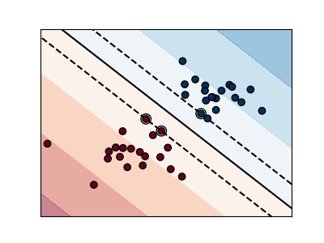 | 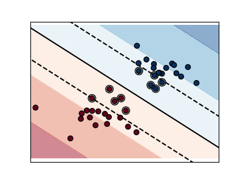 |

*Left: Large $C$ — the model tries hard to classify every point correctly, resulting in a narrow margin. Right: Small $C$ — the model allows more violations, resulting in a wider, more generalizable margin. Support vectors are circled. (Source: scikit-learn)*

```python
from sklearn.svm import LinearSVC

# Soft margin with moderate regularization
model = LinearSVC(C=1.0, loss='hinge', max_iter=5000)
model.fit(X_train, y_train)
```

**When to use:**
- Default approach for linear SVM classification
- Always prefer soft margin over hard margin in practice (robust to outliers and noise)

---

### How to Choose $C$

$C$ is the most important hyperparameter in SVMs. There is no universal "best" value — it depends on your data.

**Step 1 — Understand what $C$ does:**

| $C$ | Margin | Training accuracy | Generalization | Risk |
|-----|--------|-------------------|----------------|------|
| Very small (e.g., 0.001) | Very wide | Low | May be too smooth | Underfitting |
| Small (e.g., 0.1) | Wide | Moderate | Good regularization | Slight underfitting |
| Medium (e.g., 1.0) | Balanced | Good | Good balance | **Good starting point** |
| Large (e.g., 100) | Narrow | High | May not generalize | Overfitting |
| Very large (e.g., 1e6) | Nearly hard margin | Very high | Poor | Severe overfitting |

**Step 2 — Use cross-validation to find the best $C$:**

```python
from sklearn.model_selection import GridSearchCV
from sklearn.pipeline import Pipeline
from sklearn.preprocessing import StandardScaler
from sklearn.svm import LinearSVC

model = Pipeline([
    ('scaler', StandardScaler()),
    ('svm', LinearSVC(loss='hinge', max_iter=10000))
])

# Search over a logarithmic range (always use log scale for C)
param_grid = {'svm__C': [0.001, 0.01, 0.1, 1, 10, 100, 1000]}
grid = GridSearchCV(model, param_grid, cv=5, scoring='accuracy', n_jobs=-1)
grid.fit(X_train, y_train)

print(f"Best C: {grid.best_params_['svm__C']}")
print(f"Best CV accuracy: {grid.best_score_:.4f}")
```

**Step 3 — Rules of thumb:**
- **Always search on a logarithmic scale** — try $C \in \{10^{-3}, 10^{-2}, 10^{-1}, 1, 10, 10^2, 10^3\}$, then zoom in
- **Start with $C = 1.0$** — it's the default and a reasonable middle ground
- **Noisy data?** → use smaller $C$ (more regularization, wider margin)
- **Clean data with clear separation?** → try larger $C$ (less regularization)
- **Many features, few samples?** → smaller $C$ helps prevent overfitting
- If your best $C$ is at the edge of your search range, **extend the range** in that direction

---

### Loss Functions in SVM: Hinge vs Squared Hinge

When configuring `LinearSVC`, the `loss` parameter determines how misclassifications are penalized. This choice affects the shape of the decision boundary and the model's sensitivity to outliers.

**Hinge loss** (`loss='hinge'`):

$$L_{\text{hinge}} = \max(0, 1 - y_i \cdot f(\mathbf{x}_i))$$

- Instances correctly classified **beyond the margin** ($y_i \cdot f(\mathbf{x}_i) \geq 1$) → loss = 0 (completely ignored)
- Instances inside the margin or misclassified → loss increases **linearly**
- This is the **standard SVM loss** — it produces sparse solutions (fewer support vectors)
- Equivalent to the classic maximum-margin formulation

**Squared hinge loss** (`loss='squared_hinge'`):

$$L_{\text{sq\_hinge}} = \max(0, 1 - y_i \cdot f(\mathbf{x}_i))^2$$

- Same as hinge, but the penalty grows **quadratically** for violations
- Penalizes large margin violations much more heavily than hinge
- This is the **default for `LinearSVC`** in scikit-learn (for numerical stability)
- Produces fewer support vectors in some cases but is more sensitive to outliers

**Comparison:**

| Property | Hinge Loss | Squared Hinge Loss |
|----------|-----------|-------------------|
| **Formula** | $\max(0, 1 - y \cdot f(x))$ | $\max(0, 1 - y \cdot f(x))^2$ |
| **Penalty growth** | Linear | Quadratic |
| **Outlier sensitivity** | Moderate | High (big violations get squared penalty) |
| **Differentiable?** | No (kink at $y \cdot f(x) = 1$) | Yes (smooth everywhere) |
| **Scikit-learn default** | `SVC`, `SGDClassifier` | `LinearSVC` |
| **Equivalent to** | Classic max-margin SVM (L1 penalty on slack) | L2 penalty on slack variables |

**Which one to use?**
- **`loss='hinge'`** — Use when you want the classic SVM behavior, or when your data has outliers that shouldn't dominate the loss. Required if you want `LinearSVC` to behave like a standard SVM.
- **`loss='squared_hinge'`** — Use when you want a smoother optimization (default). Good when data is clean and you want faster convergence.

```python
from sklearn.svm import LinearSVC

# Standard SVM with hinge loss (classic formulation)
model_hinge = LinearSVC(C=1.0, loss='hinge', max_iter=10000)

# Squared hinge loss (default, smoother optimization)
model_sq_hinge = LinearSVC(C=1.0, loss='squared_hinge', max_iter=10000)
```

> **Note:** `SVC` always uses hinge loss internally. The `loss` parameter choice only applies to `LinearSVC` and `SGDClassifier`.

---

## Nonlinear SVM Classification

When data is not linearly separable, you need to map it into a higher-dimensional space where a linear separator can be found.

### Polynomial Features (Explicit Mapping)

One approach is to explicitly add polynomial features, then apply a linear SVM:

```python
from sklearn.preprocessing import PolynomialFeatures, StandardScaler
from sklearn.pipeline import Pipeline
from sklearn.svm import LinearSVC

poly_svm = Pipeline([
    ("poly_features", PolynomialFeatures(degree=3)),
    ("scaler", StandardScaler()),
    ("svm", LinearSVC(C=10, loss="hinge", max_iter=5000))
])
poly_svm.fit(X_train, y_train)
```

**Problem:** For high-degree polynomials or many features, the number of generated features **explodes combinatorially**, making this approach slow and memory-intensive.

**Solution:** The **kernel trick**.

---

### Polynomial Kernel

Instead of explicitly computing all polynomial feature combinations, the **polynomial kernel** computes the dot product in the higher-dimensional space *implicitly*:

$$K(\mathbf{x}_i, \mathbf{x}_j) = (\gamma \, \mathbf{x}_i \cdot \mathbf{x}_j + r)^d$$

Where:
- $d$ = polynomial degree
- $\gamma$ = controls the influence of each training instance
- $r$ = coef0, shifts the kernel (independent term)

```python
from sklearn.svm import SVC

# Polynomial kernel of degree 3
model = SVC(kernel='poly', degree=3, coef0=1, C=5)
model.fit(X_train, y_train)
```

**Hyperparameters to tune:**

| Parameter | Effect of Increasing |
|-----------|---------------------|
| `degree` | More complex decision boundary, risk of overfitting |
| `coef0` | Higher-degree terms get more influence |
| `C` | Less regularization, tighter fit to training data |

**When to use:**
- Data has polynomial relationships
- You know the approximate degree of the relationship
- Moderate-sized datasets (kernel SVMs scale poorly with $m$)

**Visual intuition — Kernel Decision Boundaries:**

| Linear | Polynomial | RBF | Sigmoid |
|:---:|:---:|:---:|:---:|
| 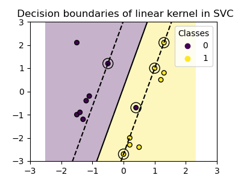 |  | 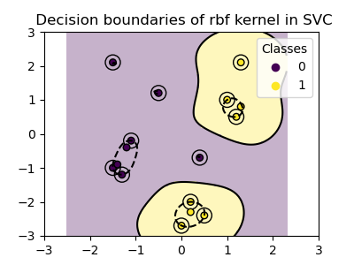 | 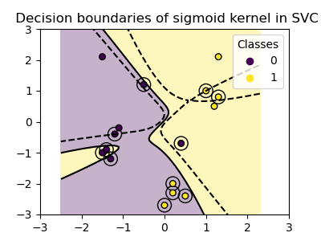 |

*Each kernel creates a different shaped decision boundary (black line) with margins (dashed lines). Support vectors are circled. Notice how RBF and polynomial kernels can capture nonlinear boundaries, while the linear kernel can only draw straight lines. (Source: scikit-learn)*

---

### Adding Similarity Features

Another approach to nonlinearity is computing **similarity features** using a similarity function (e.g., Gaussian RBF) with respect to **landmark** points.

**Idea:** For each instance $\mathbf{x}$, create a new feature for each landmark $\ell$:

$$\phi(\mathbf{x}, \ell) = \exp\left(-\gamma \|\mathbf{x} - \ell\|^2\right)$$

This transforms the feature space so that instances close to a landmark have a feature value near 1, and instances far from it have a value near 0.

**How to choose landmarks?** The simplest approach is to create a landmark at every training instance — which is exactly what the RBF kernel does implicitly.

---

### Gaussian RBF Kernel

The **Radial Basis Function (RBF)** kernel is the most popular kernel for nonlinear SVMs:

$$K(\mathbf{x}_i, \mathbf{x}_j) = \exp\left(-\gamma \|\mathbf{x}_i - \mathbf{x}_j\|^2\right)$$

- $\gamma$ large → each instance has a narrow influence (high variance, complex boundary)
- $\gamma$ small → each instance has a wide influence (high bias, smoother boundary)

**$\gamma$ and $C$ interact together:**

| $\gamma$ | $C$ | Result |
|-----------|-----|--------|
| High | High | Overfitting — complex boundary, few violations allowed |
| High | Low | Moderate — complex boundary but more violations allowed |
| Low | High | Moderate — smooth boundary but few violations allowed |
| Low | Low | Underfitting — smooth boundary, many violations allowed |

```python
from sklearn.svm import SVC

# RBF kernel (default)
model = SVC(kernel='rbf', gamma=0.1, C=1.0)
model.fit(X_train, y_train)
```

**When to use:**
- Default choice for nonlinear problems
- When you don't know the structure of the nonlinearity
- Works well on moderate-sized datasets (up to tens of thousands of instances)

**Rule of thumb:** Start with RBF kernel. Only switch to polynomial if you have domain knowledge suggesting polynomial relationships, or to linear if the dataset is very large or high-dimensional.

**Visual intuition — Effect of $\gamma$ and $C$ on the RBF kernel:**

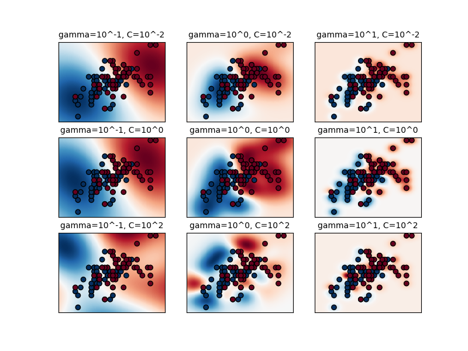

*A 3x3 grid showing how different combinations of $\gamma$ (columns) and $C$ (rows) affect the decision boundary. Low $\gamma$ + low $C$ = very smooth boundary (underfitting). High $\gamma$ + high $C$ = very complex boundary (overfitting). The best models lie along the diagonal. (Source: scikit-learn)*

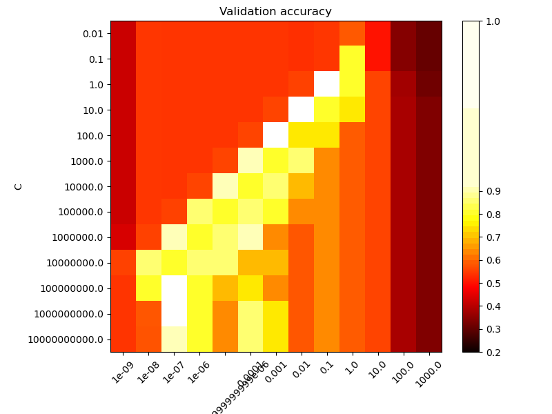

*Cross-validation accuracy as a function of $C$ and $\gamma$. The bright yellow region shows the optimal parameter combinations. Notice how the best-performing area forms a diagonal — smooth models (low $\gamma$) need less regularization (higher $C$) to compensate. (Source: scikit-learn)*

**XOR Problem — why kernel choice matters:**

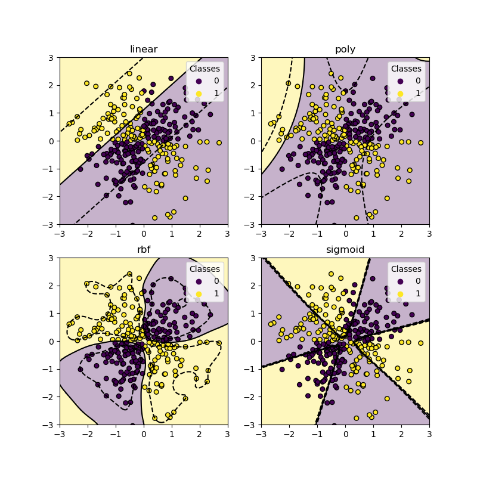

*The XOR problem is a classic example where only the RBF kernel can find a reasonable decision boundary. The linear kernel fails completely, and the polynomial and sigmoid kernels struggle. This demonstrates why RBF is the default go-to kernel. (Source: scikit-learn)*

---

## Computational Complexity

| Algorithm | Training Complexity | Prediction Complexity | Best For |
|-----------|--------------------|-----------------------|----------|
| `LinearSVC` | $O(m \times n)$ | $O(n)$ | Large datasets, many features |
| `SVC` (linear kernel) | $O(m^2 \times n)$ to $O(m^3 \times n)$ | $O(n_{sv} \times n)$ | Small to medium datasets |
| `SVC` (RBF kernel) | $O(m^2 \times n)$ to $O(m^3 \times n)$ | $O(n_{sv} \times n)$ | Non-linear, medium datasets |
| `SGDClassifier` (hinge) | $O(m \times n)$ | $O(n)$ | Very large datasets, online learning |

Where $m$ = samples, $n$ = features, $n_{sv}$ = number of support vectors.

**Key takeaway:** Kernel SVMs (`SVC`) scale **poorly** with the number of training instances due to $O(m^2)$ to $O(m^3)$ training time. For datasets larger than ~50,000 instances, prefer `LinearSVC` or `SGDClassifier`.

```python
# For large datasets — use LinearSVC (much faster)
from sklearn.svm import LinearSVC
model = LinearSVC(C=1.0, loss='hinge', max_iter=10000)

# For very large datasets — use SGDClassifier with hinge loss (online SVM)
from sklearn.linear_model import SGDClassifier
model = SGDClassifier(loss='hinge', alpha=1/(m*C), max_iter=1000)

# For small/medium datasets with nonlinearity — use SVC with kernel
from sklearn.svm import SVC
model = SVC(kernel='rbf', gamma='scale', C=1.0)
```

---

## SVM Regression

SVMs can also be used for regression (**Support Vector Regression — SVR**). Instead of maximizing the margin between classes, SVR tries to fit as many instances as possible **within a margin** of width $\varepsilon$ around the prediction, while keeping the model as flat as possible.

**Key difference from classification:**
- **Classification:** maximize the margin, keep instances *outside* the margin
- **Regression:** keep instances *inside* the margin (within $\varepsilon$ of the prediction)

**Optimization objective:**

$$\min_{\mathbf{w}, b, \xi, \xi^*} \quad \frac{1}{2}\|\mathbf{w}\|^2 + C \sum_{i=1}^{m}(\xi_i + \xi_i^*)$$

Subject to:

$$y_i - (\mathbf{w} \cdot \mathbf{x}_i + b) \leq \varepsilon + \xi_i$$
$$(\mathbf{w} \cdot \mathbf{x}_i + b) - y_i \leq \varepsilon + \xi_i^*$$
$$\xi_i, \xi_i^* \geq 0$$

**Hyperparameters:**

| Parameter | Effect |
|-----------|--------|
| $\varepsilon$ | Width of the "tube" — larger $\varepsilon$ means more tolerance, fewer support vectors, smoother model |
| $C$ | Regularization — large $C$ penalizes points outside the tube more, tighter fit |

```python
from sklearn.svm import SVR, LinearSVR

# Linear SVR (fast, for large datasets)
model = LinearSVR(epsilon=1.5, C=1.0, max_iter=10000)
model.fit(X_train, y_train)

# Nonlinear SVR with RBF kernel (for complex relationships)
model = SVR(kernel='rbf', C=100, gamma=0.1, epsilon=0.1)
model.fit(X_train, y_train)
```

**When to use SVR:**
- When you need robustness to outliers (the $\varepsilon$-insensitive loss ignores small errors)
- When the dataset is small to medium-sized
- When you need nonlinear regression with kernel flexibility

**Visual intuition — SVR with different kernels:**

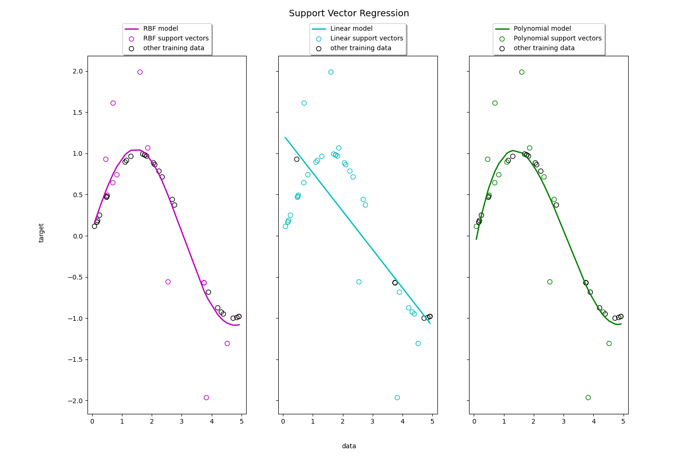

*SVR fits a regression line (or curve) and defines an $\varepsilon$-tube around it. Points inside the tube incur zero loss. Points outside become support vectors (circled). Notice how the RBF and polynomial kernels capture the sinusoidal pattern better than the linear kernel. (Source: scikit-learn)*

---

## Under the Hood

### Decision Function and Predictions

For a trained SVM, the decision function for a new instance $\mathbf{x}$ is:

$$f(\mathbf{x}) = \mathbf{w} \cdot \mathbf{x} + b = \sum_{i=1}^{m} \alpha_i \, y_i \, (\mathbf{x}_i \cdot \mathbf{x}) + b$$

Where:
- $\alpha_i$ are the **Lagrange multipliers** (dual coefficients) — only nonzero for **support vectors**
- $y_i \in \{-1, +1\}$ are the class labels
- $\mathbf{x}_i$ are the training instances

**Classification rule:** $\hat{y} = \text{sign}(f(\mathbf{x}))$

The key insight: the decision function depends **only on the support vectors** (instances with $\alpha_i > 0$), not on all training data. This makes predictions efficient even if the training set was large.

---

### Training Objective

The SVM training objective in **primal form** is:

$$\min_{\mathbf{w}, b} \quad \frac{1}{2}\|\mathbf{w}\|^2 + C \sum_{i=1}^{m} \max\left(0, 1 - y_i(\mathbf{w} \cdot \mathbf{x}_i + b)\right)$$

This combines:
1. **Margin maximization** — the $\frac{1}{2}\|\mathbf{w}\|^2$ term (smaller $\|\mathbf{w}\|$ = wider margin)
2. **Hinge loss** — the $\max(0, 1 - y_i f(\mathbf{x}_i))$ term penalizes violations

The hinge loss is zero when an instance is correctly classified and on the correct side of the margin. It increases linearly as the instance moves to the wrong side.

**Hinge loss compared to other loss functions:**

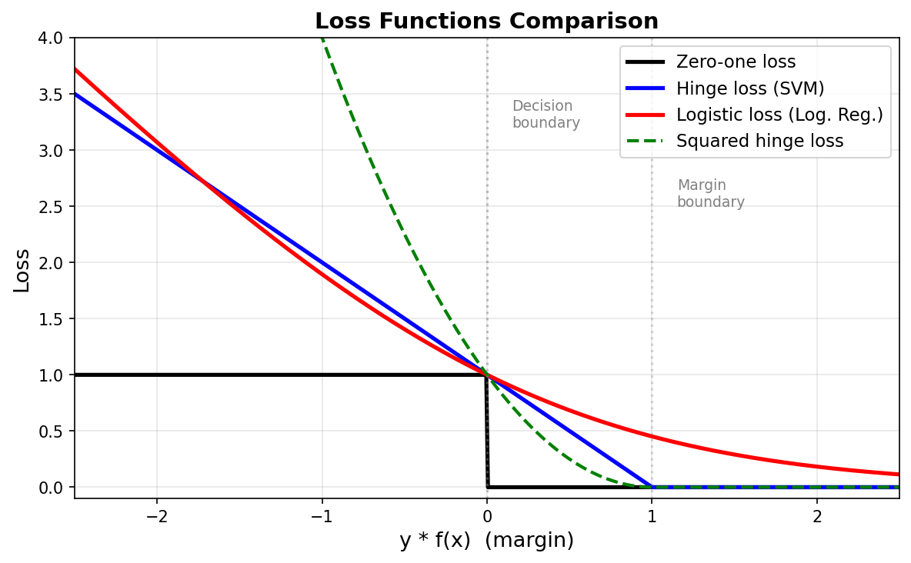

*Comparison of loss functions used in classification. The **hinge loss** (SVM) is zero for $y \cdot f(x) \geq 1$ — meaning correctly classified instances beyond the margin incur no loss at all. The **logistic loss** (Logistic Regression) is always positive, even for correct predictions. The **zero-one loss** is the ideal but non-differentiable loss. Hinge loss is a convex upper bound on the zero-one loss, which is why SVMs can be optimized efficiently.*

---

### Quadratic Programming

The SVM optimization problem is a **Quadratic Programming (QP)** problem — a convex optimization problem with a quadratic objective function and linear constraints.

**General QP form:**

$$\min_{\mathbf{p}} \quad \frac{1}{2}\mathbf{p}^T \mathbf{H} \mathbf{p} + \mathbf{f}^T \mathbf{p}$$

Subject to: $\mathbf{A} \mathbf{p} \leq \mathbf{b}$

For the **soft margin linear SVM** (hard margin when $C \to \infty$):

| QP Parameter | SVM Meaning | Dimensions |
|--------------|-------------|------------|
| $\mathbf{p}$ | Contains $\mathbf{w}$, $b$, and slack variables $\xi_i$ | $(n + 1 + m) \times 1$ |
| $\mathbf{H}$ | Identity matrix for $\mathbf{w}$ part, zeros elsewhere | $(n+1+m) \times (n+1+m)$ |
| $\mathbf{f}$ | $C$ for the slack variables, 0 for $\mathbf{w}$ and $b$ | $(n+1+m) \times 1$ |
| $\mathbf{A}$ | Encodes the classification constraints | $2m \times (n+1+m)$ |
| $\mathbf{b}$ | $-1$ for classification constraints, $0$ for slack constraints | $2m \times 1$ |

**Why QP matters:** Because the SVM problem is convex QP, it is guaranteed to have a **unique global optimum** — no local minima. Any QP solver will find the optimal solution.

---

### The Dual Problem

Instead of solving the primal problem directly, we can solve its **dual form** using Lagrange multipliers:

$$\max_{\alpha} \quad \sum_{i=1}^{m} \alpha_i - \frac{1}{2} \sum_{i=1}^{m}\sum_{j=1}^{m} \alpha_i \alpha_j y_i y_j (\mathbf{x}_i \cdot \mathbf{x}_j)$$

Subject to: $0 \leq \alpha_i \leq C$ and $\sum_{i=1}^{m} \alpha_i y_i = 0$

**Primal vs. Dual — when to use which:**

| Aspect | Primal | Dual |
|--------|--------|------|
| **Variables** | $n + 1$ (features + bias) | $m$ (one per training instance) |
| **Better when** | $m \gg n$ (many instances, few features) | $n \gg m$ (many features, few instances) |
| **Kernel trick** | Not applicable | Enables the kernel trick |
| **Solver** | `LinearSVC` (uses liblinear, primal) | `SVC` (uses libsvm, dual) |

**Rule of thumb:**
- **Millions of instances, hundreds of features** → solve the **primal** (use `LinearSVC`)
- **Thousands of instances, need kernels** → solve the **dual** (use `SVC`)

---

### Kernelized SVMs

The kernel trick is what makes the dual form powerful. Notice that the dual problem only involves **dot products** $\mathbf{x}_i \cdot \mathbf{x}_j$. We can replace every dot product with a **kernel function**:

$$K(\mathbf{x}_i, \mathbf{x}_j) = \phi(\mathbf{x}_i) \cdot \phi(\mathbf{x}_j)$$

Where $\phi$ is a (potentially infinite-dimensional) feature mapping. The kernel computes the dot product in the transformed space **without ever computing** $\phi(\mathbf{x})$ explicitly.

**Common kernels:**

| Kernel | Formula | When to Use |
|--------|---------|-------------|
| **Linear** | $K(\mathbf{x}_i, \mathbf{x}_j) = \mathbf{x}_i \cdot \mathbf{x}_j$ | Linearly separable data, large datasets |
| **Polynomial** | $(\gamma \, \mathbf{x}_i \cdot \mathbf{x}_j + r)^d$ | Polynomial relationships, known degree |
| **RBF (Gaussian)** | $\exp(-\gamma\|\mathbf{x}_i - \mathbf{x}_j\|^2)$ | Default for nonlinear, unknown structure |
| **Sigmoid** | $\tanh(\gamma \, \mathbf{x}_i \cdot \mathbf{x}_j + r)$ | Rarely used (not always a valid kernel) |

**Mercer's Theorem:** A function $K$ is a valid kernel if and only if it satisfies **Mercer's condition** — the kernel matrix must be positive semi-definite for any set of inputs. All kernels above (except sigmoid in some parameter ranges) satisfy this.

---

### Online SVMs

Standard SVM solvers (like `libsvm`) are **batch** algorithms — they require the entire dataset in memory. For very large datasets or streaming data, **online SVMs** are needed.

**SGDClassifier with hinge loss** implements an online, approximate SVM using Stochastic Gradient Descent:

$$\text{SGD objective:} \quad \frac{\alpha}{2}\|\mathbf{w}\|^2 + \frac{1}{m}\sum_{i=1}^{m} \max(0, 1 - y_i(\mathbf{w} \cdot \mathbf{x}_i + b))$$

Where $\alpha$ is the regularization parameter (equivalent to $\frac{1}{mC}$ in the standard SVM formulation).

```python
from sklearn.linear_model import SGDClassifier

# Online SVM using SGD
model = SGDClassifier(loss='hinge', alpha=0.001, max_iter=1000, tol=1e-3)
model.fit(X_train, y_train)

# For streaming data — partial_fit for online learning
model = SGDClassifier(loss='hinge', alpha=0.001)
for X_batch, y_batch in data_stream:
    model.partial_fit(X_batch, y_batch, classes=[0, 1])
```

**Key properties of online SVMs:**

| Property | Batch SVM (`SVC`) | Online SVM (`SGDClassifier`) |
|----------|-------------------|------------------------------|
| **Training** | Full dataset at once | One sample/batch at a time |
| **Convergence** | Exact (QP solver) | Approximate (SGD) |
| **Scaling** | $O(m^2)$ to $O(m^3)$ | $O(m \times n)$ per epoch |
| **Kernel support** | Yes (all kernels) | No (linear only) |
| **Streaming data** | No | Yes (`partial_fit`) |
| **Memory** | $O(m^2)$ for kernel matrix | $O(n)$ for weight vector |

---

## Multi-Class SVM Classification

SVMs are inherently **binary classifiers** — they separate two classes at a time. For problems with $K > 2$ classes, two strategies are used:

### One-vs-One (OvO)

Trains one binary SVM for **every pair of classes**: $\binom{K}{2} = \frac{K(K-1)}{2}$ classifiers.

For 10 classes (e.g., MNIST digits): $\binom{10}{2} = 45$ classifiers.

At prediction time, each classifier votes, and the class with the most votes wins.

- **Advantage:** Each classifier trains on a small subset of data (only 2 classes) → faster per classifier
- **Disadvantage:** Many classifiers to train for large $K$
- **Used by:** `SVC` (default in scikit-learn — uses libsvm)

### One-vs-All (OvA / OvR)

Trains one binary SVM **per class**: class $k$ vs. all other classes. Total: $K$ classifiers.

At prediction time, each classifier outputs a confidence score $f_k(\mathbf{x})$, and the class with the highest score wins.

- **Advantage:** Only $K$ classifiers → fewer models
- **Disadvantage:** Each classifier trains on the full dataset, and the classes can be very imbalanced (1 class vs. all others)
- **Used by:** `LinearSVC` (default), `SGDClassifier`

```python
from sklearn.svm import SVC, LinearSVC
from sklearn.multiclass import OneVsRestClassifier

# SVC uses OvO by default (no change needed)
ovo_model = SVC(kernel='rbf', C=1.0)
ovo_model.fit(X_train, y_train)  # automatically trains K*(K-1)/2 classifiers

# LinearSVC uses OvR by default
ovr_model = LinearSVC(C=1.0, max_iter=10000)
ovr_model.fit(X_train, y_train)

# Force OvR with kernel SVM
ovr_kernel = OneVsRestClassifier(SVC(kernel='rbf', C=1.0))
ovr_kernel.fit(X_train, y_train)
```

| Strategy | # Classifiers | Training data per classifier | Default in |
|----------|:---:|---|---|
| **OvO** | $\frac{K(K-1)}{2}$ | Only samples from 2 classes | `SVC` |
| **OvR** | $K$ | All samples (1 class vs rest) | `LinearSVC`, `SGDClassifier` |

**Rule of thumb:** OvO is faster for kernel SVMs (smaller subsets), OvR is preferred for linear SVMs (simpler, fewer models).

---

## One-Class SVM (Anomaly / Novelty Detection)

One-Class SVM is an **unsupervised** algorithm that learns a decision boundary around the "normal" data, then classifies new instances as **inliers** (normal) or **outliers** (anomalous).

**How it works:**
- Trains only on normal data (no labels needed)
- Learns the smallest region in feature space that contains most of the training instances
- New instances that fall outside this region are flagged as anomalies

**Key hyperparameter: $\nu$ (nu)**
- Controls the **upper bound** on the fraction of training errors and the **lower bound** on the fraction of support vectors
- Think of it as "expected proportion of outliers" — set $\nu = 0.1$ if you expect ~10% of data to be anomalous

```python
from sklearn.svm import OneClassSVM

# Train on normal data only
model = OneClassSVM(nu=0.1, kernel='rbf', gamma='scale')
model.fit(X_normal)

# Predict: +1 = inlier, -1 = outlier
predictions = model.predict(X_new)
outliers = X_new[predictions == -1]
```

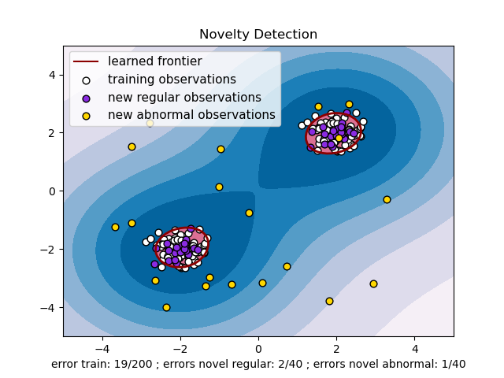

*One-Class SVM learns a boundary (dark red line) around the training data (white points). New regular observations (purple) fall inside the boundary, while abnormal observations (gold) are correctly identified as outliers. (Source: scikit-learn)*

**When to use:**
- Fraud detection, network intrusion detection
- Manufacturing defect detection
- Any scenario where you have abundant "normal" data but few or no examples of anomalies

---

## Kernel Selection Flowchart

```
What kind of data do you have?
│
├── Large dataset (> 50k samples)?
│   ├── YES → Use LinearSVC or SGDClassifier (linear kernel only)
│   │         Kernel SVMs are too slow at O(m²) to O(m³)
│   └── NO ↓
│
├── High-dimensional sparse data (text, genomics)?
│   ├── YES → Linear kernel (LinearSVC)
│   │         High-dimensional data is often linearly separable
│   └── NO ↓
│
├── Do you know the relationship is polynomial?
│   ├── YES → Polynomial kernel (SVC with kernel='poly')
│   │         Set degree based on domain knowledge
│   └── NO ↓
│
├── Small/medium dataset, unknown nonlinearity?
│   ├── YES → RBF kernel (SVC with kernel='rbf')  ← DEFAULT CHOICE
│   │         Tune gamma and C with cross-validation
│   └── NO ↓
│
└── None of the above?
    → Start with RBF, compare with linear.
      If neither works, consider other models (RF, XGBoost, NN)
```

---

## SVM vs. Other Models

| Aspect | SVM | Logistic Regression | Random Forest | Neural Network |
|--------|-----|-------|--------|--------|
| **Best for** | Small/medium data, high-dim, clear margin | Probability estimates, interpretability | Large data, mixed feature types | Very large data, complex patterns |
| **Nonlinearity** | Via kernels | Manual feature engineering | Built-in (tree splits) | Built-in (layers) |
| **Scalability** | Poor with kernels ($O(m^2$–$m^3)$) | Excellent ($O(mn)$) | Good ($O(mn\log m)$) | Good with GPUs |
| **Interpretability** | Low (kernel) / Medium (linear) | High (coefficients) | Medium (feature importance) | Very low |
| **Probability output** | Platt scaling (slow, unreliable) | Native (calibrated) | Native (vote fractions) | Native (softmax) |
| **Handles missing data** | No | No | Yes | No |
| **Feature scaling needed** | **Yes (critical)** | Recommended | No | Yes |
| **Outlier sensitivity** | Moderate (soft margin helps) | High | Low | Moderate |
| **Hyperparameter tuning** | $C$, $\gamma$, kernel | $C$ / $\alpha$ | n_estimators, max_depth | Architecture, LR, ... |

**When to choose SVM over alternatives:**
- **Over Logistic Regression:** When the decision boundary is nonlinear and you have a small/medium dataset
- **Over Random Forest:** When you have high-dimensional data with few samples (e.g., text, genomics), or when you need better margins
- **Over Neural Networks:** When data is too small for deep learning, or you need a model with theoretical guarantees (convex optimization, unique global optimum)


*Different SVM kernels applied to the Iris dataset, showing how each creates different decision boundaries on the same data. (Source: scikit-learn)*

---

## Pros, Cons, and Usage

### Advantages

- **Strong generalization** — maximum margin principle provides theoretical guarantees against overfitting
- **Effective in high-dimensional spaces** — works well even when $n > m$ (more features than samples)
- **Kernel flexibility** — can model complex nonlinear decision boundaries without explicit feature mapping
- **Robust to overfitting** (with proper $C$) — especially in high-dimensional spaces with clear margin
- **Global optimum guaranteed** — convex optimization means no local minima
- **Memory efficient** — only support vectors are stored for predictions
- **Versatile** — works for classification, regression, and outlier detection

### Disadvantages

- **Slow on large datasets** — kernel SVMs scale $O(m^2)$ to $O(m^3)$; impractical for $m > 50\text{k}$ with kernels
- **Sensitive to feature scaling** — SVMs compute distances, so features on different scales distort the margin. **Always scale your features.**
- **No native probability estimates** — `SVC` can output probabilities via Platt scaling (`probability=True`), but this is slow and sometimes poorly calibrated
- **Difficult to interpret** — unlike linear models or decision trees, the learned boundary is not easily explainable (especially with kernels)
- **Hyperparameter tuning required** — $C$, $\gamma$, kernel choice all significantly affect performance
- **Not great for noisy data with overlapping classes** — soft margin helps, but SVMs prefer clean margins
- **Binary by nature** — multi-class requires strategies like One-vs-One (OvO) or One-vs-All (OvR)

### When to Use SVMs

| Scenario | Recommendation |
|----------|---------------|
| Small to medium dataset (< 50k samples) with nonlinear boundaries | **SVC with RBF kernel** |
| Large dataset (> 50k samples), linear problem | **LinearSVC or SGDClassifier** |
| High-dimensional sparse data (e.g., text classification) | **LinearSVC** (very effective) |
| Need nonlinear regression on small datasets | **SVR with RBF kernel** |
| Online / streaming data | **SGDClassifier with hinge loss** |
| Need interpretable model | **Consider other models** (logistic regression, decision trees) |
| Very large dataset with nonlinear boundaries | **Consider other models** (random forests, gradient boosting, neural networks) |

---

## Common Pitfalls

### 1. Forgetting to Scale Features

SVMs are distance-based. If one feature ranges from 0 to 1000 and another from 0 to 1, the first feature will dominate the margin computation. **Always standardize or normalize your features.**

```python
from sklearn.preprocessing import StandardScaler
from sklearn.pipeline import Pipeline
from sklearn.svm import SVC

# Always use a pipeline to ensure scaling
model = Pipeline([
    ('scaler', StandardScaler()),
    ('svm', SVC(kernel='rbf', C=1.0, gamma='scale'))
])
model.fit(X_train, y_train)
```

### 2. Using Kernel SVM on Large Datasets

Kernel SVMs (`SVC`) have $O(m^2)$ to $O(m^3)$ training time. On a dataset with 1 million instances, training can take **days or never finish**. Use `LinearSVC` or `SGDClassifier` instead.

### 3. Not Tuning $C$ and $\gamma$

Default hyperparameters rarely give optimal results. Always use cross-validation to tune them:

```python
from sklearn.model_selection import GridSearchCV

param_grid = {
    'svm__C': [0.1, 1, 10, 100],
    'svm__gamma': ['scale', 'auto', 0.01, 0.1, 1]
}

grid = GridSearchCV(model, param_grid, cv=5, scoring='accuracy', n_jobs=-1)
grid.fit(X_train, y_train)
print(f"Best params: {grid.best_params_}")
```

### 4. Confusing $C$ Direction with Regularization

In most models (Ridge, Lasso), $\alpha$ increases = more regularization. In SVMs, $C$ increases = **less** regularization. This is because $C$ is the penalty for violations, not the regularization strength.

$$C = \frac{1}{\alpha} \quad \Rightarrow \quad \text{large } C = \text{small regularization}$$

### 5. Using `probability=True` Unnecessarily

Enabling `probability=True` in `SVC` fits an additional Platt scaling model via cross-validation after training, which **significantly slows down** training. Only enable it if you actually need probability estimates.

### 6. Ignoring Convergence Warnings

`LinearSVC` and `SGDClassifier` may not converge with default `max_iter`. If you see convergence warnings, increase `max_iter`:

```python
# Fix convergence warning
model = LinearSVC(C=1.0, max_iter=10000)  # default is 1000
```

### 7. Choosing the Wrong Kernel

- **Start with RBF** — it's the most versatile default
- **Switch to linear** if the dataset is large or high-dimensional (text, genomics)
- **Use polynomial** only if you have domain knowledge about the degree
- **Avoid sigmoid** — it's not a valid kernel for all parameter values

### 8. Not Handling Class Imbalance

SVMs are sensitive to imbalanced classes. Use `class_weight='balanced'` to adjust:

```python
model = SVC(kernel='rbf', C=1.0, class_weight='balanced')
```

---

## Quick Reference

```python
from sklearn.svm import SVC, LinearSVC, SVR, LinearSVR
from sklearn.linear_model import SGDClassifier
from sklearn.preprocessing import StandardScaler
from sklearn.pipeline import Pipeline

# ---- CLASSIFICATION ----

# Linear SVM (large datasets)
clf = Pipeline([('scaler', StandardScaler()), ('svm', LinearSVC(C=1.0, max_iter=10000))])

# Nonlinear SVM with RBF kernel (small/medium datasets)
clf = Pipeline([('scaler', StandardScaler()), ('svm', SVC(kernel='rbf', C=1.0, gamma='scale'))])

# Polynomial kernel
clf = Pipeline([('scaler', StandardScaler()), ('svm', SVC(kernel='poly', degree=3, coef0=1, C=5))])

# Online SVM (streaming / very large data)
clf = Pipeline([('scaler', StandardScaler()), ('svm', SGDClassifier(loss='hinge', alpha=0.001))])

# ---- REGRESSION ----

# Linear SVR (large datasets)
reg = Pipeline([('scaler', StandardScaler()), ('svr', LinearSVR(epsilon=0.1, C=1.0, max_iter=10000))])

# Nonlinear SVR with RBF kernel
reg = Pipeline([('scaler', StandardScaler()), ('svr', SVR(kernel='rbf', C=100, gamma=0.1, epsilon=0.1))])
```
