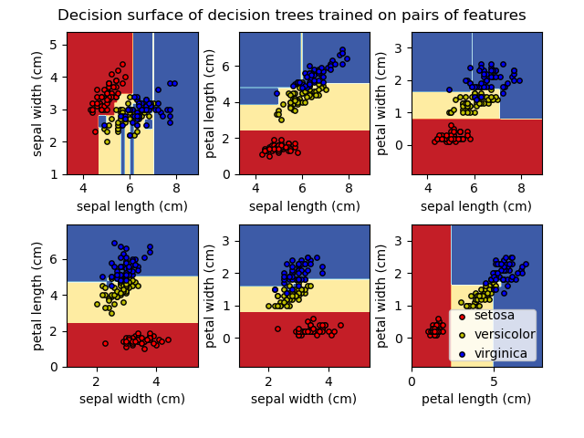

# Decision Trees

Decision Trees are **supervised learning models** that learn simple decision rules inferred from data features to predict a target variable. They work by recursively splitting the feature space into regions, making predictions based on the majority class (classification) or mean value (regression) in each region.

**Core idea:** At each node, the algorithm selects the feature and threshold that produces the **purest** child nodes — splitting the data so that instances in each resulting subset are as homogeneous as possible with respect to the target.

---

## Training and Visualizing a Decision Tree

Scikit-Learn uses the **CART algorithm** (Classification and Regression Trees) to train decision trees. Training is straightforward:

```python
from sklearn.datasets import load_iris
from sklearn.tree import DecisionTreeClassifier, export_graphviz
import graphviz

# Load data and train
iris = load_iris()
X, y = iris.data, iris.target

tree_clf = DecisionTreeClassifier(max_depth=2, random_state=42)
tree_clf.fit(X, y)

# Visualize the tree
dot_data = export_graphviz(
    tree_clf,
    out_file=None,
    feature_names=iris.feature_names,
    class_names=iris.target_names,
    rounded=True,
    filled=True
)
graph = graphviz.Source(dot_data)
graph.render("iris_tree")  # saves to iris_tree.pdf
```

You can also use `sklearn.tree.plot_tree()` for quick matplotlib-based visualization:

```python
from sklearn.tree import plot_tree
import matplotlib.pyplot as plt

fig, ax = plt.subplots(figsize=(12, 8))
plot_tree(tree_clf, feature_names=iris.feature_names,
          class_names=iris.target_names, filled=True, rounded=True, ax=ax)
plt.tight_layout()
plt.show()
```

**Each node in the visualization shows:**


| Attribute | Meaning |
|-----------|---------|
| **Feature & threshold** | The splitting rule (e.g., `petal length <= 2.45`) |
| **gini** (or **entropy**) | The impurity measure of the node |
| **samples** | Number of training instances reaching this node |
| **value** | Distribution of instances across classes (e.g., `[50, 0, 0]`) |
| **class** | The predicted class (majority class in the node) |

---

## Making Predictions

A Decision Tree makes predictions by **traversing from the root to a leaf**, following the splitting rules at each internal node.

**How it works:**

```
1. Start at the root node
2. Check the splitting condition (e.g., petal length <= 2.45?)
3. If True → go to the left child
   If False → go to the right child
4. Repeat until you reach a leaf node
5. The leaf's class (classification) or mean value (regression) is the prediction
```

**Example traversal for Iris classification (max_depth=2):**

```
Root: petal length <= 2.45?
├── Yes → Leaf: class = setosa (50 samples, pure)
└── No → petal width <= 1.75?
    ├── Yes → Leaf: class = versicolor (mostly, some virginica)
    └── No → Leaf: class = virginica (mostly, some versicolor)
```

**Key property: Decision Trees are white-box models.** You can fully understand and explain every prediction by following the path from root to leaf. This makes them one of the most **interpretable** models in machine learning.



**Prediction complexity:** $O(\log_2(m))$ for a balanced tree, where $m$ is the number of training instances. The prediction is independent of the number of features at each node — only one feature is checked per node.

```python
# Make a prediction
instance = [[5.1, 3.5, 1.4, 0.2]]  # a new iris measurement
prediction = tree_clf.predict(instance)
print(f"Predicted class: {iris.target_names[prediction[0]]}")
```

---

## Estimating Class Probabilities

A Decision Tree can also estimate the **probability** that an instance belongs to a particular class. It returns the **proportion of training instances of each class** in the leaf node the instance ends up in.

```python
# Get class probabilities
probs = tree_clf.predict_proba([[5.0, 3.6, 1.3, 0.25]])
print(f"Probabilities: {probs}")
# e.g., [[1.0, 0.0, 0.0]] — 100% setosa
```

**How it works:**
1. Traverse the tree to the appropriate leaf node
2. The probability for each class $k$ is simply:

$$P(\text{class } k | \text{leaf}) = \frac{\text{number of class } k \text{ instances in the leaf}}{\text{total instances in the leaf}}$$

**Example:** If a leaf contains 49 versicolor and 5 virginica instances (54 total):
- $P(\text{setosa}) = 0/54 = 0\%$
- $P(\text{versicolor}) = 49/54 \approx 90.7\%$
- $P(\text{virginica}) = 5/54 \approx 9.3\%$

**Important:** Because the probabilities are based on the training instances that ended up in each leaf, they are inherently **coarse**. Two instances that land in the same leaf will always receive the same probability estimates, regardless of how different they actually are. Deeper trees produce more leaves, which can give more granular (but potentially overfit) probability estimates.

---

## The CART Training Algorithm

Scikit-Learn uses the **CART (Classification and Regression Trees)** algorithm, which builds the tree by making **greedy, binary splits**.

**Algorithm:**

```
function CART(dataset, depth):
    if stopping_condition_met(dataset, depth):
        return create_leaf(dataset)
    
    best_feature, best_threshold = None, None
    best_cost = infinity
    
    for each feature k:
        for each threshold t (unique values of feature k):
            split dataset into left (feature k <= t) and right (feature k > t)
            cost = (n_left / n_total) * impurity(left) + (n_right / n_total) * impurity(right)
            if cost < best_cost:
                best_cost = cost
                best_feature, best_threshold = k, t
    
    left_data, right_data = split(dataset, best_feature, best_threshold)
    
    node = create_node(best_feature, best_threshold)
    node.left = CART(left_data, depth + 1)
    node.right = CART(right_data, depth + 1)
    return node
```

**Key properties of CART:**

| Property | Description |
|----------|-------------|
| **Binary splits** | Each node splits into exactly 2 children (left and right) |
| **Greedy** | At each step, it picks the locally optimal split (no backtracking) |
| **Top-down** | Builds from the root down, recursively |
| **Cost function** | Minimizes weighted impurity of child nodes |

**The cost function for classification:**

$$J(k, t_k) = \frac{m_{\text{left}}}{m} G_{\text{left}} + \frac{m_{\text{right}}}{m} G_{\text{right}}$$

Where:
- $k$ is the feature index, $t_k$ is the threshold
- $m_{\text{left}}, m_{\text{right}}$ are the number of instances in the left and right subsets
- $G_{\text{left}}, G_{\text{right}}$ are the impurity (Gini or entropy) of the left and right subsets

**Stopping conditions:**
- Maximum depth reached (`max_depth`)
- Minimum samples per node (`min_samples_split`)
- Minimum samples per leaf (`min_samples_leaf`)
- Node is pure (impurity = 0)
- Maximum number of leaf nodes reached (`max_leaf_nodes`)

**Important:** Finding the optimal tree (globally) is an **NP-complete** problem. CART uses a greedy heuristic, so the resulting tree is **not guaranteed to be globally optimal**. This is why different random seeds or slightly different data can produce different trees.

---

## Computational Complexity

| Operation | Complexity | Notes |
|-----------|-----------|-------|
| **Training** | $O(n \times m \log(m))$ | For each feature ($n$), sort $m$ instances and evaluate splits |
| **Prediction** | $O(\log_2(m))$ | Traverse from root to leaf (balanced tree) |
| **Prediction (worst case)** | $O(m)$ | Completely unbalanced tree (degenerate) |

**Training breakdown:**
- At each node, the algorithm considers all $n$ features
- For each feature, it needs to evaluate all possible thresholds (unique values)
- Sorting each feature takes $O(m \log m)$
- Total per node: $O(n \times m)$ (after pre-sorting)
- Total nodes ≈ $O(m)$ in the worst case, but typically $O(\log m)$ depth

**Comparison with other models:**

| Model | Training | Prediction |
|-------|----------|------------|
| Decision Tree | $O(n \times m \log m)$ | $O(\log_2 m)$ |
| Linear Regression | $O(n^2 m)$ or $O(n^3)$ | $O(n)$ |
| SVM (linear) | $O(m \times n)$ | $O(n)$ |
| SVM (kernel) | $O(m^2 \times n)$ to $O(m^3 \times n)$ | $O(n_{sv} \times n)$ |
| k-NN | $O(1)$ (lazy) | $O(m \times n)$ |

**Key takeaway:** Decision Trees have fast training and extremely fast prediction. The $O(\log_2 m)$ prediction time is one of their major practical advantages.

> **Note:** Setting `presort=True` (deprecated in recent scikit-learn versions) was an option to pre-sort the data at each node to speed up training. It helped for small datasets but was slower for large ones due to the overhead of sorting at every node.

---

## Gini Impurity or Entropy?

Decision Trees can use either **Gini impurity** or **entropy** as the impurity measure. Both quantify how "mixed" the classes are in a node.

### Gini Impurity

$$G_i = 1 - \sum_{k=1}^{K} p_{i,k}^2$$

Where $p_{i,k}$ is the ratio of class $k$ instances among the training instances in node $i$.

- $G = 0$ → **pure node** (all instances belong to one class)
- $G = 0.5$ → **maximum impurity** for binary classification (50/50 split)
- $G_{\max} = 1 - 1/K$ for $K$ classes

### Entropy

$$H_i = -\sum_{k=1}^{K} p_{i,k} \log_2(p_{i,k})$$

(By convention, $0 \log_2 0 = 0$.)

- $H = 0$ → **pure node**
- $H = 1$ → **maximum impurity** for binary classification (50/50 split)
- $H_{\max} = \log_2(K)$ for $K$ classes

### Comparison

| Aspect | Gini Impurity | Entropy |
|--------|--------------|---------|
| **Range (binary)** | 0 to 0.5 | 0 to 1 |
| **Computation** | Slightly faster (no logarithm) | Slightly slower (requires log) |
| **Behavior** | Tends to isolate the most frequent class in its own branch | Tends to produce slightly more balanced trees |
| **Default** | Scikit-Learn default (`criterion='gini'`) | Set `criterion='entropy'` |
| **Practical difference** | Usually negligible | Usually negligible |

```python
# Gini (default)
tree_gini = DecisionTreeClassifier(criterion='gini', max_depth=3)

# Entropy
tree_entropy = DecisionTreeClassifier(criterion='entropy', max_depth=3)
```

**In practice, the choice rarely matters.** Gini impurity is slightly faster to compute and is the default. Entropy tends to produce slightly more balanced trees. When they differ, Gini tends to isolate the most frequent class in its own branch, while entropy produces more balanced splits.

**Rule of thumb:** Use the default (Gini). Only switch to entropy if you have a specific reason or are doing comparative experiments.

---

## Regularization Hyperparameters

Decision Trees make very few assumptions about the data (they are **nonparametric models**). Without restrictions, they will grow until every leaf is pure — which almost always leads to **overfitting**.

**Regularization** restricts the tree's freedom to reduce overfitting. This is also called **pruning**.

### Pre-pruning (Restrict During Training)

| Hyperparameter | Effect | Default |
|---------------|--------|---------|
| `max_depth` | Maximum depth of the tree | `None` (unlimited) |
| `min_samples_split` | Minimum instances required to split a node | `2` |
| `min_samples_leaf` | Minimum instances required in a leaf node | `1` |
| `max_leaf_nodes` | Maximum number of leaf nodes | `None` (unlimited) |
| `max_features` | Maximum features considered for each split | `None` (all features) |
| `min_impurity_decrease` | Minimum impurity decrease required for a split | `0.0` |

```python
from sklearn.tree import DecisionTreeClassifier

# Unrestricted tree (likely to overfit)
tree_overfit = DecisionTreeClassifier(random_state=42)

# Regularized tree
tree_reg = DecisionTreeClassifier(
    max_depth=5,               # limit depth
    min_samples_split=10,      # need at least 10 samples to split
    min_samples_leaf=5,        # each leaf must have at least 5 samples
    max_leaf_nodes=20,         # at most 20 leaves
    random_state=42
)
```

**How each hyperparameter affects the model:**

```
Increasing max_depth       → more complex model → risk of overfitting
Decreasing max_depth       → simpler model      → risk of underfitting

Increasing min_samples_split → more regularization → simpler model
Increasing min_samples_leaf  → more regularization → simpler model
Decreasing max_leaf_nodes    → more regularization → simpler model
Increasing max_features      → more choices per split → more complex splits
```

### Post-pruning (Prune After Training)

Scikit-Learn supports **cost-complexity pruning** (also called minimal cost-complexity pruning or weakest-link pruning) via the `ccp_alpha` parameter.

The idea: after building the full tree, progressively remove subtrees that provide the least per-node improvement in impurity, penalized by a complexity term $\alpha$.

**Effective total cost:**

$$R_\alpha(T) = R(T) + \alpha |T|$$

Where:
- $R(T)$ = total impurity of the tree (sum of weighted leaf impurities)
- $|T|$ = number of leaf nodes
- $\alpha$ = complexity parameter (higher $\alpha$ → more pruning)

```python
# Find the optimal ccp_alpha using cross-validation
import numpy as np
from sklearn.model_selection import cross_val_score

# Get the pruning path
path = tree_clf.cost_complexity_pruning_path(X, y)
ccp_alphas = path.ccp_alphas

# Evaluate each alpha
scores = []
for alpha in ccp_alphas:
    clf = DecisionTreeClassifier(ccp_alpha=alpha, random_state=42)
    score = cross_val_score(clf, X, y, cv=5, scoring='accuracy')
    scores.append(score.mean())

best_alpha = ccp_alphas[np.argmax(scores)]
print(f"Best ccp_alpha: {best_alpha:.4f}")

# Train final model
tree_pruned = DecisionTreeClassifier(ccp_alpha=best_alpha, random_state=42)
tree_pruned.fit(X, y)
```

**General strategy:**
1. Start with an unrestricted tree to see its full complexity
2. Use cross-validation to tune regularization hyperparameters
3. `max_depth` and `min_samples_leaf` are usually the most impactful
4. `ccp_alpha` is a principled alternative that considers the full tree structure

---

## Regression

Decision Trees can also perform **regression** tasks. Instead of predicting a class, each leaf predicts a **value** — typically the **mean** of the target values of the training instances in that leaf.

### How Regression Trees Work

The CART algorithm works similarly to classification, but the cost function changes:

**Cost function for regression (MSE):**

$$J(k, t_k) = \frac{m_{\text{left}}}{m} \text{MSE}_{\text{left}} + \frac{m_{\text{right}}}{m} \text{MSE}_{\text{right}}$$

Where:

$$\text{MSE}_{\text{node}} = \frac{1}{m_{\text{node}}} \sum_{i \in \text{node}} (y_i - \hat{y}_{\text{node}})^2 \quad \text{and} \quad \hat{y}_{\text{node}} = \frac{1}{m_{\text{node}}} \sum_{i \in \text{node}} y_i$$

The algorithm tries to minimize the variance within each resulting subset.

```python
from sklearn.tree import DecisionTreeRegressor
import numpy as np

# Generate noisy quadratic data
np.random.seed(42)
X = np.sort(5 * np.random.rand(200, 1), axis=0)
y = np.sin(X).ravel() + np.random.randn(200) * 0.1

# Train regression trees with different depths
tree_reg_2 = DecisionTreeRegressor(max_depth=2, random_state=42)
tree_reg_5 = DecisionTreeRegressor(max_depth=5, random_state=42)
tree_reg_none = DecisionTreeRegressor(random_state=42)  # no limit

tree_reg_2.fit(X, y)
tree_reg_5.fit(X, y)
tree_reg_none.fit(X, y)
```

**Key differences from classification trees:**

| Aspect | Classification Tree | Regression Tree |
|--------|-------------------|-----------------|
| **Leaf prediction** | Majority class | Mean of target values |
| **Impurity measure** | Gini or Entropy | MSE (or MAE) |
| **Output** | Class label / probabilities | Continuous value |
| **Cost function** | Weighted Gini/Entropy | Weighted MSE |

**Alternative criterion:** You can use MAE (Mean Absolute Error) instead of MSE by setting `criterion='absolute_error'`, which is more robust to outliers.

```python
# MAE criterion (more robust to outliers)
tree_reg_mae = DecisionTreeRegressor(criterion='absolute_error', max_depth=5)
```

### Regression Tree Predictions Are Step Functions

A critical property of regression trees: the predictions are **piecewise constant** — the model outputs the same value for all instances in a given region. The prediction surface looks like a **staircase**, not a smooth curve.


This means:
- Regression trees **cannot extrapolate** — predictions outside the training range are clamped to the nearest leaf value
- The more leaves, the more steps, the finer the approximation (but risk of overfitting)
- Regularization (`max_depth`, `min_samples_leaf`) controls the smoothness of the step function

---

## Instability

Despite their many advantages, Decision Trees have important **limitations** that you must be aware of.

### Sensitivity to Training Data

Decision Trees are **highly sensitive** to small changes in the training data. Removing or adding a few instances can produce a completely different tree. This happens because:

1. **Greedy, top-down splitting:** A different choice at the root propagates down, producing an entirely different tree structure
2. **Axis-aligned boundaries:** Splits are always perpendicular to a feature axis, making the boundary sensitive to data orientation

```python
from sklearn.datasets import make_moons
from sklearn.tree import DecisionTreeClassifier

# Train two trees on slightly different data
X, y = make_moons(n_samples=300, noise=0.3, random_state=42)

tree_1 = DecisionTreeClassifier(max_depth=5, random_state=42)
tree_1.fit(X[:250], y[:250])  # slightly different subset

tree_2 = DecisionTreeClassifier(max_depth=5, random_state=42)
tree_2.fit(X[50:], y[50:])  # another subset

# These trees can have VERY different structures
```

### Orthogonal Decision Boundaries

Decision Trees produce **axis-aligned** (orthogonal) decision boundaries — each split is perpendicular to one feature axis. This means they struggle with datasets where the true boundary is diagonal or curved.

**Example:** For a dataset where the optimal boundary is a 45° line $x_1 = x_2$, a Decision Tree must approximate this diagonal with many small horizontal and vertical steps — like drawing a diagonal line on a grid using only horizontal and vertical segments.

**Mitigation:** Rotating the features (e.g., with PCA) can sometimes help, but this undermines interpretability.

### High Variance

Decision Trees have **high variance** — they can vary dramatically with different training sets. This is the fundamental reason behind ensemble methods:

- **Random Forests:** Train many trees on random subsets with random feature subsets, then average/vote → reduces variance
- **Gradient Boosting:** Train trees sequentially, each correcting the errors of the previous → reduces bias and variance

---

## Pros, Cons, and Usage

### Advantages

- **Highly interpretable** — the decision path is transparent and can be visualized as a flowchart. Unlike SVMs or neural networks, you can explain exactly *why* a prediction was made
- **No feature scaling required** — Decision Trees are based on thresholds, not distances. Features on different scales don't affect the model
- **Handles both numerical and categorical features** — splits work on any orderable feature
- **Fast prediction** — $O(\log_2 m)$ traversal from root to leaf
- **Nonlinear relationships** — captures complex interactions between features without explicit feature engineering
- **Built-in feature importance** — the impurity reduction at each split gives a natural measure of feature importance
- **Low data preparation** — no need for normalization, dummy encoding (in theory), or imputation (some implementations handle missing values)

### Disadvantages

- **High variance (instability)** — small changes in data can produce completely different trees
- **Prone to overfitting** — without regularization, trees grow to perfectly fit the training data
- **Greedy algorithm** — locally optimal splits don't guarantee a globally optimal tree
- **Axis-aligned boundaries** — can only make splits perpendicular to feature axes, requiring many splits to approximate diagonal or curved boundaries
- **Biased toward features with many levels** — features with more unique values have more candidate thresholds, potentially getting unfairly selected more often
- **Piecewise constant predictions (regression)** — cannot produce smooth predictions or extrapolate beyond the training range
- **Can create biased trees with imbalanced datasets** — majority class dominates splits unless explicitly handled

### When to Use Decision Trees

| Scenario | Recommendation |
|----------|---------------|
| Need interpretable, explainable model | **Decision Tree** (excellent) |
| Quick baseline model | **Decision Tree** (fast to train and easy to understand) |
| Feature importance analysis | **Decision Tree** (built-in via impurity reduction) |
| Data with mixed feature types | **Decision Tree** (handles numerical and categorical) |
| Need high accuracy | **Use ensembles** (Random Forest, Gradient Boosting) instead of a single tree |
| Need smooth regression predictions | **Consider other models** (linear regression, SVR, neural networks) |
| High-dimensional sparse data (e.g., text) | **Not ideal** — prefer linear models or SVMs |
| Need stable, reproducible results | **Use ensembles** — single trees are too unstable |

---

## Common Pitfalls

### 1. Not Regularizing the Tree

The single most common mistake. An unrestricted Decision Tree will memorize the training set, creating a leaf for nearly every instance.

```python
# BAD — unrestricted tree, almost certainly overfitting
tree = DecisionTreeClassifier()
tree.fit(X_train, y_train)
print(f"Depth: {tree.get_depth()}, Leaves: {tree.get_n_leaves()}")
# e.g., Depth: 20, Leaves: 500 — way too complex!

# GOOD — regularized tree
tree = DecisionTreeClassifier(max_depth=5, min_samples_leaf=10)
tree.fit(X_train, y_train)
```

**Always set at least one of:** `max_depth`, `min_samples_leaf`, `max_leaf_nodes`, or use `ccp_alpha` for post-pruning.

### 2. Trusting a Single Tree for Important Decisions

Due to high variance, a single Decision Tree should not be your final model for critical applications. **Use ensembles:**

```python
from sklearn.ensemble import RandomForestClassifier, GradientBoostingClassifier

# Random Forest — reduces variance via bagging + feature randomness
rf = RandomForestClassifier(n_estimators=100, max_depth=10, random_state=42)

# Gradient Boosting — reduces bias and variance via sequential correction
gb = GradientBoostingClassifier(n_estimators=200, max_depth=3, learning_rate=0.1)
```

### 3. Expecting Good Extrapolation in Regression

Regression trees predict the **mean target value** in each leaf region. For any input outside the training range, the prediction is just the value of the nearest leaf — the tree cannot extrapolate trends.

```python
# Tree trained on X in [0, 5] — predictions for X > 5 are just the
# value of the rightmost leaf, NOT an extrapolation of the trend
```

If you need extrapolation, use linear models, polynomial features, or neural networks.

### 4. Ignoring Class Imbalance

With imbalanced datasets, the tree tends to create rules that favor the majority class. Use `class_weight='balanced'`:

```python
tree = DecisionTreeClassifier(
    max_depth=5,
    class_weight='balanced',  # adjusts weights inversely proportional to class frequency
    random_state=42
)
```

### 5. Using Decision Trees on High-Dimensional Sparse Data

Decision Trees are not well-suited for high-dimensional sparse data (e.g., text data with bag-of-words features). With thousands of features, most of which are zero, the tree struggles to find meaningful splits and tends to overfit. Prefer linear models (`LogisticRegression`, `LinearSVC`) or specialized models for such data.

### 6. Misinterpreting Feature Importance

Scikit-Learn's `feature_importances_` is based on **total impurity reduction** — features that appear higher in the tree or are used in more splits get higher importance. However:

- It **does not** mean the feature is causally important
- It is **biased** toward high-cardinality features (more unique values → more splitting opportunities)
- Correlated features can "share" importance unpredictably — one may get all the credit while an equally informative correlated feature gets none

```python
# Use permutation importance for a more reliable measure
from sklearn.inspection import permutation_importance

result = permutation_importance(tree, X_test, y_test, n_repeats=10, random_state=42)
print(f"Permutation importances: {result.importances_mean}")
```

### 7. Forgetting That Trees Cannot Learn XOR-like Patterns Efficiently

Because splits are axis-aligned, a simple XOR pattern (where the boundary is diagonal) requires an exponentially deep tree to approximate. If your data has such patterns, consider:
- **Rotating features** with PCA
- **Using ensemble methods** that combine many trees
- **Using kernel-based models** (SVM with RBF kernel)

---

## Quick Reference

```python
from sklearn.tree import DecisionTreeClassifier, DecisionTreeRegressor
from sklearn.tree import plot_tree, export_graphviz
from sklearn.ensemble import RandomForestClassifier, GradientBoostingClassifier

# ---- CLASSIFICATION ----

# Simple regularized classifier
clf = DecisionTreeClassifier(
    max_depth=5,
    min_samples_leaf=5,
    random_state=42
)
clf.fit(X_train, y_train)

# With cost-complexity pruning
clf = DecisionTreeClassifier(ccp_alpha=0.01, random_state=42)

# With class imbalance handling
clf = DecisionTreeClassifier(max_depth=5, class_weight='balanced', random_state=42)

# ---- REGRESSION ----

# Simple regularized regressor
reg = DecisionTreeRegressor(
    max_depth=5,
    min_samples_leaf=10,
    random_state=42
)
reg.fit(X_train, y_train)

# With MAE criterion (robust to outliers)
reg = DecisionTreeRegressor(criterion='absolute_error', max_depth=5, random_state=42)

# ---- FEATURE IMPORTANCE ----

importances = clf.feature_importances_
print("Feature importances:", importances)

# ---- VISUALIZATION ----

plot_tree(clf, feature_names=feature_names, class_names=class_names,
          filled=True, rounded=True)

# ---- ENSEMBLES (preferred over single trees) ----

rf = RandomForestClassifier(n_estimators=100, max_depth=10, random_state=42)
gb = GradientBoostingClassifier(n_estimators=200, max_depth=3, learning_rate=0.1)
```
