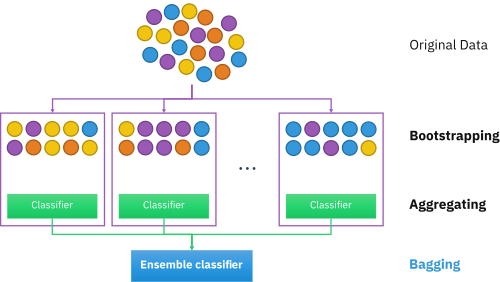
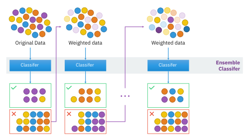
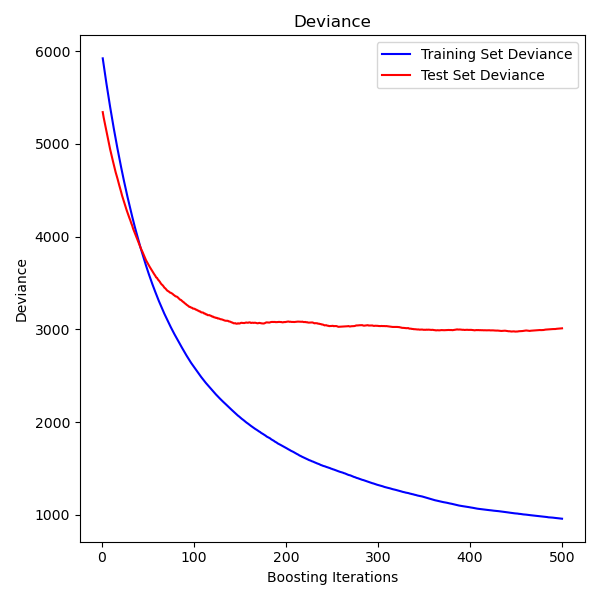
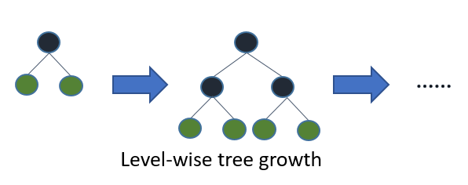
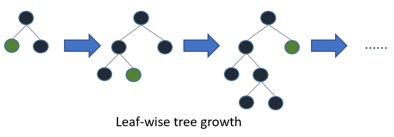
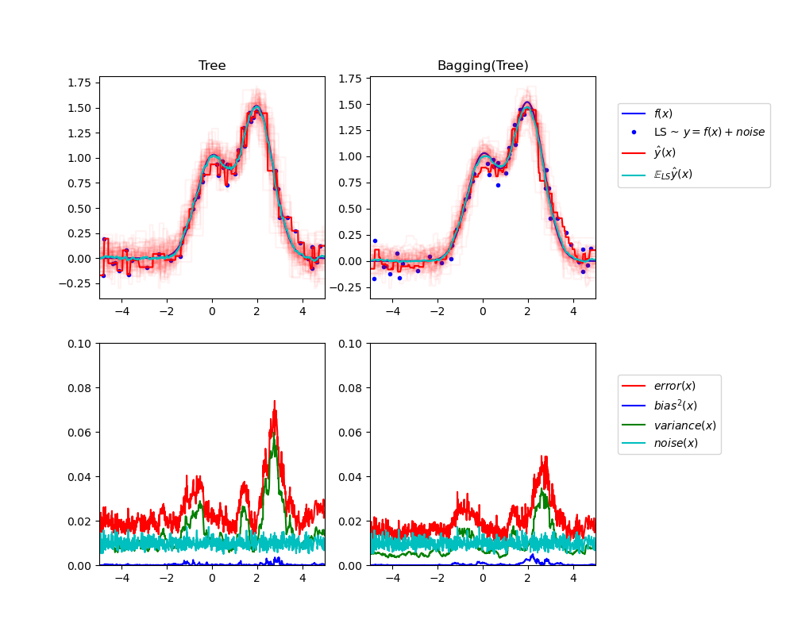

# Ensemble Learning and Random Forests Cheatsheet

## Table of Contents

- [Voting Classifiers](#voting-classifiers)
- [Bagging and Pasting](#bagging-and-pasting)
- [Bagging and Pasting in Scikit-Learn](#bagging-and-pasting-in-scikit-learn)
- [Out-of-Bag Evaluation](#out-of-bag-evaluation)
- [Random Patches and Random Subspaces](#random-patches-and-random-subspaces)
- [Random Forests](#random-forests)
- [Extra-Trees](#extra-trees)
- [Feature Importance](#feature-importance)
- [Boosting](#boosting)
  - [AdaBoost](#adaboost)
  - [Gradient Boosting](#gradient-boosting)
  - [XGBoost, LightGBM, and CatBoost](#xgboost-lightgbm-and-catboost)
- [Stacking](#stacking)
- [Bagging vs Boosting: The Bias-Variance Perspective](#bagging-vs-boosting-the-bias-variance-perspective)
- [When to Use Which Method](#when-to-use-which-method)
- [Hyperparameter Tuning Quick Reference](#hyperparameter-tuning-quick-reference)

---

## Voting Classifiers

A **Voting Classifier** aggregates the predictions of multiple diverse classifiers (e.g., Logistic Regression, SVM, Random Forest) and predicts the class that receives the most votes.

### Hard Voting

Each classifier casts a single vote for a class, and the majority wins (mode of the predictions).

### Soft Voting

Each classifier provides a probability vector for each class. The probabilities are averaged across classifiers, and the class with the highest average probability is selected. Soft voting typically outperforms hard voting because it gives more weight to highly confident predictions.

### Pros

- Often achieves higher accuracy than any single constituent classifier (wisdom of the crowd).
- Simple to implement and conceptually intuitive.
- Works with any combination of heterogeneous classifiers.

### Cons

- All classifiers must be trained and run at prediction time, increasing computational cost.
- Only effective when individual classifiers are diverse and reasonably accurate (better than random guessing).
- Soft voting requires all classifiers to support `predict_proba`.

### Usage

```python
from sklearn.ensemble import VotingClassifier
from sklearn.linear_model import LogisticRegression
from sklearn.svm import SVC
from sklearn.tree import DecisionTreeClassifier

clf1 = LogisticRegression()
clf2 = SVC(probability=True)
clf3 = DecisionTreeClassifier()

voting_clf = VotingClassifier(
    estimators=[('lr', clf1), ('svc', clf2), ('dt', clf3)],
    voting='soft'  # or 'hard'
)
voting_clf.fit(X_train, y_train)
```

### Regression Counterpart

Scikit-Learn also provides `VotingRegressor`, which averages the predictions of multiple regressors:

```python
from sklearn.ensemble import VotingRegressor
from sklearn.linear_model import LinearRegression
from sklearn.ensemble import RandomForestRegressor, GradientBoostingRegressor

reg1 = LinearRegression()
reg2 = RandomForestRegressor(n_estimators=100, random_state=42)
reg3 = GradientBoostingRegressor(n_estimators=100, random_state=42)

voting_reg = VotingRegressor(
    estimators=[('lr', reg1), ('rf', reg2), ('gb', reg3)]
)
voting_reg.fit(X_train, y_train)
```

For regression, aggregation is always the **mean** of predictions (no "hard" vs. "soft" distinction). You can optionally set `weights` to give more influence to better regressors.

### Common Pitfalls

- Using classifiers that are too similar (e.g., three Decision Trees with the same hyperparameters) provides little diversity and minimal improvement.
- Forgetting to set `probability=True` on SVC when using soft voting.
- Assuming that combining weak classifiers will always improve results — each learner must perform better than random chance.

---

## Bagging and Pasting

Both **Bagging** (Bootstrap Aggregating) and **Pasting** train multiple instances of the same algorithm on different random subsets of the training data, then aggregate their predictions.


*Bagging: multiple models are trained on different bootstrap samples, then their predictions are aggregated. (Source: [Wikipedia](https://en.wikipedia.org/wiki/Bootstrap_aggregating))*

| Aspect | Bagging | Pasting |
|--------|---------|---------|
| Sampling | **With** replacement (bootstrap) | **Without** replacement |
| Diversity | Higher (due to bootstrap overlap variation) | Lower |
| Bias | Slightly higher | Slightly lower |
| Variance | Significantly lower | Lower (but less than bagging) |

### How Aggregation Works

- **Classification**: majority vote (statistical mode).
- **Regression**: average of predictions.

### Pros

- Dramatically reduces variance and overfitting compared to a single model.
- Bagging can be trained in parallel across multiple CPU cores or servers.
- Each predictor sees a different subset, introducing beneficial diversity.

### Cons

- Increases overall training time proportional to the number of estimators (mitigated by parallelism).
- May increase bias slightly (bagging) compared to a single well-tuned model.
- Less effective on low-variance models (e.g., Linear Regression).

### Usage

Best applied to high-variance, low-bias models such as Decision Trees.

### Common Pitfalls

- Using too few estimators, which does not sufficiently reduce variance.
- Applying bagging to already-low-variance models where it adds cost without benefit.
- Confusing bagging (with replacement) and pasting (without replacement).

---

## Bagging and Pasting in Scikit-Learn

Scikit-Learn provides `BaggingClassifier` and `BaggingRegressor` for both bagging and pasting.

```python
from sklearn.ensemble import BaggingClassifier
from sklearn.tree import DecisionTreeClassifier

bag_clf = BaggingClassifier(
    estimator=DecisionTreeClassifier(),
    n_estimators=500,
    max_samples=100,        # size of each subset
    bootstrap=True,         # True = bagging, False = pasting
    n_jobs=-1,              # use all available CPU cores
    random_state=42
)
bag_clf.fit(X_train, y_train)
y_pred = bag_clf.predict(X_test)
```

### Key Parameters

| Parameter | Description |
|-----------|-------------|
| `n_estimators` | Number of base estimators in the ensemble |
| `max_samples` | Number (or fraction) of samples drawn for each estimator |
| `bootstrap` | `True` for bagging, `False` for pasting |
| `n_jobs` | Number of parallel jobs (`-1` = all cores) |
| `oob_score` | Whether to use out-of-bag samples for evaluation |

### Common Pitfalls

- Setting `max_samples` too low leads to underfitting; too high reduces diversity.
- Forgetting to set `n_jobs=-1` and missing out on parallelism.

---

## Out-of-Bag Evaluation

In bagging, each predictor is trained on roughly **63%** of the training instances (due to bootstrap sampling). The remaining ~37% that a given predictor never saw are its **out-of-bag (OOB) instances**.

### Why ~63%? The Math Behind It

When drawing `n` samples with replacement from a dataset of `n` instances, the probability that a specific instance is **not** picked in a single draw is \(1 - \frac{1}{n}\). Over `n` draws:

$$P(\text{not picked}) = \left(1 - \frac{1}{n}\right)^n$$

As \(n \to \infty\), this converges to:

$$\lim_{n \to \infty} \left(1 - \frac{1}{n}\right)^n = e^{-1} \approx 0.3679$$

So roughly **37%** of instances are left out (OOB), and **63%** are included in each bootstrap sample. This holds regardless of dataset size.


*Bootstrap sampling: some instances are picked multiple times, while others are left out entirely (OOB). (Source: [Wikipedia](https://en.wikipedia.org/wiki/Bootstrap_aggregating))*

Since each predictor has its own OOB set, we can evaluate each predictor on its OOB instances and average across all predictors. This provides a free validation estimate **without needing a separate validation set**.

```python
bag_clf = BaggingClassifier(
    estimator=DecisionTreeClassifier(),
    n_estimators=500,
    bootstrap=True,
    oob_score=True,
    n_jobs=-1,
    random_state=42
)
bag_clf.fit(X_train, y_train)
print(bag_clf.oob_score_)           # OOB accuracy
print(bag_clf.oob_decision_function_)  # OOB class probabilities per instance
```

### Pros

- No need to sacrifice data for a validation set — use all available data for training.
- Provides an unbiased estimate of generalization performance.
- Automatically available as a by-product of bagging.

### Cons

- Only available when `bootstrap=True` (bagging, not pasting).
- Slightly more computation during training to track OOB evaluations.

### Common Pitfalls

- Using OOB score with `bootstrap=False` — this will raise an error since there are no OOB samples without replacement.
- Treating OOB score as a perfect substitute for cross-validation on very small datasets.

---

## Random Patches and Random Subspaces

`BaggingClassifier` supports sampling not just rows but also **features**, adding further diversity.

| Method | Samples (rows) | Features (columns) |
|--------|:-:|:-:|
| **Bagging / Pasting** | Sampled | All |
| **Random Subspaces** | All | Sampled |
| **Random Patches** | Sampled | Sampled |

### Key Parameters

| Parameter | Description |
|-----------|-------------|
| `max_features` | Number (or fraction) of features drawn for each estimator |
| `bootstrap_features` | Whether to sample features with replacement |

```python
bag_clf = BaggingClassifier(
    estimator=DecisionTreeClassifier(),
    n_estimators=500,
    max_samples=0.8,
    bootstrap=True,
    max_features=0.5,          # each estimator sees 50% of features
    bootstrap_features=True,
    n_jobs=-1,
    random_state=42
)
```

### Pros

- Particularly useful for high-dimensional datasets (many features).
- Increases predictor diversity, further reducing variance.
- Random Subspaces keeps all training instances, useful when data is scarce.

### Cons

- Each individual predictor becomes weaker due to seeing fewer features.
- More hyperparameters to tune.

### Common Pitfalls

- Sampling too few features so that individual learners cannot capture meaningful patterns.
- Not understanding the distinction between sampling instances and features.

---

## Random Forests

A **Random Forest** is an ensemble of Decision Trees trained via bagging (typically `max_samples` = size of training set) with an additional layer of randomness: at each node, only a random subset of features is considered for splitting.


*Random Forest: each tree votes on the prediction, and the majority vote wins. Each tree sees a different subset of features and samples. (Source: [Wikipedia](https://en.wikipedia.org/wiki/Bootstrap_aggregating))*

```python
from sklearn.ensemble import RandomForestClassifier

rf_clf = RandomForestClassifier(
    n_estimators=500,
    max_leaf_nodes=16,
    n_jobs=-1,
    random_state=42
)
rf_clf.fit(X_train, y_train)
```

### Pros

- One of the most powerful and versatile ML algorithms out of the box.
- Handles both classification and regression.
- Naturally resistant to overfitting (with enough trees).
- Handles missing values and maintains accuracy for non-linear relationships.
- Requires relatively little hyperparameter tuning.

### Cons

- Less interpretable than a single Decision Tree.
- Can be slow for real-time predictions with very large ensembles.
- Tends to struggle with very high-dimensional sparse data (e.g., text) compared to linear models.
- Memory-intensive for large forests.

### Usage

Ideal for tabular data, medium-sized datasets, when you need a strong baseline with minimal tuning.

#### Regression Counterpart

```python
from sklearn.ensemble import RandomForestRegressor

rf_reg = RandomForestRegressor(
    n_estimators=500,
    max_depth=None,       # let trees grow fully (default)
    n_jobs=-1,
    random_state=42
)
rf_reg.fit(X_train, y_train)
y_pred = rf_reg.predict(X_test)
```

The API is identical. Aggregation uses the **mean** of tree predictions instead of majority vote.

### Common Pitfalls

- Using too few trees (`n_estimators` too low): accuracy has not yet converged.
- Not setting `max_depth` or `max_leaf_nodes` for very deep forests on noisy data.
- Expecting Random Forests to extrapolate well beyond training data range (they cannot).
- Ignoring class imbalance — use `class_weight='balanced'` or resampling.

---

## Extra-Trees

**Extremely Randomized Trees (Extra-Trees)** push randomness further: instead of searching for the *best* threshold at each feature split, they use a **random threshold** for each feature.

```python
from sklearn.ensemble import ExtraTreesClassifier

et_clf = ExtraTreesClassifier(
    n_estimators=500,
    n_jobs=-1,
    random_state=42
)
et_clf.fit(X_train, y_train)
```

### Pros

- **Faster training** than Random Forests because finding the optimal threshold is the most computationally expensive part of growing a tree.
- Even lower variance than Random Forests due to extra randomization.
- Trades a slightly higher bias for a significantly lower variance.

### Cons

- Slightly higher bias may reduce performance on some datasets.
- Individual trees are less accurate (though the ensemble can compensate).

### Usage

Use when training speed is critical or when you suspect overfitting with standard Random Forests. Often worth trying alongside Random Forests and comparing via cross-validation.

### Common Pitfalls

- Assuming Extra-Trees always outperform Random Forests — it depends on the dataset.
- Not comparing both approaches on your specific problem.

---

## Feature Importance

Random Forests (and tree-based ensembles in general) provide a natural measure of **feature importance**: how much each feature contributes to reducing impurity across all trees.

```python
from sklearn.ensemble import RandomForestClassifier

rf_clf = RandomForestClassifier(n_estimators=500, n_jobs=-1, random_state=42)
rf_clf.fit(X_train, y_train)

for name, score in zip(feature_names, rf_clf.feature_importances_):
    print(f"{name}: {score:.4f}")
```

### Pros

- Quick, automatic insight into which features matter most.
- Useful for feature selection and data understanding.
- Impurity-based importances are computed during training (no extra cost).

### Cons

- Impurity-based importances can be biased toward high-cardinality features.
- Does not capture feature interactions directly.
- Correlated features share importance, making each appear less important individually.

### Common Pitfalls

- Relying solely on impurity-based importance for high-cardinality or correlated features — consider **permutation importance** as an alternative.
- Interpreting importance as causation rather than predictive relevance.

### Permutation Importance

Permutation importance measures how much the model's performance **drops** when a single feature's values are randomly shuffled. Unlike impurity-based importance, it is computed on a held-out set and is **not biased** toward high-cardinality features.

```python
from sklearn.inspection import permutation_importance

# Compute on the test set (or validation set) — NOT the training set
result = permutation_importance(
    rf_clf, X_test, y_test,
    n_repeats=10,          # shuffle each feature 10 times
    random_state=42,
    n_jobs=-1
)

for name, importance_mean, importance_std in zip(
    feature_names, result.importances_mean, result.importances_std
):
    print(f"{name}: {importance_mean:.4f} ± {importance_std:.4f}")
```

**When to prefer permutation importance over impurity-based:**

- Features have very different cardinalities (e.g., ID-like columns vs. binary flags).
- Features are highly correlated — permutation importance is still affected but less misleading.
- You want to measure importance on unseen data (generalization relevance, not training relevance).

### Regression Counterpart

Feature importance works identically for regression ensembles:

```python
from sklearn.ensemble import RandomForestRegressor

rf_reg = RandomForestRegressor(n_estimators=500, n_jobs=-1, random_state=42)
rf_reg.fit(X_train, y_train)
print(rf_reg.feature_importances_)  # same API as classifier
```

---

## Boosting

**Boosting** trains predictors sequentially, where each new predictor focuses on correcting the errors of its predecessors. Unlike bagging, boosting **cannot** be easily parallelized because each step depends on the previous one.


*Boosting: learners are trained sequentially, with each one focusing on the errors of the previous. The weighted dataset evolves across rounds. (Source: [Wikipedia](https://en.wikipedia.org/wiki/Boosting_(machine_learning)))*

### AdaBoost

**Adaptive Boosting** adjusts instance weights: misclassified instances receive higher weights so subsequent classifiers focus more on hard cases.

#### Algorithm (High Level)

1. Train a base classifier on the training data.
2. Compute its weighted error rate.
3. Compute the classifier's weight (more accurate classifiers get higher weights).
4. Update instance weights: increase weights of misclassified instances.
5. Train the next classifier on the reweighted data.
6. Repeat for `n_estimators` iterations.
7. Final prediction: weighted majority vote.

#### Key Formulas

**Weighted error rate** of the j-th predictor:

$$r_j = \frac{\sum_{i: \hat{y}_j^{(i)} \neq y^{(i)}} w^{(i)}}{\sum_{i} w^{(i)}}$$

where \(w^{(i)}\) is the weight of the i-th instance.

**Predictor weight** (how much influence the j-th predictor gets):

$$\alpha_j = \eta \cdot \ln\left(\frac{1 - r_j}{r_j}\right)$$

where \(\eta\) is the learning rate. A predictor at 50% error gets \(\alpha = 0\) (no influence). Lower error means higher weight.

**Instance weight update** (after the j-th predictor):

$$w^{(i)} \leftarrow \begin{cases} w^{(i)} \cdot e^{\alpha_j} & \text{if instance } i \text{ was misclassified} \\ w^{(i)} & \text{if instance } i \text{ was correctly classified} \end{cases}$$

Then all weights are normalized so they sum to 1.

**Final prediction** (aggregation):

$$\hat{y}(\mathbf{x}) = \underset{k}{\operatorname{argmax}} \sum_{\substack{j=1 \\ \hat{y}_j(\mathbf{x})=k}}^{N} \alpha_j$$

The class that accumulates the highest total weight wins.

```python
from sklearn.ensemble import AdaBoostClassifier
from sklearn.tree import DecisionTreeClassifier

ada_clf = AdaBoostClassifier(
    estimator=DecisionTreeClassifier(max_depth=1),  # "decision stump"
    n_estimators=200,
    algorithm='SAMME',       # or 'SAMME.R' for probabilities
    learning_rate=0.5,
    random_state=42
)
ada_clf.fit(X_train, y_train)
```

#### Pros

- Can achieve very high accuracy by focusing on hard examples.
- Simple to implement with weak learners (e.g., decision stumps).
- Naturally performs feature selection.

#### Cons

- Sequential training — cannot be parallelized.
- Sensitive to noisy data and outliers (they get increasingly higher weights).
- Prone to overfitting if `n_estimators` is too high or the base learner is too complex.

#### Common Pitfalls

- Using a complex base estimator (e.g., deep trees) instead of a weak learner — leads to rapid overfitting.
- Setting `learning_rate` too high, causing oscillation, or too low, requiring excessive estimators.
- Not handling outliers in the data before training.

---

### Gradient Boosting

**Gradient Boosting** builds trees sequentially, but instead of adjusting instance weights, each new tree fits the **residual errors** (negative gradient of the loss function) of the combined ensemble so far.



#### Key Formulas

**Additive model**: the ensemble prediction after \(M\) stages is:

$$F_M(\mathbf{x}) = F_0(\mathbf{x}) + \eta \cdot h_1(\mathbf{x}) + \eta \cdot h_2(\mathbf{x}) + \cdots + \eta \cdot h_M(\mathbf{x})$$

where \(F_0\) is the initial prediction (e.g., the mean of \(y\) for regression), \(h_m\) is the m-th tree, and \(\eta\) is the learning rate.

**At each stage \(m\)**, a new tree \(h_m\) is trained to predict the **pseudo-residuals**:

$$r_m^{(i)} = -\frac{\partial L\left(y^{(i)},\; F_{m-1}(\mathbf{x}^{(i)})\right)}{\partial F_{m-1}(\mathbf{x}^{(i)})}$$

For **MSE loss** (regression), the pseudo-residuals simplify to actual residuals:

$$r_m^{(i)} = y^{(i)} - F_{m-1}(\mathbf{x}^{(i)})$$

**Update**: \(F_m(\mathbf{x}) = F_{m-1}(\mathbf{x}) + \eta \cdot h_m(\mathbf{x})\)

The learning rate \(\eta\) shrinks each tree's contribution, acting as regularization.

```python
from sklearn.ensemble import GradientBoostingRegressor

gbrt = GradientBoostingRegressor(
    max_depth=2,
    n_estimators=100,
    learning_rate=0.1,
    random_state=42
)
gbrt.fit(X_train, y_train)
```

#### Classification Counterpart

```python
from sklearn.ensemble import GradientBoostingClassifier

gbc = GradientBoostingClassifier(
    max_depth=3,
    n_estimators=100,
    learning_rate=0.1,
    random_state=42
)
gbc.fit(X_train, y_train)
```

For classification, Gradient Boosting fits trees to the negative gradient of the **log loss** (cross-entropy) instead of MSE.

```python
import numpy as np
from sklearn.ensemble import GradientBoostingRegressor
from sklearn.metrics import mean_squared_error

gbrt = GradientBoostingRegressor(
    max_depth=2,
    n_estimators=500,
    learning_rate=0.1,
    n_iter_no_change=10,     # early stopping patience
    validation_fraction=0.1, # fraction for early stopping
    random_state=42
)
gbrt.fit(X_train, y_train)
print(f"Stopped at {gbrt.n_estimators_} trees")
```

#### Key Hyperparameters

| Parameter | Effect |
|-----------|--------|
| `learning_rate` | Shrinks the contribution of each tree. Lower values need more trees but generalize better |
| `n_estimators` | Number of boosting stages |
| `max_depth` | Depth of each tree (typically 2–5) |
| `subsample` | Fraction of samples used per tree (<1.0 = **Stochastic Gradient Boosting**) |

#### Pros

- Often the best-performing algorithm on tabular data (especially with XGBoost, LightGBM, CatBoost).
- Flexible — supports various loss functions.
- Regularization via learning rate, tree constraints, and early stopping.

#### Cons

- Sequential training — inherently slower than bagging-based methods.
- More hyperparameters to tune than Random Forests.
- Sensitive to noisy data without proper regularization.

#### Common Pitfalls

- Not using early stopping, leading to overfitting with too many trees.
- Setting `learning_rate` too high — fast training but poor generalization.
- Forgetting to scale or clean data; Gradient Boosting is less forgiving of messy inputs than Random Forests.
- Ignoring `subsample` for stochastic boosting, which often improves generalization and speed.

---

### XGBoost, LightGBM, and CatBoost

Scikit-Learn's `GradientBoostingClassifier`/`Regressor` is a solid implementation, but in practice, three **optimized libraries** dominate competitive ML and production use. All three are gradient boosting frameworks, but they differ significantly in how they build trees, handle features, and optimize performance.

#### XGBoost (Extreme Gradient Boosting)

The first widely adopted high-performance gradient boosting library. Introduced several key innovations over basic gradient boosting.

**Key innovations:**
- **Regularized objective** — adds L1 and L2 regularization terms directly to the loss function on leaf weights, not just tree structure constraints. This is unique to XGBoost — sklearn's GBM only regularizes through tree constraints
- **Weighted quantile sketch** — an approximate split-finding algorithm that handles weighted data efficiently, enabling distributed training on datasets that don't fit in memory
- **Sparsity-aware splitting** — natively handles missing values by learning the best default direction (left or right) for missing values at each split during training
- **Column block structure** — pre-sorts data into compressed column blocks for efficient parallel split finding within a single tree
- **Shrinkage + column subsampling** — combines learning rate with per-tree feature sampling, borrowing the diversity idea from Random Forests

```python
from xgboost import XGBClassifier

xgb_clf = XGBClassifier(
    n_estimators=500,
    max_depth=6,              # default (deeper than sklearn's GBM)
    learning_rate=0.1,        # called 'eta' in native API
    subsample=0.8,            # row sampling per tree
    colsample_bytree=0.8,    # feature sampling per tree
    reg_alpha=0.0,            # L1 regularization on leaf weights
    reg_lambda=1.0,           # L2 regularization on leaf weights
    eval_metric='logloss',
    random_state=42,
    n_jobs=-1
)
xgb_clf.fit(X_train, y_train, eval_set=[(X_val, y_val)], verbose=False)
```

#### LightGBM (Light Gradient Boosting Machine)

Developed by Microsoft. Significantly faster than XGBoost on large datasets due to two algorithmic innovations.

**Key innovations:**
- **Gradient-based One-Side Sampling (GOSS)** — keeps all instances with large gradients (hard examples) and randomly samples from instances with small gradients. This focuses computation on the instances that matter most without significantly hurting accuracy
- **Exclusive Feature Bundling (EFB)** — identifies mutually exclusive sparse features (features that rarely take nonzero values simultaneously) and bundles them into a single feature. This dramatically reduces the effective number of features for high-dimensional sparse data
- **Leaf-wise (best-first) tree growth** — instead of growing all nodes at the same depth (level-wise like XGBoost by default), LightGBM always splits the leaf with the highest loss reduction. This produces deeper, asymmetric trees that often converge faster but risk overfitting:





- **Histogram-based splitting** — bins continuous features into discrete histograms (default 255 bins), making split-finding $O(\text{bins})$ instead of $O(m)$. XGBoost later adopted this too via `tree_method='hist'`
- **Native categorical feature support** — handles categoricals directly without one-hot encoding

```python
import lightgbm as lgbm
from lightgbm import LGBMClassifier

lgbm_clf = LGBMClassifier(
    n_estimators=500,
    max_depth=-1,             # no limit (leaf-wise controls complexity)
    num_leaves=31,            # max leaves per tree — PRIMARY complexity control
    learning_rate=0.1,
    subsample=0.8,
    colsample_bytree=0.8,
    min_child_samples=20,     # min instances per leaf
    random_state=42,
    n_jobs=-1
)
lgbm_clf.fit(
    X_train, y_train,
    eval_set=[(X_val, y_val)],
    callbacks=[lgbm.early_stopping(50), lgbm.log_evaluation(0)]
)
```

**Critical difference:** LightGBM's primary complexity control is `num_leaves`, **not** `max_depth`. Setting `num_leaves=31` with `max_depth=-1` is the default. If you also set `max_depth`, keep it consistent: `num_leaves` should be at most $2^{\text{max\_depth}}$, otherwise `max_depth` has no real effect.

#### CatBoost (Categorical Boosting)

Developed by Yandex. Designed specifically to handle categorical features and reduce prediction shift.

**Key innovations:**
- **Ordered Target Statistics** — encodes categorical features using target statistics computed only on preceding instances (in a random permutation). This prevents **target leakage** that occurs with naive target encoding, where a category's encoding depends on the very labels it's trying to predict
- **Ordered Boosting** — trains each tree on a different permutation of the data, computing residuals only from "past" data in the permutation. This reduces **prediction shift** — the bias that occurs in standard gradient boosting because residuals on training data are computed using the same instances that were used to train previous trees
- **Symmetric (oblivious) Decision Trees** — uses the **same splitting condition at all nodes of each depth level**. Every node at depth 2, for example, uses the same feature and threshold. This produces balanced trees that are faster to evaluate (SIMD-friendly) and act as implicit regularization
- **Native categorical support** — the best among the three for datasets with many categorical features, requiring no preprocessing

```python
from catboost import CatBoostClassifier

cat_clf = CatBoostClassifier(
    iterations=500,           # same as n_estimators
    depth=6,                  # tree depth (symmetric trees)
    learning_rate=0.1,
    l2_leaf_reg=3.0,          # L2 regularization
    cat_features=categorical_column_indices,  # pass categorical column indices
    early_stopping_rounds=50,
    verbose=0,
    random_seed=42
)
cat_clf.fit(X_train, y_train, eval_set=(X_val, y_val))
```

#### Detailed Comparison

| Aspect | XGBoost | LightGBM | CatBoost |
|--------|---------|----------|----------|
| **Tree growth** | Depth-wise (default) | Leaf-wise (best-first) | Symmetric (oblivious) |
| **Training speed** | Fast | Fastest (especially on large data) | Moderate (slower per iteration) |
| **Categorical features** | Requires manual encoding | Native support (good) | Native support (best) |
| **Missing values** | Native handling (learns best direction) | Native handling | Native handling |
| **GPU support** | Yes | Yes | Yes |
| **Primary complexity control** | `max_depth` | `num_leaves` | `depth` |
| **Regularization** | L1, L2, gamma on leaf weights | L1, L2, min_child_samples | L2, random_strength, ordered boosting |
| **Default performance** | Good (needs tuning) | Good (needs tuning) | Often best out-of-the-box |
| **Overfitting risk** | Moderate | Higher (leaf-wise is aggressive) | Lower (ordered boosting reduces prediction shift) |
| **Community / ecosystem** | Largest, most tutorials | Large | Growing |

#### When to Pick Which

- **XGBoost** — safe default for any tabular problem. Largest community, most tutorials, excellent documentation. Start here if unsure.
- **LightGBM** — large datasets (>100k rows), speed-critical applications, high-dimensional sparse data. Control complexity with `num_leaves`, not `max_depth`.
- **CatBoost** — datasets with many categorical features, when you want strong performance with minimal preprocessing and tuning. Often wins out-of-the-box.

**In practice:** Try all three with default parameters, then tune the best-performing one. On Kaggle competitions, LightGBM and XGBoost are the most popular; CatBoost often wins with less tuning effort.

#### Common Pitfalls

- **Not using early stopping** — all three libraries can overfit given enough trees. **Always** provide a validation set and use early stopping.
- **LightGBM overfitting on small datasets** — leaf-wise growth is aggressive. Reduce `num_leaves` or set a reasonable `max_depth`.
- **Forgetting to declare categorical features in CatBoost** — if you label-encode or one-hot-encode your categoricals before passing them, you lose CatBoost's main advantage.
- **One-hot encoding with LightGBM/CatBoost** — both handle categoricals natively. One-hot encoding wastes memory, slows training, and often hurts tree-based model performance.
- **Mixing up `num_leaves` and `max_depth` in LightGBM** — `num_leaves` is the primary control. Setting `max_depth=5` but `num_leaves=1000` means `max_depth` has no practical effect.
- **Not scaling the comparison** — these libraries have different default hyperparameters, so compare them with proper tuning on each, not just default vs. default.

---

## Stacking

**Stacking** (Stacked Generalization) trains a **meta-learner** (blender) to combine the predictions of several base classifiers, instead of using simple voting or averaging.

### How It Works

1. Split the training set into two subsets.
2. Train several base classifiers (layer 1) on the first subset.
3. Use the base classifiers to make predictions on the second subset (hold-out set).
4. Train a meta-learner (layer 2) on these predictions (using hold-out targets as labels).
5. At prediction time: base classifiers predict → their outputs are fed to the meta-learner → final prediction.

```python
from sklearn.ensemble import StackingClassifier
from sklearn.linear_model import LogisticRegression
from sklearn.ensemble import RandomForestClassifier, ExtraTreesClassifier
from sklearn.svm import SVC

stacking_clf = StackingClassifier(
    estimators=[
        ('rf', RandomForestClassifier(n_estimators=100, random_state=42)),
        ('et', ExtraTreesClassifier(n_estimators=100, random_state=42)),
        ('svc', SVC(probability=True, random_state=42))
    ],
    final_estimator=LogisticRegression(),
    cv=5,    # use cross-validation to generate training data for meta-learner
    n_jobs=-1
)
stacking_clf.fit(X_train, y_train)
```

### Regression Counterpart

```python
from sklearn.ensemble import StackingRegressor
from sklearn.linear_model import RidgeCV
from sklearn.ensemble import RandomForestRegressor, GradientBoostingRegressor
from sklearn.svm import SVR

stacking_reg = StackingRegressor(
    estimators=[
        ('rf', RandomForestRegressor(n_estimators=100, random_state=42)),
        ('gb', GradientBoostingRegressor(n_estimators=100, random_state=42)),
        ('svr', SVR(kernel='rbf'))
    ],
    final_estimator=RidgeCV(),   # simple linear meta-learner with built-in CV
    cv=5,
    n_jobs=-1
)
stacking_reg.fit(X_train, y_train)
```

The API is identical to classification. The meta-learner predicts a continuous value instead of a class. `RidgeCV` is a good default meta-learner for regression stacking.

### Pros

- Can squeeze out additional performance beyond voting classifiers.
- The meta-learner can discover optimal ways to weight and combine base predictions.
- Supports multi-layer stacking for even more complex ensembles.

### Cons

- More complex to implement and tune.
- Higher computational cost (training base classifiers + meta-learner).
- Increased risk of overfitting, especially with small datasets.
- Harder to interpret.

### Common Pitfalls

- Training the meta-learner on the same data used to train base classifiers — causes severe overfitting. Always use a hold-out set or cross-validation.
- Using an overly complex meta-learner (e.g., deep neural network). A simple model like Logistic Regression is usually sufficient and less prone to overfitting.
- Not diversifying the base classifiers — stacking benefits most from diverse, uncorrelated learners.
- Stacking too many layers without enough data to support them.

---

## Quick Comparison Table

| Method | Training | Parallelizable | Variance Reduction | Bias | Overfitting Risk |
|--------|----------|:-:|:-:|:-:|:-:|
| Voting | Independent | Yes | Moderate | Unchanged | Low |
| Bagging | Independent (bootstrap) | Yes | High | Slightly higher | Low |
| Pasting | Independent (no replacement) | Yes | Moderate | Unchanged | Low–Moderate |
| Random Forest | Independent (bagging + feature sampling) | Yes | High | Slightly higher | Low |
| Extra-Trees | Independent (random thresholds) | Yes | Very High | Slightly higher | Low |
| AdaBoost | Sequential | No | Moderate | Low | Moderate–High |
| Gradient Boosting | Sequential | No | High | Low | Moderate–High |
| Stacking | Layer-wise | Partially | High | Low | Moderate–High |

---

## Bagging vs Boosting: The Bias-Variance Perspective

Understanding **why** bagging and boosting work requires understanding the bias-variance tradeoff:



$$\text{Total Error} = \text{Bias}^2 + \text{Variance} + \text{Irreducible Noise}$$

### Bagging Reduces Variance

- Decision Trees are high-variance models (small changes in data → very different trees).
- Bagging trains many trees on different bootstrap samples and **averages** their predictions.
- Averaging many high-variance, low-bias models **reduces variance** without significantly increasing bias.
- **Analogy**: asking 100 people to estimate something and taking the average — individual errors cancel out.

### Boosting Reduces Bias

- Boosting starts with a weak learner (high bias, low variance) such as a decision stump.
- Each subsequent model corrects the errors of the combined ensemble so far.
- Sequentially reducing residual errors **directly reduces bias**.
- **Risk**: if you boost too many rounds, you start fitting noise → variance increases → overfitting.

### Visual Intuition

```
Bagging:  Many complex models → Average them → Lower variance, similar bias
Boosting: Many simple models → Add them up → Lower bias, risk of higher variance

Bagging:  [Complex Tree 1] + [Complex Tree 2] + ... → Average → Stable prediction
Boosting: [Stump 1] + [Stump 2] + [Stump 3] + ... → Sum → Precise prediction
```

### Key Takeaway

| | Starts With | Primarily Fixes | Risk |
|--|--|--|--|
| **Bagging** | High-variance model (deep trees) | Variance | Slight bias increase |
| **Boosting** | High-bias model (stumps/shallow trees) | Bias | Overfitting if unchecked |

This is why **bagging rarely overfits** (adding more trees just averages more noise away) while **boosting can overfit** (adding more rounds keeps fitting residuals, eventually fitting noise).

---

## When to Use Which Method

### Decision Flowchart

```
Start
  │
  ├─ Need a quick, strong baseline?
  │    → Random Forest (minimal tuning, robust)
  │
  ├─ Need maximum predictive performance?
  │    → Gradient Boosting (XGBoost / LightGBM / CatBoost)
  │
  ├─ Dataset is very large (millions of rows)?
  │    → LightGBM (fastest histogram-based training)
  │
  ├─ Many categorical features?
  │    → CatBoost (native categorical handling)
  │
  ├─ Suspect overfitting with Random Forest?
  │    → Try Extra-Trees (more regularization via random thresholds)
  │
  ├─ Want to combine heterogeneous models (RF + SVM + LR)?
  │    → Voting Classifier or Stacking
  │
  ├─ Very small dataset, can't afford a validation set?
  │    → Bagging with OOB evaluation
  │
  ├─ High-dimensional sparse data (text, NLP)?
  │    → Linear models often beat tree-based ensembles
  │    → If using trees, try Random Subspaces
  │
  └─ Need interpretability?
       → Single Decision Tree > Random Forest > Gradient Boosting
       → Use feature importance / SHAP values for ensemble interpretability
```

### Summary by Use Case

| Scenario | Recommended Method |
|----------|-------------------|
| Tabular data, quick baseline | Random Forest |
| Tabular data, maximum performance | XGBoost / LightGBM / CatBoost |
| Small dataset | Bagging + OOB evaluation |
| Many categorical features | CatBoost |
| Very large dataset (>1M rows) | LightGBM |
| Combining different model types | Voting or Stacking |
| Overfitting with RF | Extra-Trees or reduce `max_depth` |
| Real-time / low-latency predictions | Fewer trees, or single Gradient Boosted model with pruning |
| Competitions / squeezing last 0.1% | Stacking multiple diverse models |

---

## Hyperparameter Tuning Quick Reference

### Random Forest — Recommended Starting Values

| Parameter | Starting Value | Tuning Range | Notes |
|-----------|:--:|:--:|-------|
| `n_estimators` | 500 | 100–2000 | More is generally better; diminishing returns after ~500 |
| `max_depth` | None | 5–50 or None | None = fully grown; limit for noisy data |
| `max_features` | `'sqrt'` | `'sqrt'`, `'log2'`, 0.3–0.8 | `'sqrt'` is default for classification |
| `min_samples_leaf` | 1 | 1–20 | Increase to regularize |
| `min_samples_split` | 2 | 2–20 | Increase to regularize |
| `class_weight` | None | `'balanced'` | Use for imbalanced classes |

### Gradient Boosting (XGBoost/LightGBM) — Recommended Starting Values

| Parameter | Starting Value | Tuning Range | Notes |
|-----------|:--:|:--:|-------|
| `n_estimators` | 500 | 100–5000 | **Always** use with early stopping |
| `learning_rate` | 0.1 | 0.01–0.3 | Lower → more trees needed, better generalization |
| `max_depth` | 3–6 | 2–10 | Shallow trees work best for boosting |
| `subsample` | 0.8 | 0.5–1.0 | Stochastic boosting; <1.0 reduces overfitting |
| `colsample_bytree` | 0.8 | 0.5–1.0 | Column subsampling per tree |
| `min_child_weight` | 1 | 1–10 | Minimum sum of instance weight in a leaf |
| `reg_alpha` (L1) | 0 | 0–10 | L1 regularization on leaf weights |
| `reg_lambda` (L2) | 1 | 0–10 | L2 regularization on leaf weights |

### LightGBM-Specific

| Parameter | Starting Value | Tuning Range | Notes |
|-----------|:--:|:--:|-------|
| `num_leaves` | 31 | 15–127 | **Main** complexity control (replaces `max_depth`) |
| `min_data_in_leaf` | 20 | 5–100 | Prevents overfitting on small groups |

### Tuning Strategy

1. **Start with defaults** and establish a baseline with cross-validation.
2. **Fix `learning_rate=0.1`** and tune tree structure (`max_depth`, `num_leaves`, `min_samples_leaf`).
3. **Tune regularization** (`subsample`, `colsample_bytree`, `reg_alpha`, `reg_lambda`).
4. **Lower `learning_rate`** to 0.01–0.05, increase `n_estimators`, and use early stopping.
5. **Use `RandomizedSearchCV`** or **Optuna** for efficient hyperparameter search:

```python
from sklearn.model_selection import RandomizedSearchCV
from scipy.stats import randint, uniform

param_distributions = {
    'n_estimators': randint(100, 1000),
    'max_depth': randint(3, 10),
    'learning_rate': uniform(0.01, 0.29),
    'subsample': uniform(0.5, 0.5),
    'colsample_bytree': uniform(0.5, 0.5),
}

search = RandomizedSearchCV(
    xgb_clf, param_distributions,
    n_iter=50, cv=5, scoring='accuracy',
    random_state=42, n_jobs=-1
)
search.fit(X_train, y_train)
print(search.best_params_)
```
