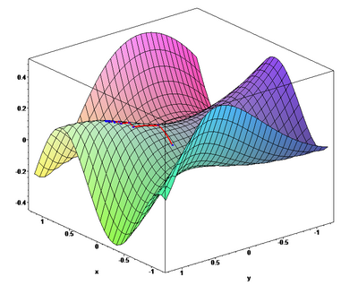

# Feature Scaling

Feature scaling is the process of transforming features to a similar range or distribution. It is critical for gradient descent convergence and also affects distance-based algorithms. When features are on vastly different scales (e.g., age 0–100 vs salary 20,000–200,000), the cost function contours become elongated ellipses, causing gradient descent to zigzag and converge slowly. Scaling makes contours more circular, allowing gradient descent to move directly toward the minimum.



*When features are on different scales, the cost surface becomes elongated and gradient descent zigzags. Scaling makes contours more circular, allowing direct convergence to the minimum.*

---

## 1. Standardization (Z-Score Normalization)

**Definition:** Transforms features to have zero mean and unit variance by subtracting the mean and dividing by the standard deviation.

$$x' = \frac{x - \mu}{\sigma}$$

Where $\mu$ = mean, $\sigma$ = standard deviation. Result: mean = 0, std = 1.

**Time Complexity:**
- Fit (compute $\mu$ and $\sigma$): $O(mn)$ — one pass over all $m$ samples and $n$ features.
- Transform: $O(mn)$ — subtract and divide per element.

**When to use:**
- Features follow a Gaussian (normal) distribution or approximately normal
- Algorithms that assume zero-centered data (e.g., linear regression with gradient descent, SVMs, PCA)
- When outliers are not extreme (they still affect $\mu$ and $\sigma$)

**Advantages:**
- ✅ Preserves the shape of the original distribution
- ✅ Handles negative values naturally
- ✅ Widely applicable and well understood
- ✅ No bounded range, so less information loss than min-max

**Disadvantages:**
- ❌ Sensitive to outliers (outliers skew $\mu$ and $\sigma$)
- ❌ Does not bound values to a specific range
- ❌ Assumes approximately normal distribution for best results

**Python:**
```python
from sklearn.preprocessing import StandardScaler
scaler = StandardScaler()
X_scaled = scaler.fit_transform(X_train)
X_test_scaled = scaler.transform(X_test)  # always use train's μ and σ
```

---

## 2. Min-Max Normalization

**Definition:** Scales features to a fixed range, typically [0, 1], by subtracting the minimum value and dividing by the range.

$$x' = \frac{x - x_{min}}{x_{max} - x_{min}}$$

Result: all values in [0, 1].

**Time Complexity:**
- Fit (find $x_{min}$ and $x_{max}$): $O(mn)$ — one pass over all samples and features.
- Transform: $O(mn)$ — subtract and divide per element.

**When to use:**
- Features do NOT follow a Gaussian distribution
- Algorithms that require bounded inputs (e.g., neural networks with sigmoid activations, image pixel values)
- When you need values in a specific range

**Advantages:**
- ✅ Guarantees a bounded range [0, 1]
- ✅ Preserves zero entries in sparse data
- ✅ Simple to understand and interpret
- ✅ Works well when you know the data bounds

**Disadvantages:**
- ❌ Very sensitive to outliers (a single outlier compresses all other values)
- ❌ Does not center the data at zero
- ❌ New data outside training range maps beyond [0, 1]

**Python:**
```python
from sklearn.preprocessing import MinMaxScaler
scaler = MinMaxScaler()
X_scaled = scaler.fit_transform(X_train)
```

---

## 3. Robust Scaling

**Definition:** Uses the median and interquartile range (IQR) instead of mean and standard deviation. Robust to outliers.

$$x' = \frac{x - \text{median}}{\text{IQR}}$$

Where $\text{IQR} = Q_3 - Q_1$ (75th percentile − 25th percentile).

**Time Complexity:**
- Fit (compute median and IQR): $O(mn \log m)$ — requires sorting each feature column to find percentiles.
- Transform: $O(mn)$ — subtract and divide per element.

**When to use:**
- Data contains significant outliers
- You want scaling that ignores extreme values
- Features are not normally distributed

**Advantages:**
- ✅ Robust to outliers (median and IQR are not affected by extreme values)
- ✅ Centers around median
- ✅ Better than standardization when data has many outliers

**Disadvantages:**
- ❌ Does not bound values to a specific range
- ❌ Less commonly used, may be unfamiliar to some teams
- ❌ If data has no outliers, standardization is simpler and sufficient

**Python:**
```python
from sklearn.preprocessing import RobustScaler
scaler = RobustScaler()
X_scaled = scaler.fit_transform(X_train)
```

---

## Feature Scaling Summary

| Method | Formula | Range | Outlier Robust? | Best For |
|--------|---------|-------|-----------------|----------|
| **Standardization** | $\frac{x - \mu}{\sigma}$ | Unbounded | ❌ No | Normally distributed data |
| **Min-Max** | $\frac{x - x_{min}}{x_{max} - x_{min}}$ | [0, 1] | ❌ No | Bounded range needed |
| **Robust** | $\frac{x - \text{median}}{\text{IQR}}$ | Unbounded | ✅ Yes | Data with outliers |

> **Important:** Always fit the scaler on the **training set only**, then transform both training and test sets. This prevents data leakage.
