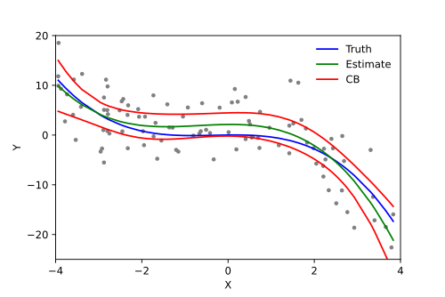

# Polynomial Regression Cheatsheet

> Polynomial Regression extends Linear Regression to model non-linear relationships by adding polynomial terms to the feature set — while remaining a linear model in the parameters.

---

## What is Polynomial Regression?

Polynomial Regression is an extension of Linear Regression that models **non-linear relationships** between features and the target variable by adding polynomial terms (powers and interactions of the original features) to the model.

Despite fitting curves, Polynomial Regression is still a **linear model** — it is linear in the **parameters** $\theta$, not in the features $x$. We simply create new features ($x^2, x^3, \ldots$) and then fit a standard linear model on the expanded feature set.

---

## Equation

For a single feature $x$, polynomial regression of degree $d$:

$$\hat{y} = \theta_0 + \theta_1 x + \theta_2 x^2 + \theta_3 x^3 + \cdots + \theta_d x^d$$

In matrix form, we transform the feature matrix $X$ into a polynomial feature matrix $X_{poly}$ and then apply regular linear regression:

$$\hat{y} = X_{poly} \theta$$

---

## Visual Intuition



*Polynomial regression fits a curve to data that a straight line cannot capture. Higher degrees fit more complex patterns but risk overfitting.*

---

## How It Works

```
Step 1: Choose a polynomial degree d
Step 2: Transform features: [x] → [x, x², x³, ..., xᵈ]
Step 3: (Optional) Add interaction terms for multiple features
Step 4: Fit standard Linear Regression on the transformed features
Step 5: Use Normal Equation or Gradient Descent to find θ
```

**For multiple features** ($x_1, x_2$) with degree 2, the expanded features include:

$$[1, \; x_1, \; x_2, \; x_1^2, \; x_1 x_2, \; x_2^2]$$

The number of features grows combinatorially: with $n$ original features and degree $d$, the expanded feature count is $\binom{n+d}{d}$. For example:

| Original features ($n$) | Degree ($d$) | Polynomial features |
|:---:|:---:|:---:|
| 2 | 2 | 6 |
| 2 | 3 | 10 |
| 10 | 2 | 66 |
| 10 | 3 | 286 |
| 100 | 2 | 5,151 |

---

## Choosing the Polynomial Degree

The degree $d$ is a **hyperparameter** that controls the model's complexity:

| Degree | Model behavior | Risk |
|:---:|:---|:---|
| **1** | Standard linear regression (straight line) | Underfitting if relationship is non-linear |
| **2–3** | Captures moderate curvature | Usually a good default |
| **4–6** | Fits complex shapes | Starting to overfit on small datasets |
| **> 6** | Extreme flexibility | Almost certainly overfitting |

**How to choose:**
- Use **cross-validation** to compare different degrees and pick the one with the lowest validation error.
- Watch the **learning curves**: if training error is low but validation error is high, the degree is too high.
- **Start simple** (degree 2) and increase only if the model underfits.

---

## Overfitting and Regularization

Polynomial Regression is highly prone to overfitting because:
1. **High-degree polynomials** can fit arbitrarily complex curves, including noise.
2. **Coefficient magnitudes** can become very large, leading to wild oscillations between data points.


*Left: Underfitting (degree too low). Right: Overfitting (degree too high). The model fits training data perfectly but generalizes poorly.*

**Solutions:**
- **Regularization** (Ridge, Lasso, Elastic Net) — constrains coefficient magnitudes. See [regularization_techniques.md](../regularization_techniques.md).
- **Reduce degree** — simplest fix.
- **More training data** — harder for the model to memorize.
- **Feature scaling** — essential when using polynomial features because $x^d$ magnifies scale differences enormously.

---

## When to Use Polynomial Regression Instead of Other Linear Models

Polynomial Regression sits between plain Linear Regression and fully non-linear models. Choosing it over other options depends on the data, the problem, and what you need from the model.

**Use Polynomial Regression when:**

1. **The relationship is clearly non-linear but smooth.** If a scatter plot of feature vs. target shows a curve (parabola, S-shape, or wave), a straight line will systematically underfit. Polynomial terms can capture that curvature without leaving the linear regression framework.

2. **You have few features.** Polynomial feature expansion grows combinatorially. With 2–5 original features and degree 2–3, it's manageable. With 100 features, even degree 2 produces 5,000+ features — at that point, other models are better choices.

3. **You need interpretable coefficients.** The model is still $\hat{y} = \theta_0 + \theta_1 x + \theta_2 x^2 + \ldots$ — each coefficient has a clear meaning (the effect of that term on the prediction). Tree-based models and neural networks don't offer this.

4. **You need to extrapolate (with caution).** Unlike tree-based models which predict a constant outside the training range, polynomial models produce a mathematical function that extends beyond the data. This can be useful in engineering or physics where you know the underlying relationship is polynomial — but dangerous otherwise, because high-degree polynomials diverge wildly.

---

## Python Implementation

**Using Scikit-learn:**

```python
from sklearn.preprocessing import PolynomialFeatures
from sklearn.linear_model import LinearRegression
from sklearn.pipeline import Pipeline
from sklearn.preprocessing import StandardScaler

# Create a pipeline: polynomial features → scaling → linear regression
poly_model = Pipeline([
    ('poly_features', PolynomialFeatures(degree=3, include_bias=False)),
    ('scaler', StandardScaler()),
    ('lin_reg', LinearRegression())
])

poly_model.fit(X_train, y_train)
predictions = poly_model.predict(X_test)
```

**With regularization (recommended):**

```python
from sklearn.linear_model import Ridge

poly_ridge = Pipeline([
    ('poly_features', PolynomialFeatures(degree=3, include_bias=False)),
    ('scaler', StandardScaler()),
    ('ridge', Ridge(alpha=1.0))
])

poly_ridge.fit(X_train, y_train)
```

---

## Key Takeaways

| Aspect | Detail |
|:---|:---|
| **What it does** | Adds polynomial terms to model non-linear relationships |
| **Still linear?** | Yes — linear in parameters, not in features |
| **Main hyperparameter** | Polynomial degree $d$ |
| **Danger** | Overfitting increases sharply with higher degrees |
| **Must-do** | Feature scaling (polynomial terms amplify scale differences) |
| **Best practice** | Use with regularization (Ridge or Elastic Net) |
| **Feature explosion** | $n=100, d=2$ → 5,151 features — be careful with high $n$ or $d$ |
