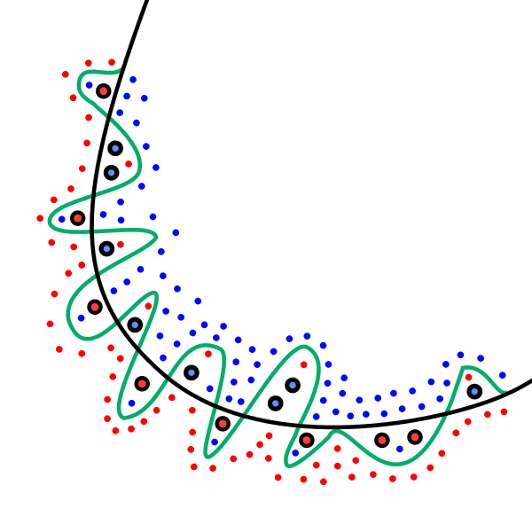
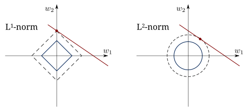

# Regularization Techniques

Regularization is a set of techniques that prevent overfitting by adding a penalty term to the cost function. This penalty discourages the model from learning overly complex patterns (large coefficients) that fit noise in the training data rather than the true underlying relationship.

**Why regularize?** When the model has many features, it can memorize training data (overfitting). Regularization constrains the magnitude of the coefficients, forcing the model to generalize better.



*Left: Underfitting (high bias, low variance) — model is too simple. Middle: Good fit — balanced. Right: Overfitting (low bias, high variance) — model is too complex and needs regularization.*

---

## 1. Ridge Regression (L2 Regularization)

**Definition:** Ridge Regression adds the sum of **squared** coefficients (L2 norm) as a penalty to the cost function. This shrinks all coefficients toward zero but never sets them exactly to zero. It keeps all features in the model but reduces their individual influence.

**Time Complexity:**
- Normal Equation: $O(n^3 + mn^2)$ — same as OLS. The $\lambda I$ addition is $O(n^2)$, negligible.
- Gradient Descent: $O(kmn)$ — same as standard GD. The L2 gradient adds $O(n)$ per iteration.
- Prediction: $O(n)$ per sample.

**Cost Function:**

$$J(\theta) = \frac{1}{2m} \sum_{i=1}^{m} (\hat{y}_i - y_i)^2 + \lambda \sum_{j=1}^{n} \theta_j^2$$

| MSE (data fit) | L2 penalty (complexity) |
|:-:|:-:|

> Note: The intercept $\theta_0$ is NOT regularized (only $\theta_1$ through $\theta_n$).

**Closed-Form Solution (Normal Equation with Ridge):**

$$\theta = (X^T X + \lambda I)^{-1} X^T y$$

Adding $\lambda I$ to $X^T X$ makes the matrix always invertible, even when $X^T X$ is singular.

**How to apply:**
```python
from sklearn.linear_model import Ridge

# λ is called 'alpha' in sklearn
model = Ridge(alpha=1.0)
model.fit(X_train, y_train)
predictions = model.predict(X_test)
print(f"Coefficients: {model.coef_}")
```

**How to interpret results:**
- All coefficients are present but smaller than OLS
- Larger $\lambda$ → smaller coefficients → simpler model
- Coefficients approaching zero = feature has less influence
- Compare coefficients across features to assess relative importance

**Choosing $\lambda$ (alpha):**
```python
from sklearn.linear_model import RidgeCV
# Cross-validation to find best lambda
model = RidgeCV(alphas=[0.01, 0.1, 1.0, 10.0, 100.0], cv=5)
model.fit(X_train, y_train)
print(f"Best alpha: {model.alpha_}")
```

**Advantages:**
- ✅ Handles multicollinearity well (stabilizes coefficient estimates)
- ✅ Always has a unique solution ($\lambda I$ ensures invertibility)
- ✅ Has a closed-form solution (fast computation)
- ✅ Works well when all features contribute to the prediction
- ✅ Prevents overfitting

**Disadvantages:**
- ❌ Does NOT perform feature selection (keeps all features)
- ❌ Less interpretable with many features (no coefficients set to zero)
- ❌ Requires tuning $\lambda$ via cross-validation
- ❌ Biased estimator (introduces small bias to reduce variance)

**Best for:** Datasets with many correlated features where all features are believed to contribute.

---

## 2. Lasso Regression (L1 Regularization)

**Definition:** Lasso (Least Absolute Shrinkage and Selection Operator) adds the sum of **absolute** coefficients (L1 norm) as a penalty. Unlike Ridge, Lasso can shrink coefficients to exactly zero, effectively removing features from the model. This makes Lasso a feature selection method.

**Time Complexity:**
- Coordinate Descent: $O(kmn)$ — where $k$ = passes over all coordinates. Each coordinate update is $O(m)$.
- No closed-form solution, so always iterative. Typically slower than Ridge (Normal Equation).
- Prediction: $O(n)$ per sample, but effectively $O(s)$ where $s$ is the number of non-zero coefficients (sparse).

**Cost Function:**

$$J(\theta) = \frac{1}{2m} \sum_{i=1}^{m} (\hat{y}_i - y_i)^2 + \lambda \sum_{j=1}^{n} |\theta_j|$$

| MSE (data fit) | L1 penalty (sparsity) |
|:-:|:-:|

**No closed-form solution.** Must use iterative methods (coordinate descent, gradient descent with subgradients).

**How to apply:**
```python
from sklearn.linear_model import Lasso

model = Lasso(alpha=0.1)
model.fit(X_train, y_train)
predictions = model.predict(X_test)
print(f"Coefficients: {model.coef_}")
print(f"Non-zero features: {np.sum(model.coef_ != 0)} out of {len(model.coef_)}")
```

**How to interpret results:**
- Coefficients set to zero → those features are eliminated
- Non-zero coefficients → the selected important features
- Larger $\lambda$ → more coefficients become zero → sparser model
- The remaining non-zero coefficients indicate the most important features

**Choosing $\lambda$:**
```python
from sklearn.linear_model import LassoCV
model = LassoCV(alphas=[0.001, 0.01, 0.1, 1.0], cv=5)
model.fit(X_train, y_train)
print(f"Best alpha: {model.alpha_}")
print(f"Features selected: {np.sum(model.coef_ != 0)}")
```

**Advantages:**
- ✅ Performs automatic feature selection (sparse models)
- ✅ Creates simpler, more interpretable models
- ✅ Works well when only a few features are truly important
- ✅ Prevents overfitting

**Disadvantages:**
- ❌ No closed-form solution (slower than Ridge for large datasets)
- ❌ Arbitrarily selects one feature among correlated group (unstable)
- ❌ May remove useful features if they are correlated
- ❌ Can underperform Ridge when many features contribute equally
- ❌ Requires tuning $\lambda$ via cross-validation

**Best for:** High-dimensional datasets where you suspect many features are irrelevant. When you need interpretability and feature selection.

---

## 3. Elastic Net (L1 + L2 Combined)

**Definition:** Elastic Net combines both L1 (Lasso) and L2 (Ridge) penalties, balancing feature selection with coefficient shrinkage. A mixing parameter `r` controls the ratio between L1 and L2. It overcomes Lasso's limitation of arbitrarily selecting among correlated features.

**Time Complexity:**
- Coordinate Descent: $O(kmn)$ — same as Lasso. The combined L1+L2 update per coordinate is still $O(m)$.
- No closed-form solution.
- Prediction: $O(n)$ per sample (or $O(s)$ if the solution is sparse).

**Cost Function:**

$$J(\theta) = \frac{1}{2m} \sum (\hat{y}_i - y_i)^2 + r \cdot \lambda \sum |\theta_j| + \frac{(1-r)}{2} \cdot \lambda \sum \theta_j^2$$

| MSE | L1 (Lasso) | L2 (Ridge) |
|:-:|:-:|:-:|

Where:
- $r$ = mixing ratio (0 to 1). $r=1$ → pure Lasso, $r=0$ → pure Ridge
- $\lambda$ = overall regularization strength

**How to apply:**
```python
from sklearn.linear_model import ElasticNet

# l1_ratio = r (mixing parameter)
model = ElasticNet(alpha=0.1, l1_ratio=0.5)  # 50% Lasso, 50% Ridge
model.fit(X_train, y_train)
predictions = model.predict(X_test)
print(f"Coefficients: {model.coef_}")
print(f"Non-zero: {np.sum(model.coef_ != 0)}")
```

**How to interpret results:**
- Some coefficients may be zero (from L1 component → feature selection)
- Remaining coefficients are shrunk (from L2 component → stability)
- Handles correlated features better than pure Lasso
- Tuning $r$ determines whether behavior is more Lasso-like or Ridge-like

**Choosing $\lambda$ and $r$:**
```python
from sklearn.linear_model import ElasticNetCV
model = ElasticNetCV(l1_ratio=[0.1, 0.3, 0.5, 0.7, 0.9], cv=5)
model.fit(X_train, y_train)
print(f"Best alpha: {model.alpha_}")
print(f"Best l1_ratio: {model.l1_ratio_}")
```

**Advantages:**
- ✅ Combines benefits of both Ridge and Lasso
- ✅ Handles groups of correlated features (selects the group, not just one)
- ✅ More stable feature selection than Lasso alone
- ✅ Flexible: can behave like Ridge, Lasso, or anything in between

**Disadvantages:**
- ❌ Two hyperparameters to tune ($\lambda$ and $r$)
- ❌ More computationally expensive than Ridge or Lasso alone
- ❌ Less interpretable parameter choices (what does $r=0.7$ mean?)

**Best for:** Datasets with many correlated features where both feature selection and coefficient shrinkage are desired.

---

## Regularization Visual Comparison


*L1 (Lasso) constraint produces sparse solutions — the optimal point tends to land on an axis, zeroing out some coefficients. L2 (Ridge) constraint shrinks all coefficients but keeps them non-zero.*



*The diamond shape (L1/Lasso) has corners on the axes, making it more likely that the optimal solution has zero-valued coefficients. The circle (L2/Ridge) has no corners, so coefficients shrink but rarely reach zero.*

## Regularization Summary

| Aspect | Ridge (L2) | Lasso (L1) | Elastic Net |
|--------|-----------|-----------|-------------|
| **Penalty** | $\sum \theta_j^2$ | $\sum \|\theta_j\|$ | $r \sum \|\theta_j\| + (1-r) \sum \theta_j^2$ |
| **Feature selection** | ❌ No | ✅ Yes | ✅ Yes |
| **Closed-form** | ✅ Yes | ❌ No | ❌ No |
| **Correlated features** | Keeps all, shrinks | Picks one arbitrarily | Groups them together |
| **Hyperparameters** | $\lambda$ | $\lambda$ | $\lambda$, $r$ |
| **When to use** | All features matter | Few features matter | Correlated features |
